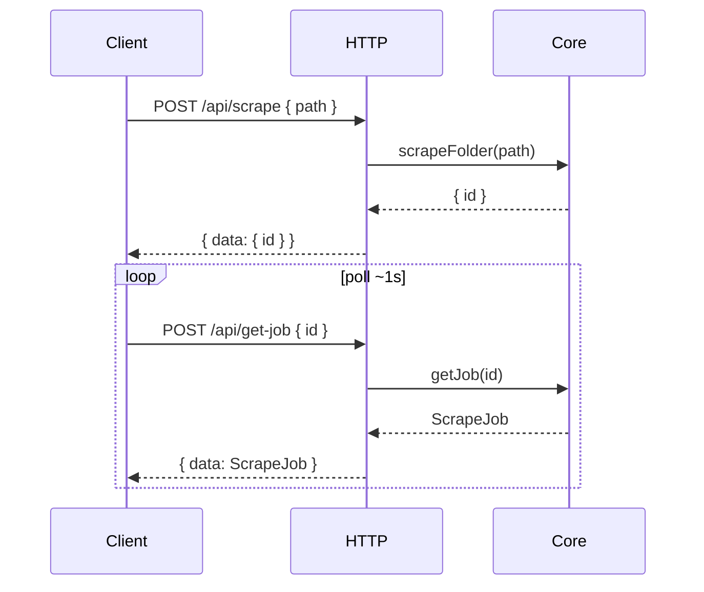

# Scrape (HTTP job API + Core parity)

This design document is the **golden source** for the v3 scrape feature: Core scrape pipeline (legacy UI parity), Internal HTTP job API, and Layer 1 clients (Web UI / CLI / AI / MCP).

Related earlier Core note: [2026-08-19-core-scrape-folder-design.md](../superpowers/specs/2026-08-19-core-scrape-folder-design.md) (initial TV+TMDB only — **superseded** by the matrix below for product scope).

## 1. Background

ScrapeDialog starts a Core scrape job (`POST /api/scrape`) and polls `POST /api/get-job` until the job is terminal. Tasks cover **TV show | movie** × **TMDB | TVDB**.

Core already has a job-based `scrapeFolder` + CLI (`smm scrape` / `smm job`). This design expands Core to **full historical UI parity**, then exposes HTTP + UI as the only scrape path.

| Task | Output |
|------|--------|
| `poster` | `poster.{ext}` in media folder root |
| `fanart` | `fanart.{ext}` in media folder root |
| `thumbnails` | TV only: per-episode still beside each linked video |
| `nfo` | TV: `tvshow.nfo` + `{videoStem}.nfo`; Movie: `movie.nfo` |

### 1.1 Legacy parity matrix (must match UI)

| Task | TV+TMDB | TV+TVDB | Movie+TMDB | Movie+TVDB |
|------|---------|---------|------------|------------|
| poster | series `poster_path` | series `image` / best artwork | movie `poster_path` | movie image / artworks |
| fanart | series backdrop | background artwork type (else best) | movie backdrop | background / best |
| thumbnails | episode stills | episode images (season extended) | **omit / skip** (UI TODO) | **omit / skip** |
| nfo | tvshow + episode nfos | same via TVDB builders + translations | `movie.nfo` | `movie.nfo` via TVDB |

Source of truth for resolvers/builders (port into Core, do not call UI):

- Poster/fanart URL: `apps/ui/src/hooks/useScrapePosterMutation.ts`, `useScrapeFanartMutation.ts`
- Thumbnails: `useDownloadThumbnailFromTMDB` / `useDownloadThumbnailFromTVDB`
- NFO: `useScrapeNfoMutation.ts` + `useHandleScrapeStart.ts` builders + `apps/ui/src/lib/nfo`

### 1.2 Delivery phases

1. **Core parity** — done (TV + movie × TMDB + TVDB; movie skips `thumbnails`)
2. **HTTP** — done (`POST /api/scrape` + scrape shape on `POST /api/get-job`)
3. **UI** — done (job start + poll; legacy per-task mutations removed)
4. **AI + MCP** — done (`scrape` + `get-job` tools; no confirmation; fire-and-forget scrape)

## 2. Architecture

### 2.1 Project Level Architecture

```
Layer 1: Web UI / CLI / AI / MCP
    │
    │  POST /api/scrape
    │  POST /api/get-job
    ▼
Layer 3: apps/cli Hono routes (thin)
    │
    │  Core.scrapeFolder / Core.getJob
    ▼
Layer 2: apps/core
    JobStore (ImportJob | ScrapeJob)
    scrapeFolderPipeline → task runners dispatch on type × database
    TmdbClient + TvdbClient (extended for scrape reads)
```

Per [refactoring.md](../../refactoring.md): HTTP is the Internal API channel into Core; business rules stay in Core.

### 2.2 App Level Architecture

| Piece | Role |
|-------|------|
| `Core.scrapeFolder(path, options?)` | Await prerequisites; create `ScrapeJob`; run tasks in background; return `Promise<{ id }>` |
| `Core.getJob(id)` | Return `ImportJob \| ScrapeJob` |
| `JobStore` | In-memory store for both job kinds |
| `prepareScrapeFolder` | Managed + metadata; allow `tvshow-folder` \| `movie-folder` with `database` in `{TMDB, TVDB}` |
| `checkScrapeCompletion` | TV: poster/fanart/thumbnails/nfo; Movie: poster/fanart/nfo (`movie.nfo`); thumbnails always “complete” for movies so orchestrator skips |
| Task runners | Single entry per task id; internal switch on type×database (Approach 1) |
| `TvdbClient` | Add scrape helpers: `getSeriesExtended`, `getSeasonExtended`, `getMovieExtended`, `getArtworkTypes`, translation getters as needed |
| `POST /api/scrape` | Validate body → Core → `{ data: { id } }` or `{ error }` |
| `POST /api/get-job` | Existing route; `data` is discriminated job union |
| UI `useScrapeDialog` | Job start + poll (`POST /api/scrape` + `POST /api/get-job`) |
| MCP / AI `scrape` | Start job via Core (MCP) or `POST /api/scrape` (in-app AI); returns `{ id, message }`; **no confirmation** |
| MCP / AI `get-job` | Poll any job (`scrape` \| `import`) via Core / `POST /api/get-job` |

### 2.3 Key Design

#### Decisions

| Topic | Choice |
|-------|--------|
| Response envelope | `{ data?, error? }`, HTTP **200** (same as import-folder / get-job) |
| Job poll | Reuse `POST /api/get-job` |
| Job model | Discriminated union: `kind: "import" \| "scrape"` |
| Overall job status | `failed` if **any** task is `failed`; else `succeeded` when finished |
| Prerequisites | Fail **before** creating a job → `{ error }`, no id |
| Media / DB scope | **TV + movie**, **TMDB + TVDB** (legacy parity) |
| Movie thumbnails | Skip (`skipped` / not run) — match ScrapeDialog (UI still TODO) |
| Port style | One runner per task id with type×database dispatch (not separate pipelines) |
| UI | Job start + poll; no per-task Core HTTP |

#### Prerequisites (`prepareScrapeFolder`)

Allow when:

- Folder is managed and metadata exists
- `type` is `tvshow-folder` or `movie-folder`
- Corresponding `tvShow.database` or `movie.database` is `TMDB` or `TVDB`

Reject (throw, no job) otherwise, e.g. music folder or unknown database.

#### Task orchestration

1. Resolve task list: movies use `[poster, fanart, nfo]` conceptually; job still has `thumbnails` key set to `skipped` immediately (stable job shape for UI/CLI).
2. For each remaining task: skip if completion says done; else run dispatcher; per-task failure does not abort others.
3. Terminal job status: any `failed` → job `failed`; else `succeeded`.

#### Core signatures

```ts
export type Job = ImportJob | ScrapeJob

export interface ImportJob {
  kind: "import"
  id: string
  folderPath: string
  type: FolderType
  status: JobStatus
  stage: JobStage
  progress: number
  recognizedTitle?: string
  error?: string
  createdAt: number
  updatedAt: number
}

export type ScrapeTaskRuntimeStatus =
  | "pending"
  | "running"
  | "skipped"
  | "completed"
  | "failed"

export interface ScrapeJobTask {
  status: ScrapeTaskRuntimeStatus
  error?: string
}

export interface ScrapeJob {
  kind: "scrape"
  id: string
  folderPath: string
  status: JobStatus // pending | running | succeeded | failed | aborted
  tasks: Record<"poster" | "fanart" | "thumbnails" | "nfo", ScrapeJobTask>
  error?: string
  createdAt: number
  updatedAt: number
}

export interface ScrapeFolderHandle {
  id: string
}

// Async so prerequisites can fail before JobStore.create.
Core.scrapeFolder(path: string, options?: ScrapeFolderOptions): Promise<ScrapeFolderHandle>
```

#### Runtime flow

1. Normalize path; **await** validate (managed, metadata, TV|movie + TMDB|TVDB). On failure: throw → HTTP `{ error }`; **no job**.
2. Create `ScrapeJob` with `status: "running"`, all tasks `pending`; return `{ id }` immediately after create.
3. Background (`void`): for each task in `[poster, fanart, thumbnails, nfo]` sequentially:
   - Movies: mark `thumbnails` `skipped` without calling a runner.
   - Else set task `running` (or `skipped` if completion check says so) via `JobStore.update`.
   - Await task runner (dispatches on type×database); set `completed` / `failed` (+ `error`).
4. Terminal: `status = any task failed ? "failed" : "succeeded"`.
5. Do not block the HTTP request on step 3–4.

#### CLI

```
smm scrape <folder> [--language <code>] [--wait]
```

- Always prints the **job id** on the first line.
- Without `--wait`: returns immediately after the job is created (exit 0 on start success).
- With `--wait`: polls until the job is terminal, then prints four task lines with icons, exit `1` if job `status` is not `succeeded`.

```
smm job <jobId>
```

- For scrape jobs, prints the same four icon lines (no job id).
- For import jobs, prints the job JSON.

**Icon lines** (display label `thumbnail` maps to Core task `thumbnails`):

| Status | Icon |
|--------|------|
| pending | `○` |
| running | `◐` |
| skipped | `–` |
| completed | `✓` |
| failed | `✗` |

Example (`--wait` after success):

```
<job-id>
poster ✓
fanart ✓
thumbnail ✓
nfo ✓
```

## 3. HTTP API

All endpoints: **HTTP 200**. Clients use `error` for business failure and `data` for success. Error string format: `Error Reason: <detail>`.

### 3.1 `POST /api/scrape`

Starts a scrape job.

**Request**

```ts
interface ScrapeRequestBody {
  /** Absolute media folder path (platform or POSIX; Core normalizes). */
  path: string
  /** Optional; defaults to userConfig.preferMediaLanguage. */
  language?: string
}
```

Prefer field name `path` (aligned with `import-folder`). Legacy UI type `mediaFolderPath` is out of scope for this milestone’s route.

**Success**

```json
{
  "data": { "id": "550e8400-e29b-41d4-a716-446655440000" }
}
```

**Start failure** (no job created)

```json
{
  "error": "Error Reason: /abs/path is not managed by SMM"
}
```

| Condition | Detail after `Error Reason: ` |
|-----------|-------------------------------|
| Missing / empty `path` | `path is required` |
| Unmanaged folder | `{path} is not managed by SMM` |
| Missing / corrupt metadata | `Media metadata not found: {path}` |
| Unsupported folder type | `Folder is not a TV show or movie: {path}` |
| Unsupported database | `Unsupported media database: {database}` (only `TMDB` / `TVDB`) |

Unexpected route exceptions also return `{ error: "Error Reason: …" }` with HTTP 200 (same as import-folder).

### 3.2 `POST /api/get-job`

Unchanged path and request shape.

**Request**

```json
{ "id": "<job-uuid>" }
```

**Success — scrape**

```json
{
  "data": {
    "kind": "scrape",
    "id": "550e8400-e29b-41d4-a716-446655440000",
    "folderPath": "/abs/media/folder",
    "status": "running",
    "tasks": {
      "poster": { "status": "completed" },
      "fanart": { "status": "running" },
      "thumbnails": { "status": "pending" },
      "nfo": { "status": "pending" }
    },
    "createdAt": 0,
    "updatedAt": 0
  }
}
```

**Success — import** (existing fields + discriminator)

```json
{
  "data": {
    "kind": "import",
    "id": "…",
    "folderPath": "…",
    "type": "tvshow",
    "status": "running",
    "stage": "recognize",
    "progress": 40,
    "createdAt": 0,
    "updatedAt": 0
  }
}
```

**Errors**

| Condition | Response |
|-----------|----------|
| Missing `id` | `{ "error": "Error Reason: id is required" }` |
| Unknown id | `{ "error": "Error Reason: Job not found" }` |

**Terminal scrape semantics**

- Job `status`: `succeeded` or `failed` (or `aborted` if added later).
- `failed` iff at least one task has `status: "failed"`.
- Finished task statuses: `skipped` | `completed` | `failed`.
- Failed tasks include `error` (human-readable).
- Optional job-level `error` is a summary only; clients should prefer per-task `error`.

**Polling**

Clients poll every ~1s until `status` is terminal (`succeeded` | `failed` | `aborted`).

## 4. User Stories

### 4.1 Start scrape and observe progress

* **Given** a managed TV folder with TMDB metadata  
* **When** the client `POST /api/scrape` with `{ "path": "…" }`  
* **Then** the response is `{ "data": { "id": "…" } }`  
* **And** polling `POST /api/get-job` shows `kind: "scrape"` with tasks moving `pending` → `running` → `completed`/`skipped`  
* **And** the job ends with `status: "succeeded"` when all tasks succeed or skip  



### 4.2 Prerequisite failure at start

* **Given** a path that is not managed by SMM  
* **When** the client `POST /api/scrape`  
* **Then** the response is `{ "error": "Error Reason: … is not managed by SMM" }`  
* **And** no job id is returned  

### 4.3 Partial task failure

* **Given** scrape starts successfully  
* **When** one task fails (e.g. fanart network error) and others complete/skip  
* **Then** that task has `status: "failed"` and `error`  
* **And** remaining tasks still run  
* **And** job `status` is `failed`  

### 4.4 Movie scrape skips thumbnails

* **Given** a managed movie folder with TMDB or TVDB metadata  
* **When** scrape runs to completion  
* **Then** `thumbnails` is `skipped`  
* **And** poster / fanart / nfo still run  

### 4.5 UI ScrapeDialog

* **Given** a managed TV or movie folder  
* **When** the user starts scrape in ScrapeDialog  
* **Then** UI calls `POST /api/scrape` and polls `POST /api/get-job`  
* **And** dialog task rows mirror job `tasks`  

### 4.6 AI / MCP scrape + get-job

* **Given** a managed TV or movie folder  
* **When** the assistant or MCP client calls `scrape` with `{ path }`  
* **Then** the tool returns `{ id, message: "scrape job created, use get-job tool to check job status by id." }` without waiting  
* **And** no user confirmation dialog is shown  
* **When** the client calls `get-job` with that `id`  
* **Then** the tool returns the job payload (`kind: "scrape"` or `"import"`) or an error if not found  

## 5. Out of scope

- Movie thumbnail scraping (legacy UI also TODO)  
- `--force` overwrite  
- Plan-based scrape (`try-to-scrape` / `apply`)  
- ProblemDetails / non-200 business status codes  
- New REST path `/api/job/{id}`  
- Removing leftover UI scrape mutations (`useScrapePosterMutation` and siblings) used outside ScrapeDialog  

## 6. Testing

| Layer | Scenario | Test file |
|-------|----------|-----------|
| Web e2e | ScrapeDialog: TMDB/TVDB × TV show / movie; failover; HTTP proxy | `apps/e2e/common/tv/Scrape.e2e.ts`, `ScrapeFailover.e2e.ts`, `apps/e2e/common/httpproxy/ScrapeTvShowByTmdbBehindHttpProxy.e2e.ts`, `ScrapeTvShowByTvdbBehindHttpProxy.e2e.ts` |
| CLI e2e | `smm scrape --wait` creates poster / fanart / thumbnail / nfo | `apps/cli/test/scrape.e2e.ts` |
| HTTP | `POST /api/scrape` + `POST /api/get-job` | `apps/cli/src/route/Scrape.test.ts`, `GetJob.test.ts` |
| MCP tool | MCP `scrape` + `get-job`; movie fixture; thumbnails skipped | `apps/e2e/common/mcp/McpOther-ScrapeTool.e2e.ts` |
| AI tool | Debug `scrape` + `get-job`; movie fixture; thumbnails skipped | `apps/e2e/test/specs/ai/AiTool-ScrapeTool.e2e.ts` |

## 7. Compatibility notes

- Existing `ImportJob` consumers must accept `kind: "import"` (additive field).  
- `Core.scrapeFolder` is job-based (`Promise<{ id }>`); CLI already polls.  
- CLI e2e that expected reject for movie / non-TMDB TV must flip to success (or assert artifacts) after Core parity.  
- ScrapeDialog uses `path` + `{ data: { id } }` via `POST /api/scrape`; legacy `ScrapeRequestBody.mediaFolderPath` is unused by the dialog.  
