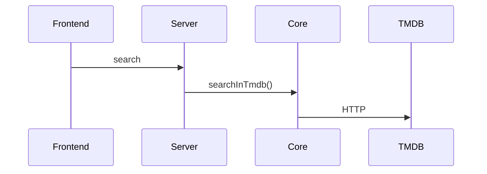
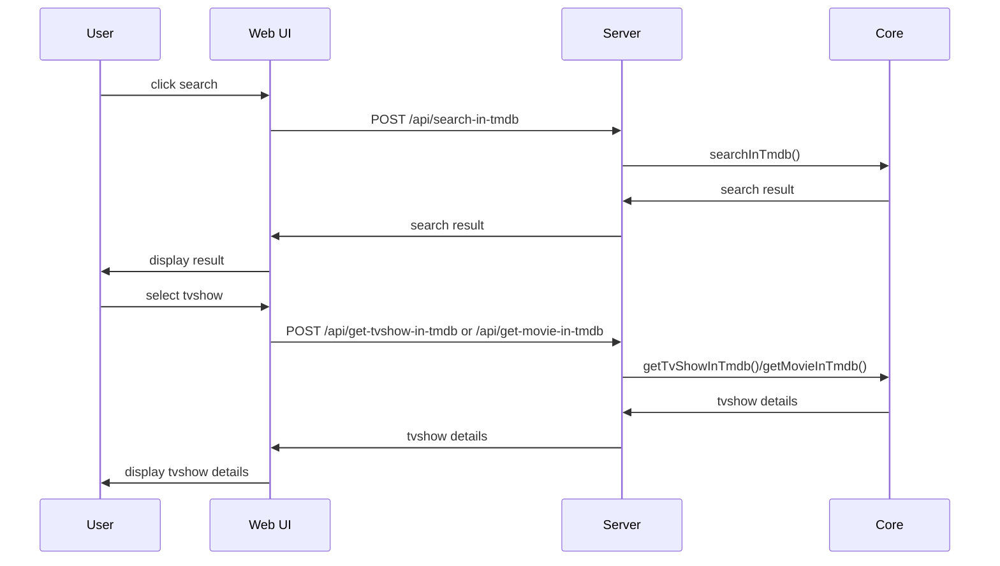
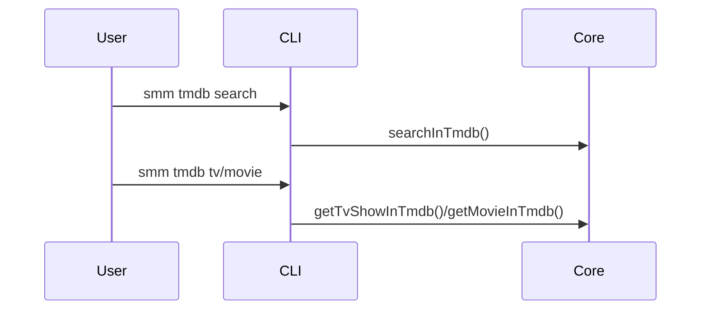
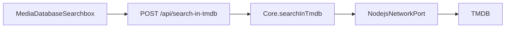

# TMDB

**Supported Platform** Web UI, CLI, Electron, ohos, AI tool, MCP tool
**Status** done

## Overview

| Key Methods in Core Module | HTTP API |
|-----------|------|
| `searchInTmdb` | `POST /api/search-in-tmdb` |
| `getMovieInTmdb` | `POST /api/get-movie-in-tmdb` |
| `getTvShowInTmdb` | `POST /api/get-tvshow-in-tmdb` |



## Web UI, Electron and ohos



## CLI

### 命令

已暴露搜索与按 id 拉取详情：

```bash
smm tmdb search "<keyword>" --type tv|movie [options]
smm tmdb tv "<tmdbid>" -f|--format json|default --lang "<lang>" [options]
smm tmdb movie "<tmdbid>" -f|--format json|default --lang "<lang>" [options]
```




### 输出格式

```bash
$ smm tmdb search "keyword" --type tv
#1 {tmdbid} {title} ({release date})
{overview}
#2 {tmdbid2} {title2} ({release date})
{overview}

$ smm tmdb tv 84666
id: 84666
name: ...
genres:
  [0]:
    id: ...
    name: ...

$ smm tmdb movie 550 -f json
{
  "id": 550,
  "title": "Fight Club",
  ...
}
```

`default`：完整 TMDB 响应的缩进 key/value 树（含全部字段）。  
`json`：pretty-print JSON。

### 常用场景

```bash
# 默认 host（userConfig / 内置）
smm tmdb search "keyword" --type tv

# 指定语言
smm tmdb search "keyword" --type tv --lang zh-CN

# 经 HTTP/SOCKS 代理
smm tmdb search "keyword" --type tv --proxy "socks5://proxy.example.com:7079"

# 自定义 host + API key
smm tmdb search "keyword" --type tv \
  --host "https://api.themoviedb.org/3" \
  --password "your-api-key" \
  --proxy "socks5://proxy.example.com:7079"

# 按 id 拉详情
smm tmdb tv 84666 --lang zh-CN
smm tmdb movie 550 -f json \
  --host "https://api.themoviedb.org/3" \
  --password "your-api-key" \
  --proxy "socks5://proxy.example.com:7079"
```

### 参数

| 参数 | 说明 |
|------|------|
| `--type` | `tv` \| `movie`（仅 `search`，必填） |
| `-f` / `--format` | `json` \| `default`（仅 `tv` / `movie`；省略为 `default`） |
| `--lang` | TMDB primary translation（如 `zh-CN`）；无效值离线报错 |
| `--host` | 覆盖 `userConfig.tmdb.host` |
| `--password` | 覆盖 `userConfig.tmdb.apiKey` |
| `--proxy` | 覆盖 `userConfig.tmdb.httpProxy` |

实现：`apps/cli/src/cli/runCli.ts`（搜索格式化：`tmdbSearchFormat.ts`；详情格式化：`tmdbDetailsFormat.ts`）。

---

## AI Tool

Chat 后端工具，**仅服务端也可执行**（registry 中 `backend: true`）。应用内 AI（`frontend: true`）经对应 HTTP API 进入 Core，不走 `/api/core/fetch`。MCP / 服务端 chat 在进程内注入 `Core.searchInTmdb` 等同名方法（与 HTTP 路由同一 Core）。

| 工具名 | HTTP | Core 方法 | 说明 |
|--------|------|-----------|------|
| `tmdb-search` | `POST /api/search-in-tmdb` | `searchInTmdb` | 关键词搜索 |
| `tmdb-get-movie` | `POST /api/get-movie-in-tmdb` | `getMovieInTmdb` | 电影详情 |
| `tmdb-get-tv-show` | `POST /api/get-tvshow-in-tmdb` | `getTvShowInTmdb` | 剧集详情 |

### 参数（与 CLI 对照）

| 工具字段 | 对应 Core |
|----------|-----------|
| `keyword`, `type` | `searchInTmdb` |
| `id` | `getMovieInTmdb` / `getTvShowInTmdb` |
| `language` | `language`（同 CLI `--lang`） |
| `baseURL` | `host`（同 CLI `--host`） |

host / apiKey / proxy 未在工具参数中指定时，仍走 `userConfig.tmdb`。

类型定义：`packages/core/types/ai-tools/tmdb*.ts`  
执行与构建：`packages/core-routes/src/tools/tmdb.ts`  
注册：`packages/core-routes/src/tools/index.ts`、`chat.ts`；CLI 注入 runner：`apps/cli/src/route/chatRoute.ts`。

System prompt 指引见 `packages/core/ai-tool/systemPrompt.ts`（先 `tmdb-search`，再按 id 拉详情）。

---

## MCP Tool

与 AI Tool **同名、同 schema**，经 MCP HTTP 暴露。工具 handler 在进程内调用 `Core.searchInTmdb` 等同名方法（与 `POST /api/search-in-tmdb` 等路由同一 Core），不走 `/api/core/fetch`。

| MCP 工具名 | HTTP | Core 方法 |
|------------|------|-----------|
| `tmdb-search` | `POST /api/search-in-tmdb` | `searchInTmdb` |
| `tmdb-get-movie` | `POST /api/get-movie-in-tmdb` | `getMovieInTmdb` |
| `tmdb-get-tv-show` | `POST /api/get-tvshow-in-tmdb` | `getTvShowInTmdb` |

注册：`packages/core-routes/src/mcp/toolHandlers/tmdbTools.ts`  
CLI runner：`apps/cli/src/mcp/mcp.ts`（`searchInTmdb` / `getMovieInTmdb` / `getTvShowInTmdb`）。

本地调试 MCP 客户端：`test/mcp-test-client/index.ts`（`SMM_MCP_URL` + `--tool tmdb-search`）。

---

## Web UI（⏳ v3 迁移）

Web UI 的改动需要使用 localStorage 开关 `smm.v3.enabled` 控制.

搜索入口：`MediaDatabaseSearchbox`（`TvShowPanelHeader` / `MovieHeaderV2`）。

**目标路径**（与 Core v3 一致）：UI 调用一对一 Internal HTTP，服务端再调对应 Core 方法。不经 `BrowserNetworkPort` / `POST /api/core/fetch`。



| 层 | 文件 / 接口 |
|----|------|
| UI | `apps/ui/src/components/MediaDatabaseSearchbox.tsx` |
| HTTP | `POST /api/search-in-tmdb` · `POST /api/get-movie-in-tmdb` · `POST /api/get-tvshow-in-tmdb` |
| Core | `searchInTmdb` · `getMovieInTmdb` · `getTvShowInTmdb` |
| 出站 | `apps/cli/src/core/NodejsNetworkPort.ts` |

Web 不调用 `smm tmdb search`，但与 CLI 共用 Core 方法与 `userConfig.tmdb` 语义。

---

## 测试

| 范围 | 文件 |
|------|------|
| CLI e2e | `apps/e2e/cli/tmdb.test.ts` — 文档「常用场景」搜索 + `tmdb tv` / `tmdb movie` get-by-id |
| core-routes 单测 | `packages/core-routes/src/tools/tmdb.test.ts` |
| MCP e2e | `apps/e2e/common/mcp/McpOther-TmdbTools.e2e.ts` — 三工具 +  live TMDB |
| MCP 客户端 | `apps/e2e/test/lib/McpClient.ts` |

MCP / 需直连 TMDB 的 e2e 在 `apps/e2e/.env.local` 配置 `TMDB_HOST`、`TMDB_API_KEY`、`TMDB_HTTP_PROXY`（网络受限环境）。

运行 CLI e2e：

```bash
cd apps/e2e/cli
bun test ./tmdb.test.ts
```

运行 MCP spec：

```bash
cd apps/e2e
pnpm run wdio --spec ./common/mcp/McpOther-TmdbTools.e2e.ts
```
