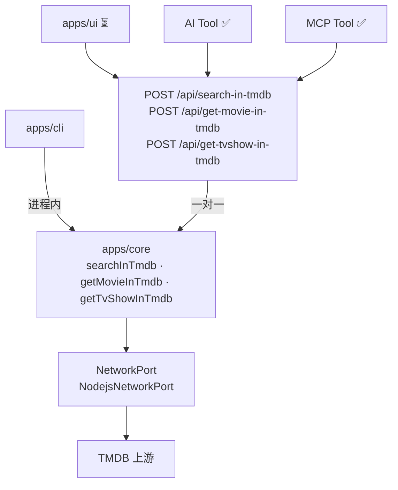
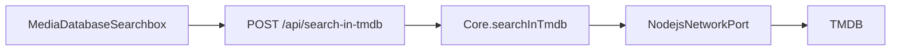

# TMDB 集成（v3）

SMM 通过 `apps/core` 统一访问 TMDB：**全部出站流量**经 `Core` + `NetworkPort`，不直连上游（浏览器侧见 [network-core.md](./network-core.md)）。

| 入口 | 状态 | 说明 |
|------|------|------|
| CLI | ✅ | `smm tmdb search` → 进程内 `Core.searchInTmdb` |
| AI Tool | ✅ | 应用内 Chat → 对应 HTTP API → Core；服务端 Chat 进程内注入 Core |
| MCP Tool | ✅ | MCP 工具进程内调用 Core 同名方法（与 HTTP 路由同一 Core） |
| Web UI | ⏳ | `smm.v3.enabled`：对应 HTTP API → Core 同名方法 |

Core 方法与 Internal HTTP **一对一**暴露。Web UI（v3）与应用内 AI 走这些 API 再进入 Core；MCP / 服务端 Chat 在进程内调用同一套 Core 方法。均不走 `POST /api/core/fetch`（那是 `BrowserNetworkPort` 的通用出站中继，见 [network-core.md](./network-core.md)）。

| Core 方法 | HTTP |
|-----------|------|
| `searchInTmdb` | `POST /api/search-in-tmdb` |
| `getMovieInTmdb` | `POST /api/get-movie-in-tmdb` |
| `getTvShowInTmdb` | `POST /api/get-tvshow-in-tmdb` |



**配置**：host / apiKey / httpProxy 来自 `userConfig.tmdb`；各入口可临时覆盖（CLI flags、工具参数 `baseURL` 等）。

---

## apps/core API

三个公开方法，共用 `createTmdbClient` 与 `NetworkPort` 出站。每个方法一对一暴露为 HTTP：

| 方法 | HTTP | 用途 |
|------|------|------|
| `searchInTmdb(keyword, options)` | `POST /api/search-in-tmdb` | 按关键词搜索 TV / movie |
| `getMovieInTmdb(id, options)` | `POST /api/get-movie-in-tmdb` | 按 TMDB id 拉电影详情 |
| `getTvShowInTmdb(id, options)` | `POST /api/get-tvshow-in-tmdb` | 按 TMDB id 拉剧集详情 |

```ts
core.searchInTmdb(keyword, {
  type: "tv" | "movie",
  language?: string,   // 离线校验 packages/core/tmdbPrimaryTranslations.ts
  host?: string,       // 默认 userConfig.tmdb.host
  password?: string,   // 默认 userConfig.tmdb.apiKey
  proxy?: string,      // 默认 userConfig.tmdb.httpProxy
})

core.getMovieInTmdb(id, { language?, host?, password?, proxy? })
core.getTvShowInTmdb(id, { language?, host?, password?, proxy? })
```

- `TmdbClient` 经 `NetworkPort` 发请求；`reverseProxyUrl: null`，`proxy` 作为 `FetchInit.proxy`（非浏览器 reverse proxy）。
- 显式 `language` 须在静态 primary translations 列表中；省略时按 `preferMediaLanguage` → OS → `en-US`。

实现：`apps/core/src/Core.ts`。

---

## CLI

### 命令

目前仅暴露搜索子命令：

```bash
smm tmdb search "<keyword>" --type tv|movie [options]
```

### 输出格式

```bash
$ smm tmdb search "keyword" --type tv
#1 {tmdbid} {title} ({release date})
{overview}
#2 {tmdbid2} {title2} ({release date})
{overview}
```

### 常用场景

```bash
# 默认 host（userConfig / 内置）
smm tmdb search "keyword" --type tv

# 指定语言
smm tmdb search "keyword" --type tv --lang zh-CN

# 经 HTTP/SOCKS 代理
smm tmdb search "keyword" --type tv --proxy "socks5://proxy.example.com:7079"

# 自定义 host + API key
smm tmdb search "keyword" --type tv \
  --host "https://api.themoviedb.org/3" \
  --password "your-api-key" \
  --proxy "socks5://proxy.example.com:7079"
```

### 参数

| 参数 | 说明 |
|------|------|
| `--type` | `tv` \| `movie`（必填） |
| `--lang` | TMDB primary translation（如 `zh-CN`）；无效值离线报错 |
| `--host` | 覆盖 `userConfig.tmdb.host` |
| `--password` | 覆盖 `userConfig.tmdb.apiKey` |
| `--proxy` | 覆盖 `userConfig.tmdb.httpProxy` |

实现：`apps/cli/src/cli/runCli.ts`（格式化：`tmdbSearchFormat.ts`）。

---

## AI Tool

Chat 后端工具，**仅服务端也可执行**（registry 中 `backend: true`）。应用内 AI（`frontend: true`）经对应 HTTP API 进入 Core，不走 `/api/core/fetch`。MCP / 服务端 chat 在进程内注入 `Core.searchInTmdb` 等同名方法（与 HTTP 路由同一 Core）。

| 工具名 | HTTP | Core 方法 | 说明 |
|--------|------|-----------|------|
| `tmdb-search` | `POST /api/search-in-tmdb` | `searchInTmdb` | 关键词搜索 |
| `tmdb-get-movie` | `POST /api/get-movie-in-tmdb` | `getMovieInTmdb` | 电影详情 |
| `tmdb-get-tv-show` | `POST /api/get-tvshow-in-tmdb` | `getTvShowInTmdb` | 剧集详情 |

### 参数（与 CLI 对照）

| 工具字段 | 对应 Core |
|----------|-----------|
| `keyword`, `type` | `searchInTmdb` |
| `id` | `getMovieInTmdb` / `getTvShowInTmdb` |
| `language` | `language`（同 CLI `--lang`） |
| `baseURL` | `host`（同 CLI `--host`） |

host / apiKey / proxy 未在工具参数中指定时，仍走 `userConfig.tmdb`。

类型定义：`packages/core/types/ai-tools/tmdb*.ts`  
执行与构建：`packages/core-routes/src/tools/tmdb.ts`  
注册：`packages/core-routes/src/tools/index.ts`、`chat.ts`；CLI 注入 runner：`apps/cli/src/route/chatRoute.ts`。

System prompt 指引见 `packages/core/ai-tool/systemPrompt.ts`（先 `tmdb-search`，再按 id 拉详情）。

---

## MCP Tool

与 AI Tool **同名、同 schema**，经 MCP HTTP 暴露。工具 handler 在进程内调用 `Core.searchInTmdb` 等同名方法（与 `POST /api/search-in-tmdb` 等路由同一 Core），不走 `/api/core/fetch`。

| MCP 工具名 | HTTP | Core 方法 |
|------------|------|-----------|
| `tmdb-search` | `POST /api/search-in-tmdb` | `searchInTmdb` |
| `tmdb-get-movie` | `POST /api/get-movie-in-tmdb` | `getMovieInTmdb` |
| `tmdb-get-tv-show` | `POST /api/get-tvshow-in-tmdb` | `getTvShowInTmdb` |

注册：`packages/core-routes/src/mcp/toolHandlers/tmdbTools.ts`  
CLI runner：`apps/cli/src/mcp/mcp.ts`（`searchInTmdb` / `getMovieInTmdb` / `getTvShowInTmdb`）。

本地调试 MCP 客户端：`test/mcp-test-client/index.ts`（`SMM_MCP_URL` + `--tool tmdb-search`）。

---

## Web UI（⏳ v3 迁移）

Web UI 的改动需要使用 localStorage 开关 `smm.v3.enabled` 控制.

搜索入口：`MediaDatabaseSearchbox`（`TvShowPanelHeader` / `MovieHeaderV2`）。

**目标路径**（与 Core v3 一致）：UI 调用一对一 Internal HTTP，服务端再调对应 Core 方法。不经 `BrowserNetworkPort` / `POST /api/core/fetch`。



| 层 | 文件 / 接口 |
|----|------|
| UI | `apps/ui/src/components/MediaDatabaseSearchbox.tsx` |
| HTTP | `POST /api/search-in-tmdb` · `POST /api/get-movie-in-tmdb` · `POST /api/get-tvshow-in-tmdb` |
| Core | `searchInTmdb` · `getMovieInTmdb` · `getTvShowInTmdb` |
| 出站 | `apps/cli/src/core/NodejsNetworkPort.ts` |

Web 不调用 `smm tmdb search`，但与 CLI 共用 Core 方法与 `userConfig.tmdb` 语义。

---

## 测试

| 范围 | 文件 |
|------|------|
| CLI e2e | `apps/cli/test/tmdb.e2e.ts` — 文档「常用场景」四类搜索 |
| core-routes 单测 | `packages/core-routes/src/tools/tmdb.test.ts` |
| MCP e2e | `apps/e2e/common/mcp/McpOther-TmdbTools.e2e.ts` — 三工具 +  live TMDB |
| MCP 客户端 | `apps/e2e/test/lib/McpClient.ts` |

MCP / 需直连 TMDB 的 e2e 在 `apps/e2e/.env.local` 配置 `TMDB_HOST`、`TMDB_API_KEY`、`TMDB_HTTP_PROXY`（网络受限环境）。

运行 MCP spec：

```bash
cd apps/e2e
pnpm run wdio --spec ./common/mcp/McpOther-TmdbTools.e2e.ts
```
