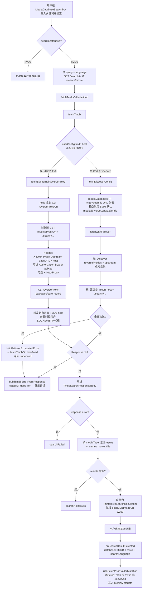

# TMDB via SMM cli


**输出格式**
```bash
$ smm tmdb search "keyword"
#{index} {tmdbid} {title} ({release data})
{description}
#{index2} {tmdbid2} {title2} ({release data 2})
{description2}
```

**使用场景**
```
# Search through SMM-provided TMDB host
smm tmdb search "keyword" --type tv

# Search with explicit language
smm tmdb search "keyword" --type tv --lang zh-CN

# Search through SMM-provided TMDB host and HTTP proxy
smm tmdb search "keyword" --type tv --proxy "socks5://proxy.example.com:7079"

# Search through custom TMDB host
smm tmdb search "keyword" --type tv --host "https://tmdb.example.com/v3"

# Search through custom TMDB host and password
smm tmdb search "keyword" --type tv --host "https://tmdb.example.com/v3" --password "password-here"

# Search through custom TMDB host, password and HTTP proxy
smm tmdb search "keyword" --type tv --host "https://tmdb.example.com/v3" --password "password-here" --proxy "socks5://proxy.example.com:7079"
```

**Arguments**
```
--type [tv|movie]
--lang <language>   # TMDB primary translation IETF tag (static snapshot of /3/configuration/primary_translations); omit → userConfig then OS; invalid values error offline
```

## Web UI Implementation

Web UI 的 TMDB 搜索入口是 `MediaDatabaseSearchbox`（电视剧 / 电影面板标题栏）。组件同时支持 TMDB 与 TVDB；本节只描述 **TMDB** 路径。

### 入口与触发

| 位置 | `mediaType` | 选中结果后续 |
|------|-------------|--------------|
| `TvShowPanelHeader` | `tv` | `useSelectTvShowForFolderMutation` → 按 id 拉详情并写 metadata |
| `MovieHeaderV2` | `movie` | 对应 movie 选择 mutation（同样再拉详情） |

用户在 `ImmersiveSearchbox` 输入关键词后按 Enter / 点搜索按钮 → `handleSearch`。

搜索语言优先级：`localStorage.lastSelectedTmdbLanguage` → `userConfig.preferMediaLanguage` → 默认。默认数据库来自 `userConfig.primaryDatabase`（可在搜索框内切换）。

### 流程图（TMDB 搜索）



### 关键代码

| 层 | 文件 | 职责 |
|----|------|------|
| UI | `apps/ui/src/components/MediaDatabaseSearchbox.tsx` | 搜索状态、语言、调 `fetchTmdbOrUndefined`、结果映射 |
| UI | `apps/ui/src/components/ImmersiveSearchbox.tsx` | 输入框 / 结果列表 / 库与语言切换 |
| API | `apps/ui/src/api/tmdb.ts` | `fetchTmdb` / `fetchTmdbOrUndefined`；自定义 host vs Discover 分流 |
| API | `apps/ui/src/api/fetchByInternalReverseProxy.ts` | 经本地 CLI reverse proxy 访问自定义上游 |
| HTTP | `apps/ui/src/lib/http.ts` | `fetchWithFailover`：代理对 + 直连链，失败域名写入 `disabledDomains` |
| CLI | `packages/core-routes` reverse proxy | 读 `X-SMM-Proxy-Upstream-BaseURL` / `X-Http-Proxy` 转发上游 |
| 选中后 | `apps/ui/src/hooks/useSelectTvShowForFolderMutation.ts` 等 | 用搜索结果 id 再拉详情并更新文件夹 metadata |

### 两条出站路径对照

1. **自定义 TMDB host**（设置里配置了 `userConfig.tmdb.host`）  
   浏览器 → CLI 内置 reverse proxy →（可选用户 `httpProxy`）→ 自定义 host。  
   API key 以 `Authorization: Bearer` 经代理头传到上游。与 CLI `smm tmdb search --host … --password … --proxy …` 语义对齐。

2. **未配置 host（默认）**  
   浏览器 → Discover 下发的 TMDB 镜像 / 默认 `https://mediadb.vercel.app/api/tmdb`（可先经 Discover reverse proxy，再直连）。  
   搜索失败时 `fetchTmdbOrUndefined` 把 failover 耗尽转成 `undefined`，再走 `classifyTmdbError` 做用户可读错误；scrape / 拉详情等路径仍用 `fetchTmdb`，让 `HttpFailoverExhaustedError` 直接抛出。

### 与 CLI 的关系

- Web 搜索**不**调用 `smm tmdb search` 子命令。  
- 自定义 host 时共用同一套 CLI reverse proxy 转发能力。  
- 默认路径走浏览器侧 Discover + failover，与 CLI 直连 host/proxy 参数是平行实现。


## apps/core design

Core exposes TMDB search for CLI (and other in-process callers):

### `searchInTmdb(keyword, options)`

```ts
core.searchInTmdb(keyword, {
  type: "tv" | "movie",
  language?: string,   // CLI `--lang`; offline check vs packages/core/tmdbPrimaryTranslations.ts; default: preferMediaLanguage → OS → en-US
  host?: string,       // default: userConfig.tmdb.host
  password?: string,   // default: userConfig.tmdb.apiKey (CLI `--password`)
  proxy?: string,      // default: userConfig.tmdb.httpProxy (CLI `--proxy`)
})
```

- Builds `TmdbClient` with Core’s `NetworkPort` (CLI: `NodejsNetworkPort`).
- When `--lang` / `language` is set, validates offline against `TMDB_PRIMARY_TRANSLATIONS` (static snapshot of TMDB primary translations).
- Sets `reverseProxyUrl: null` so requests go **direct** through NetworkPort; `proxy` is passed as `FetchInit.proxy` (not `X-Http-Proxy` / reverse proxy).
- Returns `TmdbSearchResponseBody`.
