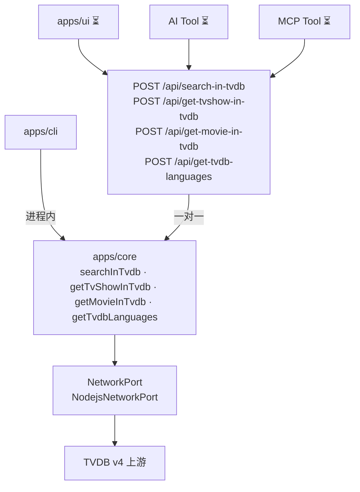

# TVDB 集成（v3）

SMM 通过 `apps/core` 统一访问 TVDB：**全部出站流量**经 `Core` + `NetworkPort`，不直连上游（浏览器侧见 [network-core.md](./network-core.md)）。

| 入口 | 状态 | 说明 |
|------|------|------|
| CLI | ✅ | `smm tvdb search` → 进程内 `Core.searchInTvdb` |
| AI Tool | ✅ | 应用内 Chat → 对应 HTTP API → Core；服务端 Chat 进程内注入 Core |
| MCP Tool | ✅ | MCP 工具进程内调用 Core 同名方法（与 HTTP 路由同一 Core） |
| Web UI | ⏳ | `smm.v3.enabled`：对应 HTTP API → Core 同名方法 |

Core 方法与 Internal HTTP **一对一**暴露。Web UI（v3）与应用内 AI 走这些 API 再进入 Core；MCP / 服务端 Chat 在进程内调用同一套 Core 方法。均不走 `POST /api/core/fetch`（那是 `BrowserNetworkPort` 的通用出站中继，见 [network-core.md](./network-core.md)）。

| Core 方法 | HTTP |
|-----------|------|
| `searchInTvdb` | `POST /api/search-in-tvdb` |
| `getTvShowInTvdb` | `POST /api/get-tvshow-in-tvdb` |
| `getMovieInTvdb` | `POST /api/get-movie-in-tvdb` |
| `getTvdbLanguages` | `POST /api/get-tvdb-languages` |



**配置**：host / apiKey / httpProxy 来自 `userConfig.tvdb`；各入口可临时覆盖（CLI flags、工具参数 `host` 等）。TVDB 的 JWT（`POST /login`，约 30 天有效）由 Core 内的 `TvdbClient` 获取并进程内缓存、临近过期自动刷新，对调用方透明。

---

## apps/core API

四个公开方法，共用 `TvdbClient` 与 `NetworkPort` 出站。每个方法一对一暴露为 HTTP：

| 方法 | HTTP | 用途 |
|------|------|------|
| `searchInTvdb(keyword, options)` | `POST /api/search-in-tvdb` | 按关键词搜索 TV series / movie |
| `getTvShowInTvdb(id, options)` | `POST /api/get-tvshow-in-tvdb` | 按 TVDB series id 拉剧集元数据（季/集 + 翻译） |
| `getMovieInTvdb(id, options)` | `POST /api/get-movie-in-tvdb` | 按 TVDB movie id 拉电影元数据（含翻译） |
| `getTvdbLanguages(options)` | `POST /api/get-tvdb-languages` | 支持的语言列表（ISO 639-3，供搜索语言下拉） |

```ts
core.searchInTvdb(keyword, {
  type: "series" | "movie",
  language?: string,   // ISO 639-3 主语言过滤（可选）；离线校验 packages/core/tvdbSupportedLanguages.ts
  host?: string,       // 默认 userConfig.tvdb.host
  password?: string,   // 默认 userConfig.tvdb.apiKey
  proxy?: string,      // 默认 userConfig.tvdb.httpProxy
})

core.getTvShowInTvdb(id, { language?, host?, password?, proxy? })
core.getMovieInTvdb(id, { language?, host?, password?, proxy? })
core.getTvdbLanguages({ host?, password?, proxy? })
```

- `TvdbClient` 经 `NetworkPort` 发请求；内部完成 `POST /login` 并缓存 JWT，`reverseProxyUrl` 语义与 TMDB 一致。
- `language` 为 ISO 639-3 代码（如 `eng`、`zho`、`yue`），须在静态 supported languages 列表中；省略时按 `preferMediaLanguage` → OS → `eng` 映射（`zh-CN`→`zho`、`en-US`→`eng`、`ja-JP`→`jpn`）。
- 搜索接口的 `language` 是**主语言过滤**（primary language filter），不返回该语言的本地化标题；本地化标题取搜索结果中的 `translations` / `name_translated` 字段（按搜索语言挑选）。
- `getTvShowInTvdb` / `getMovieInTvdb` 的 `language` 决定返回标题与剧集名的翻译语言。

实现：`apps/core/src/Core.ts`（`TvdbClient` 见 `apps/core/src/clients/TvdbClient.ts`）。

---

## CLI

### 命令

已暴露搜索与按 id 拉取**原始 TVDB API**详情（与本地 MediaMetadata / `getTvShowInTvdb` 无关）：

```bash
smm tvdb search "<keyword>" --type series|movie [options]
smm tvdb tv "<tvdbid>" -f|--format json|default --lang "<iso639-3>" [options]
smm tvdb movie "<tvdbid>" -f|--format json|default --lang "<iso639-3>" [options]
```

Core：`getTvdbSeriesById` / `getTvdbMovieById` → `{ extended, translation }`。  
勿与 `getTvShowInTvdb` / `getMovieInTvdb`（构建 MediaMetadata）混淆。

### 输出格式

```bash
$ smm tvdb search "keyword" --type series
#1 {tvdbid} {title} ({release date})
{overview}
#2 {tvdbid2} {title2} ({release date})
{overview}

$ smm tvdb tv 355969 --lang zho
extended:
  id: 355969
  name: ...
translation:
  name: ...

$ smm tvdb movie 116 -f json --lang eng
{
  "extended": { "id": 116, "name": "The Dark Knight", ... },
  "translation": { "name": "...", ... }
}
```

`default`：完整 `{ extended, translation }` 的缩进 key/value 树。  
`json`：pretty-print JSON。

### 常用场景

```bash
# 默认 host（userConfig / 内置）
smm tvdb search "keyword" --type series

# 指定语言（主语言过滤，ISO 639-3）
smm tvdb search "keyword" --type series --lang zho

# 经 HTTP/SOCKS 代理
smm tvdb search "keyword" --type series --proxy "socks5://proxy.example.com:7079"

# 自定义 host + API key
smm tvdb search "keyword" --type series \
  --host "https://api4.thetvdb.com/v4" \
  --password "your-api-key" \
  --proxy "socks5://proxy.example.com:7079"

# 按 id 拉原始详情（--lang 为翻译语言，ISO 639-3；勿传 zh-CN）
smm tvdb tv 355969 --lang zho
smm tvdb movie 116 -f json --lang eng \
  --host "https://api4.thetvdb.com/v4" \
  --password "your-api-key" \
  --proxy "socks5://proxy.example.com:7079"
```

### 参数

| 参数 | 说明 |
|------|------|
| `--type` | `series` \| `movie`（仅 `search`，必填） |
| `-f` / `--format` | `json` \| `default`（仅 `tv` / `movie`；省略为 `default`） |
| `--lang` | ISO 639-3（如 `zho`）。`search`：主语言过滤；`tv`/`movie`：翻译语言。`zh-CN` 等 IETF 标签离线报错 |
| `--host` | 覆盖 `userConfig.tvdb.host` |
| `--password` | 覆盖 `userConfig.tvdb.apiKey` |
| `--proxy` | 覆盖 `userConfig.tvdb.httpProxy` |

实现：`apps/cli/src/cli/runCli.ts`（搜索：`tvdbSearchFormat.ts`；详情树：复用 `tmdbDetailsFormat.ts`）。

---

## AI Tool

Chat 后端工具，**仅服务端也可执行**（registry 中 `backend: true`）。应用内 AI（`frontend: true`）经对应 HTTP API 进入 Core，不走 `/api/core/fetch`。MCP / 服务端 chat 在进程内注入 `Core.searchInTvdb` 等同名方法（与 HTTP 路由同一 Core）。

| 工具名 | HTTP | Core 方法 | 说明 |
|--------|------|-----------|------|
| `tvdb-search` | `POST /api/search-in-tvdb` | `searchInTvdb` | 关键词搜索 |
| `tvdb-get-movie` | `POST /api/get-movie-in-tvdb` | `getMovieInTvdb` | 电影详情 |
| `tvdb-get-tv-show` | `POST /api/get-tvshow-in-tvdb` | `getTvShowInTvdb` | 剧集详情 |
| `tvdb-get-languages` | `POST /api/get-tvdb-languages` | `getTvdbLanguages` | 支持的语言列表 |

### 参数（与 CLI 对照）

| 工具字段 | 对应 Core |
|----------|-----------|
| `keyword`, `type` | `searchInTvdb` |
| `id` | `getMovieInTvdb` / `getTvShowInTvdb` |
| `language` | `language`（同 CLI `--lang`） |
| `baseURL` | `host`（同 CLI `--host`） |

host / apiKey / proxy 未在工具参数中指定时，仍走 `userConfig.tvdb`。

类型定义：`packages/core/types/ai-tools/tvdb*.ts`  
执行与构建：`packages/core-routes/src/tools/tvdb.ts`  
注册：`packages/core-routes/src/tools/index.ts`、`chat.ts`；CLI 注入 runner：`apps/cli/src/route/chatRoute.ts`。

System prompt 指引见 `packages/core/ai-tool/systemPrompt.ts`（先 `tvdb-search`，再按 id 拉详情）。

---

## MCP Tool

与 AI Tool **同名、同 schema**，经 MCP HTTP 暴露。工具 handler 在进程内调用 `Core.searchInTvdb` 等同名方法（与 `POST /api/search-in-tvdb` 等路由同一 Core），不走 `/api/core/fetch`。

| MCP 工具名 | HTTP | Core 方法 |
|------------|------|-----------|
| `tvdb-search` | `POST /api/search-in-tvdb` | `searchInTvdb` |
| `tvdb-get-movie` | `POST /api/get-movie-in-tvdb` | `getMovieInTvdb` |
| `tvdb-get-tv-show` | `POST /api/get-tvshow-in-tvdb` | `getTvShowInTvdb` |
| `tvdb-get-languages` | `POST /api/get-tvdb-languages` | `getTvdbLanguages` |

注册：`packages/core-routes/src/mcp/toolHandlers/tvdbTools.ts`  
CLI runner：`apps/cli/src/mcp/mcp.ts`（`searchInTvdb` / `getMovieInTvdb` / `getTvShowInTvdb` / `getTvdbLanguages`）。

本地调试 MCP 客户端：`test/mcp-test-client/index.ts`（`SMM_MCP_URL` + `--tool tvdb-search`）。

---

## Web UI（⏳ v3 迁移）

Web UI 的改动需要使用 localStorage 开关 `smm.v3.enabled` 控制.

搜索入口：`MediaDatabaseSearchbox`（`TvShowPanelHeader` / `MovieHeaderV2`）。

**目标路径**（与 Core v3 一致）：UI 调用一对一 Internal HTTP，服务端再调对应 Core 方法。不经 `BrowserNetworkPort` / `POST /api/core/fetch`。


| 层 | 文件 / 接口 |
|----|------|
| UI | `apps/ui/src/components/MediaDatabaseSearchbox.tsx` |
| HTTP | `POST /api/search-in-tvdb` · `POST /api/get-movie-in-tvdb` · `POST /api/get-tvshow-in-tvdb` · `POST /api/get-tvdb-languages` |
| Core | `searchInTvdb` · `getMovieInTvdb` · `getTvShowInTvdb` · `getTvdbLanguages` |
| 出站 | `apps/cli/src/core/NodejsNetworkPort.ts` |

Web 不调用 `smm tvdb search`，但与 CLI 共用 Core 方法与 `userConfig.tvdb` 语义。

---

## 测试

| 范围 | 文件 |
|------|------|
| CLI e2e | `apps/e2e/cli/tvdb.test.ts` — 搜索 + `tvdb tv` / `tvdb movie` get-by-id |
| core-routes 单测 | `packages/core-routes/src/tools/tvdb.test.ts` |
| MCP e2e (⏳) | `apps/e2e/common/mcp/McpOther-TvdbTools.e2e.ts` — 四工具 + live TVDB（待添加） |
| MCP 客户端 | `apps/e2e/test/lib/McpClient.ts` |

MCP / 需直连 TVDB 的 e2e 在 `apps/e2e/.env.local` 配置 `TVDB_HOST`、`TVDB_API_KEY`、`TVDB_HTTP_PROXY`（网络受限环境）。

运行 CLI e2e：

```bash
cd apps/e2e/cli
bun test ./tvdb.test.ts
```

运行 MCP spec（⏳ 待 spec 添加后可用）：

```bash
cd apps/e2e
pnpm run wdio --spec ./common/mcp/McpOther-TvdbTools.e2e.ts
```
