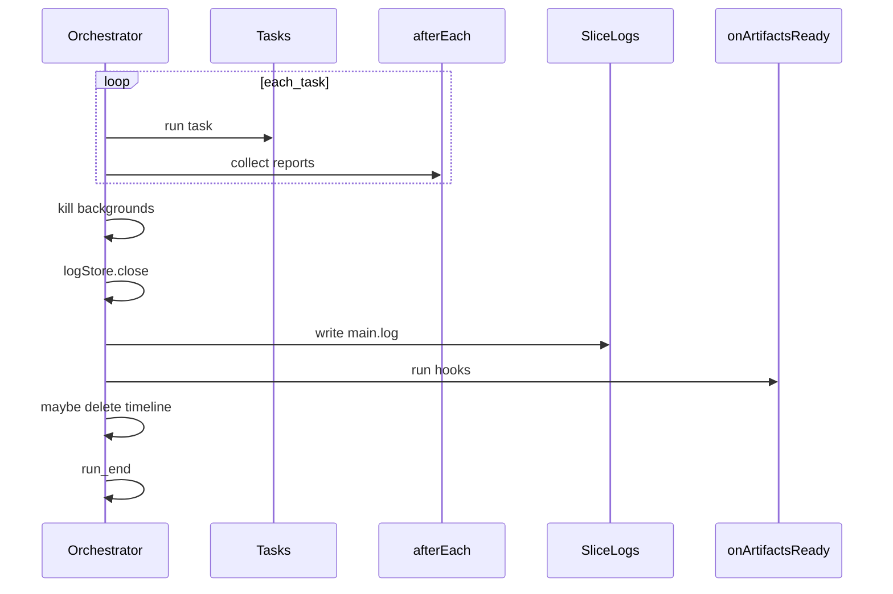

# cicd onArtifactsReady

This design document describe the high level design of a feature.
The design document is golden source and reference by one or more features.

## 1. Background

`apps/cicd` captures task stdout/stderr into `_timeline/*.jsonl` during a run, then slices plain-text per-task logs (`main.log`, background `*.log`) only after all tasks finish and backgrounds are torn down.

`afterEach` hooks run immediately after each task. At that moment `main.log` does not exist yet — only the JSONL timeline (and side artifacts copied by hooks such as `collect-wdio-report`) are available.

Callers need a second hook point that runs once all collectible artifacts are ready, including sliced logs, so post-run checks (e.g. assert patterns in `main.log`) can run from scenario JSON.

## 2. Architecture

## 2.1 Project Level Architecture

- **apps/cicd** — JSON-config task runner; owns schema, orchestration, log slicing, and hooks.
- **apps/e2e / ci/** — Consumers: scenario configs declare `onArtifactsReady` commands (e.g. `check-log.ts`) that read `{CICD_OUTPUT_DIR}/{taskName}/main.log`.

## 2.2 App Level Architecture

Within `apps/cicd`:

- `config.ts` — Zod `onArtifactsReady: Hook[]` (same shape as `afterEach`).
- `orchestrator.ts` — After log slice, before optional `_timeline` deletion, runs `onArtifactsReady` serially.
- Hook env: `CICD_ARTIFACT_DIR` / `CICD_OUTPUT_DIR` (run artifact root), `CICD_EXIT_CODE` (task aggregate, before hook results), `CICD_TASK_NAMES` (comma-separated).

## 2.3 Key Design

| Concern | Decision |
|---------|----------|
| Timing | After slice; before `keepRawTimeline` cleanup |
| Frequency | Once per run (not per task) |
| Failure | Any hook exit ≠ 0 → run `exitCode = 1` |
| `when` | `always` (default) or `success` (skip unless all tasks exited 0) |
| Early failure | No tasks / no slice → hooks skipped |
| vs afterEach | afterEach = per-task, no `main.log`; onArtifactsReady = end-of-run, `main.log` present |

## 3. User Stories

### 3.1 Post-run log check after e2e artifacts are ready

* **Given** a cicd config with an e2e task and `onArtifactsReady` hook that reads `main.log`
* **When** the run completes tasks, collects wdio reports via `afterEach`, slices logs
* **Then** the hook runs with `CICD_OUTPUT_DIR` pointing at the run dir and `{taskName}/main.log` exists as plain text

