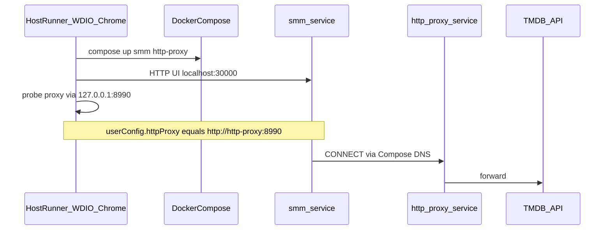

# Docker Compose E2E CI

This design document describe the high level design of a feature.
The design document is golden source and reference by one or more features.

Date: 2026-07-30
Status: Approved for implementation

## 1. Background

Docker e2e already runs common specs against `smm:latest` via `bun ci/run-e2e-test.ts --platform docker`. The app container was started with a bare `docker run`. HTTP-proxy specs on Docker cannot use the host embedded `proxy-chain` (`127.0.0.1` is unreachable from the container), so they relied on `TMDB_HTTP_PROXY` / `TVDB_HTTP_PROXY` plus `host.docker.internal` rewrites — fragile on Linux GitHub Actions.

This feature switches the docker platform lifecycle to **Compose dual-service** (`smm` + `http-proxy`) while keeping **WDIO/Chrome on the host** (Host Runner). First CI scope is `common/config` only, manual `workflow_dispatch`.

## 2. Architecture

## 2.1 Project Level Architecture

```
ci/run-e2e-test.ts --platform docker --spec ./common/config/*.e2e.ts
        │
        ▼
apps/cicd  background: bun ci/e2e-docker-container.ts
        │
        ├── docker compose -f apps/e2e/docker/docker-compose.yml up
        │     ├── http-proxy  (proxy-chain :8990)
        │     └── smm         (smm:latest :30000/:30001/:30002)
        ├── wait-ready → E2E_DOCKER_UI_ORIGIN (default http://localhost:30000)
        └── tasks → pnpm wdio:docker (host Chrome)
```

- **apps/docker** — builds `smm:latest` (unchanged; CI builds intermediates then assemble).
- **apps/e2e/docker** — compose file + http-proxy image; WDIO config unchanged.
- **ci/** — compose lifecycle; env forwarding for UI origin and proxy probe URL.

## 2.2 App Level Architecture

### Compose services

| Service | Image | Ports (host) | Role |
|---------|-------|--------------|------|
| `http-proxy` | build `apps/e2e/docker/http-proxy` | `8990:8990` | Forward HTTP proxy for e2e userConfig |
| `smm` | `smm:latest` | `30000/30001/30002` | App under test; DNS name `http-proxy` for proxy URL |

Media volume: host `os.tmpdir()/smm` → `/media` (tutorials sync unchanged).

### Env contract

| Env | Consumer | Meaning |
|-----|----------|---------|
| `E2E_DOCKER_UI_ORIGIN` | Host WDIO + wait-ready | UI base URL (default `http://localhost:30000/`) |
| `TMDB_HTTP_PROXY` / `TVDB_HTTP_PROXY` | Written into userConfig | Must resolve **inside smm** (CI: `http://http-proxy:8990`) |
| `E2E_HTTP_PROXY_PROBE_URL` | Host `isHttpProxyAccessible` | Published localhost probe (CI: `http://127.0.0.1:8990`) |
| `SMM_AUTH_TOKEN` | Container + WDIO | Auth bearer |

`dockerHttpProxyEnvForContainer` still rewrites loopback → `host.docker.internal` for developers using a host proxy; Compose service names are left unchanged.

### Lifecycle

`ci/e2e-docker-container.ts` runs `docker compose up` in the foreground (cicd `container` timeline), and `compose down` / stop on signals — same teardown contract as former `docker run --rm`.

## 2.3 Key Design

1. **Host Runner** — Chrome stays on the runner; only SMM↔proxy moves onto Compose DNS (eliminates Linux `host.docker.internal` for the e2e proxy).
2. **Split probe vs config URL** — Host cannot resolve `http-proxy`; probe via published port; app config uses Compose DNS.
3. **CI first suite** — `common/config` only; other suites migrate later by expanding the workflow matrix.

## 3. User Stories

### 3.1 Run config suite against Compose on CI

* **Given** - `workflow_dispatch` on `E2E Tests for Docker` and amd64 `smm:latest` built in-job
* **When** - job runs `bun ci/run-e2e-test.ts --platform docker --spec "./common/config/*.e2e.ts"` with compose proxy env
* **Then** - all six config specs pass and artifacts land under `artifacts/cicd/`



### 3.2 Local docker platform uses Compose

* **Given** - `smm:latest` exists and Docker Compose is available
* **When** - developer runs `--platform docker --spec ./common/config/ConfigDialog-Settings.e2e.ts`
* **Then** - compose starts both services, wait-ready succeeds, WDIO runs, compose tears down

## 4. Non-Goals

- Pushing images to GHCR
- Containerizing the test runner
- Migrating suites beyond `common/config` in the first CI workflow
- Changing Ohos / Electron / desktop proxy behavior beyond shared probe env

### CI: Assemble uses host image store

GitHub Actions `docker/setup-buildx-action` defaults to the `docker-container` driver. Intermediate images built with `buildx --load` land in the **host** daemon; a subsequent assemble `FROM smm-cli-build:latest` on the container builder cannot see them (BuildKit tries Docker Hub and fails).

**Fix:** set `driver: docker` on setup-buildx in `.github/workflows/e2e-docker.yml` so build and assemble share the same image store (amd64-only is enough for this workflow).

## 5. Verification

- Unit tests for compose helpers, UI origin env, proxy probe env.
- Manual / CI: six `common/config` specs green under `--platform docker`.
- CI assemble step succeeds after intermediates are `--load`'d (buildx `driver: docker`).
