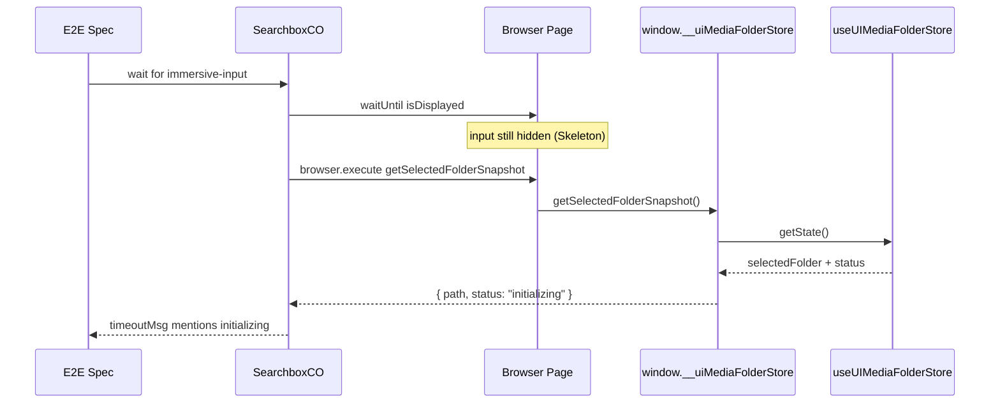

# E2E UIMediaFolderStore Window Bridge

This design document describe the high level design of a feature.
The design document is golden source and reference by one or more features.

## 1. Background

E2E failures that wait for `[data-testid="immersive-input"]` often surface as
“immersive-input was not displayed”, even when the real cause is that the
selected media folder is still in a busy `UIMediaFolderStatus`
(`initializing`, `loading`, `updating`, etc.).

`TvShowPanelHeader` intentionally hides ImmersiveSearchbox while those
statuses are active (shows Skeleton instead). Developers need the failure
message to name the folder status so they can diagnose Ohos/slow-init
scenarios quickly.

`browser.execute` can only see page globals. The Zustand store
`useUIMediaFolderStore` is module-scoped and not on `window` today. The
project already uses page bridges for automation (`window._smm_status`,
`window.__jobOrchestrator`).

## 2. Architecture

## 2.1 Project Level Architecture

```text
apps/ui                          apps/e2e
─────────                        ────────
uiMediaFolderStore (Zustand)
        │
        ▼
window.__uiMediaFolderStore  ──browser.execute──►  e2e helper
  (read-only snapshot API)                         SearchboxCO / steps
```

- **apps/ui**: owns store + narrow read-only `window` bridge + `Window` typing.
- **apps/e2e**: reads snapshot via WDIO `browser.execute`; builds status-aware
  timeout messages; optionally waits until folder is ready before asserting
  searchbox.

No changes to `apps/cli`, Electron packaging, or Ohos native code.

## 2.2 App Level Architecture

### UI (`apps/ui`)

- After `create()` of `useUIMediaFolderStore`, register a **read-only** bridge
  on `window.__uiMediaFolderStore`.
- Bridge API returns plain JSON-serializable snapshots only (no actions, no
  store instance).
- Types extended in `apps/ui/src/types/global.d.ts`.
- Always available (same policy as `_smm_status`): small surface, e2e runs
  against both Vite and packaged UI.

### E2E (`apps/e2e`)

- Helper wraps `browser.execute` and centralizes:
  - reading selected folder path + status
  - classifying “busy” statuses that hide immersive-input
  - building timeout messages
- `SearchboxCO` / `waitForDisplay` call sites for immersive-input use that
  helper when building `timeoutMsg`.
- `unknown TV show folder was imported` waits until selected folder leaves
  busy statuses (aligned with product init timeout of 3 minutes), so
  subsequent `searchbox input is empty` is not racing init.

## 2.3 Key Design

### Bridge contract (UI → page)

```ts
type UIMediaFolderStoreBridge = {
  /** Selected folder path + status, or null if nothing selected / bridge missing rows. */
  getSelectedFolderSnapshot(): {
    path: string
    status: UIMediaFolderStatus
  } | null
}
```

Rules:

- **Read-only**: no `set*`, no `updateFolderStatus`, no raw `getState` dump of actions.
- Return value must be structured-clone friendly for WDIO.
- Path comparison uses store’s native `path` / `selectedFolder` as-is (no
  Path rewriting inside the bridge).

### Busy statuses (must match `TvShowPanelHeader.isUpdatingTvShow`)

Immersive input is hidden when selection is missing OR status is one of:

- `idle`
- `pending_for_initialization`
- `initializing`
- `loading`
- `updating`

Bridge consumers treat these as “folder not ready for searchbox”.

### Timeout message policy

When waiting for immersive-input fails:

1. If snapshot status is busy →  
   `Folder was still {status} after {timeout}ms (immersive-input hidden until status=ok)`
2. If snapshot is null / bridge missing →  
   keep fallback mentioning immersive-input + “could not read folder status”
3. If status is `ok` (or other non-busy) but input still missing →  
   `immersive-input was not displayed after {timeout}ms (folder status={status})`

### Out of scope

- Writing store state from e2e.
- Exposing full Zustand store / React Query caches.
- Fixing SCF/TMDB network slowness (init may still take up to 3 minutes).
- Changing product UI visibility rules.

## 3. User Stories

### 3.1 Developer sees initializing in e2e failure

* **Given** - An unknown TV show folder was imported and auto-init is still running (`status=initializing`)
* **When** - An e2e step waits for immersive-input and times out
* **Then** - The error message states the folder was still initializing (not only that immersive-input was invisible)



### 3.2 Given step finishes after init (stability)

* **Given** - `unknown TV show folder was imported` runs on a slow platform (e.g. Ohos)
* **When** - The step completes successfully
* **Then** - Selected folder status is no longer busy (or the step fails with a status-aware message), so later searchbox asserts do not race init
