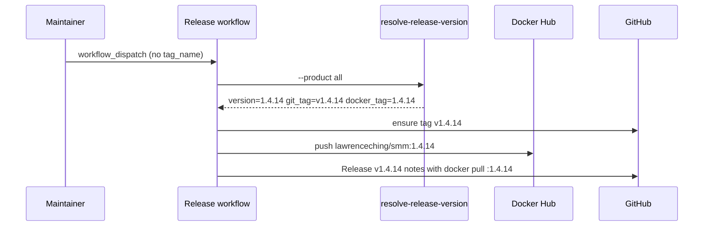

# Release version from package.json

This design document describe the high level design of a feature.
The design document is golden source and reference by one or more features.


## 1. Background

Release CI previously required a manual `tag_name` workflow input (e.g. `v1.4.14`). That value was reused as the Docker Hub image tag, producing `lawrenceching/smm:v1.4.14`. Maintainers expect:

- Git tag / GitHub Release: `v` + semver (`v1.4.14`)
- Docker Hub tag: semver **without** `v` (`1.4.14`)
- Version comes from in-repo `package.json`, not a free-form Actions input

Electron installers already embed `apps/electron/package.json` `version`. Docker had no version field.

## 2. Architecture

## 2.1 Project Level Architecture

| Source | Consumed by |
|--------|-------------|
| `apps/electron/package.json` → `version` | Release Electron, joint Release (`all`) |
| `apps/docker/package.json` → `version` | Release Docker, joint Release (`all`) |
| `ci/resolve-release-version.ts` | All release workflows |

Joint Release requires `electron.version === docker.version` (or a single `version_override`).

## 2.2 App Level Architecture

```
workflow_dispatch (optional version_override)
        │
        ▼
 resolve-release-version  ──► version / git_tag / docker_tag
        │
        ├─► ensure-release-tag(git_tag)
        ├─► Electron build / GitHub Release (git_tag)
        └─► Docker Hub push (docker_tag) + Release notes pull line (docker_tag)
```

## 2.3 Key Design

- **Single helper**: `ci/resolve-release-version.ts` emits `KEY=VALUE` for `GITHUB_OUTPUT`.
- **Products**: `--product electron|docker|all`.
- **Override**: optional `--override <semver>` (leading `v` stripped) for emergencies; skips package.json read for the resolved version (for `all`, still may validate or replace both).
- **Docker tag** = bare semver; **Git tag** = `v` + semver.
- Top-level Release workflows no longer require `tag_name`. Orchestrator may still pass resolved `tag_name` into reusable/child workflows.

## 3. User Stories

### 3.1 Joint release without typing a version

* **Given** - `apps/electron/package.json` and `apps/docker/package.json` both have `"version": "1.4.14"`
* **When** - maintainer runs **Release** with no version input
* **Then** - Git tag `v1.4.14` is ensured, Docker image `lawrenceching/smm:1.4.14` is pushed, Release notes show `docker pull lawrenceching/smm:1.4.14`



### 3.2 Version mismatch fails fast

* **Given** - electron `1.4.14` and docker `1.4.15`
* **When** - joint Release runs
* **Then** - resolve step fails before build/publish
