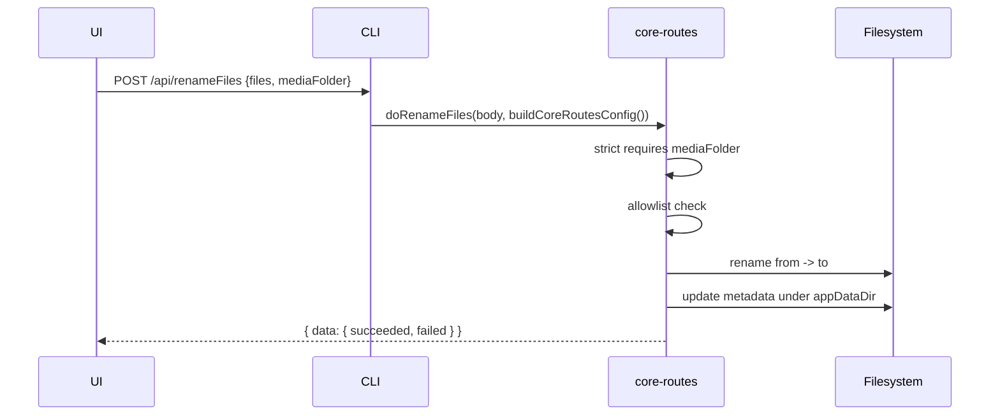

# renameFiles strict mediaFolder and Linux config path

This design document describe the high level design of a feature.
The design document is golden source and reference by one or more features.


## 1. Background

`POST /api/renameFiles` failed on Linux CI for context-menu episode rename
(`TVShow-RenameEpisodeFile.e2e.ts`) with `Media folder not found`, while
bulk rename and `RenameFolder` passed on the same runners.

Root causes:

1. **CLI wiring**: `apps/cli/src/route/RenameFiles.ts` passed only
   `appDataDir` into `doRenameFiles`. On Linux, `userDataDir`
   (`~/.config/smm`) differs from `appDataDir` (`~/.local/share/smm`).
   `readUserConfig` fell back to `appDataDir` and missed `smm.json`.
2. **Optional mediaFolder**: Context-menu callers omitted `mediaFolder`,
   forcing folder resolution via `smm.json` folders. That path broke when
   config was read from the wrong directory.
3. **Unused allowlist**: The CLI built an allowlist via `buildAllowlist()`
   but `doRenameFiles` never validated `from`/`to` against it.

## 2. Architecture

## 2.1 Project Level Architecture

- `apps/cli` mounts Hono `POST /api/renameFiles` and builds
  `CoreRoutesConfig` via `buildCoreRoutesConfig` (same as `RenameFolder`).
- `packages/core-routes` owns `doRenameFiles` business logic (shared by
  CLI and OHOS core-routes HTTP server).
- `apps/ui` calls `/api/renameFiles` with `mediaFolder` for all product
  rename flows.

## 2.2 App Level Architecture

```
UI renameFiles({ files, mediaFolder })
  → CLI handleRenameFiles
  → buildCoreRoutesConfig (allowlist + hello.userDataDir + appDataDir)
  → doRenameFiles
       strict (default true) requires mediaFolder
       allowlist check on mediaFolder + from/to
       validateRenameOperations (within media folder)
       executeBatchRenameOperations
       update metadata + broadcast
```

## 2.3 Key Design

- **`strict` (default `true`)**: HTTP clients must provide `mediaFolder`.
  `strict: false` remains for legacy / tests that resolve the folder from
  `smm.json` folders via `getMediaFolder`.
- **Allowlist**: Reuse `validatePathIsInAllowlist` with the same
  `buildAllowlist()` prefixes as `writeFile` / `deleteFile`.
- **Config**: Always pass `hello.userDataDir` so Linux and Windows both
  read the correct `smm.json`.

## 3. User Stories

### 3.1 Context-menu rename on Linux

* **Given** - A managed TV show folder is listed in `~/.config/smm/smm.json`
* **When** - The user renames an episode file from the context menu
* **Then** - `/api/renameFiles` receives `mediaFolder`, passes allowlist
  checks, renames video + associated files, and updates metadata



### 3.2 Reject missing mediaFolder under strict mode

* **Given** - A client calls `/api/renameFiles` without `mediaFolder`
* **When** - `strict` is omitted or `true`
* **Then** - The API returns
  `Validation Failed: mediaFolder is required when strict is true`
  and does not touch the filesystem
