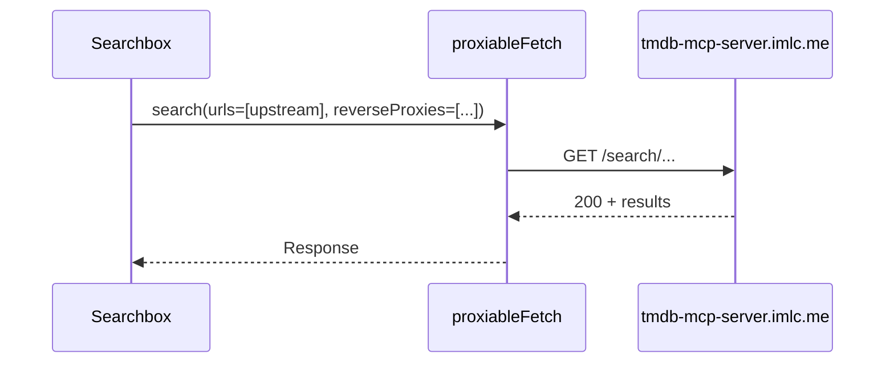
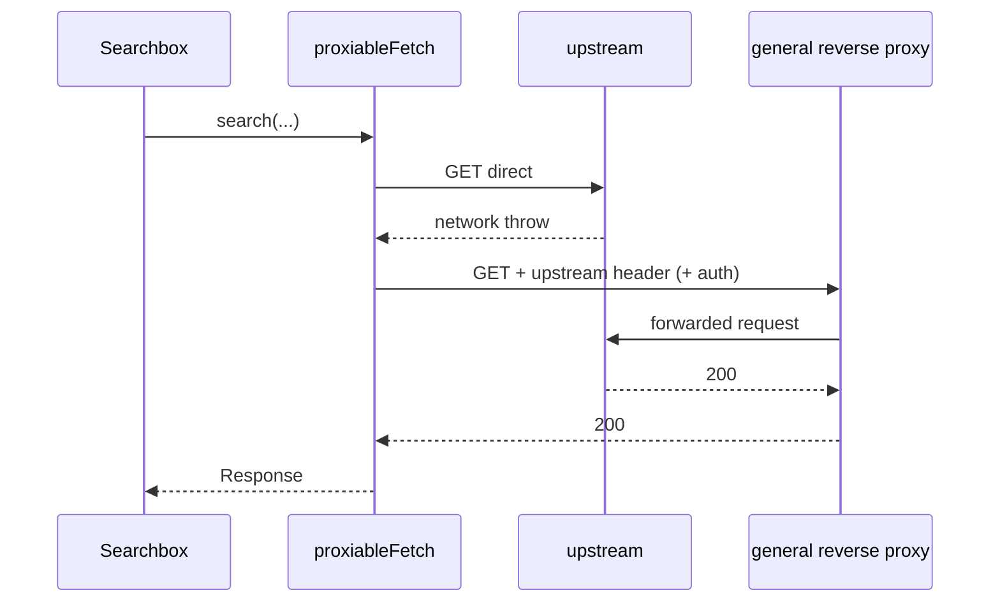

# MediaDatabaseSearchbox: Direct Upstream then General Reverse Proxy

This design document describes the high-level design for Searchbox media-database search failover: try the SMM-managed upstream directly first; on network failure only, retry through discovered general reverse proxies.

## 1. Background

`MediaDatabaseSearchbox` currently searches TMDB/TVDB only through reverse proxies (`useReverseProxyBaseUrls` → `searchTmdb` / `getTVDBv4Client`), with `https://tmdb-mcp-server.imlc.me/api/{tmdb|tvdb}` as the upstream base URL.

When the upstream host is reachable from the client, a direct request is simpler and avoids proxy latency/quota. When the upstream is unreachable (common in restricted networks), the client should fall back to general reverse proxies discovered via `/api/discover` and latency probing (`reverseProxyServiceDiscovery`).

General reverse proxies accept an upstream base URL header and an optional proxy-authorization header (see `reverse-proxy-readme.md`). Local SMM reverse proxy is out of scope for this Searchbox failover path.

Related prior work:

- `docs/superpowers/specs/2026-07-09-searchbox-reverse-proxies-design.md` — proxy-only Searchbox path
- `docs/superpowers/specs/2026-07-09-proxiable-fetch-design.md` — reusable direct-then-proxy fetch utility

## 2. Architecture

### 2.1 Project Level Architecture

| Layer | Role |
|-------|------|
| `packages/core` | Existing `proxiableFetch` (unchanged algorithm) |
| `apps/ui` | Searchbox, proxy candidate hook, search helper, proxy request headers |
| CLI `/api/discover` | Supplies `reverseProxies` list (already used by discovery) |

No CLI or Electron packaging changes.

### 2.2 App Level Architecture

```
MediaDatabaseSearchbox.handleSearch
        │
        ▼
useGeneralReverseProxyUrls
  (prefer + discovered; exclude local SMM proxy)
        │
        ▼
search helper (UI lib)
  proxiableFetch({
    urls: [SMM_*_DEFAULT_UPSTREAM],
    reverseProxies: general proxy URLs,
    abortOnHttpError: false,
    beforeFetch: inject proxy headers only when proxied,
  })
        │
        ├── TMDB path: /search/{movie|tv}?query&language
        └── TVDB path: /search?query&type&language
```

**Out of scope:** metadata detail queries, scrape, language-list hooks, folder recognition, AI transport — they keep using the local SMM reverse proxy via existing `searchTmdb` / `getTVDBv4Client`.

### 2.3 Key Design

#### Decisions (locked)

| Item | Choice |
|------|--------|
| Order | Direct upstream first, then general reverse proxies |
| Scope | `MediaDatabaseSearchbox` TMDB + TVDB search only |
| Proxy list | Prefer + discovered general proxies; **exclude** local SMM `appConfig.reverseProxyUrl` |
| Failover trigger | Network/connection failure only (`fetch` throw). HTTP non-2xx does **not** failover |
| Empty results | Treat as success with no hits; do not try next hop |
| Implementation | Reuse `proxiableFetch` with `abortOnHttpError: false` |

#### Components

| Unit | Responsibility |
|------|----------------|
| `useGeneralReverseProxyUrls` (new or filtered existing hook) | Ordered general reverse-proxy candidates: preferred from localStorage, then discovered; no local SMM proxy |
| Search helper in `apps/ui/src/lib/` | One search attempt sequence via `proxiableFetch`; `beforeFetch` adds upstream + optional proxy-authorization headers when `proxy` is set (look up `authorizationMethod` by proxy URL from the candidate list); parses JSON |
| `MediaDatabaseSearchbox.handleSearch` | Calls helper; maps success/empty/failure to existing UI error strings |
| `buildProxyRequestHeaders` | Reused for proxied attempts only |
| `proxiableFetch` / `reverseProxyServiceDiscovery` | Unchanged |

#### Proxy headers (proxied attempts only)

- Upstream base URL header pointing at `SMM_TMDB_DEFAULT_UPSTREAM` or `SMM_TVDB_DEFAULT_UPSTREAM`
- Optional proxy-authorization when `authorizationMethod === 'date-token'`
- Direct attempts send no proxy-specific headers

#### Error / edge behaviour

| Case | Behaviour |
|------|-----------|
| Direct network failure | Try general proxies in order |
| Direct HTTP non-2xx | No failover; surface as search failure |
| 2xx with empty results | Stop; show no-results |
| Proxy network failure | Try next proxy |
| All attempts fail | `searchFailed` |
| Empty proxy list | Direct only |
| AbortSignal | Stop immediately; no further attempts |

## 3. User Stories

### 3.1 Direct upstream reachable

* **Given** the SMM TMDB/TVDB upstream is reachable from the browser
* **When** the user searches in MediaDatabaseSearchbox
* **Then** the client calls the upstream directly and does not use a general reverse proxy



### 3.2 Direct unreachable, general proxy works

* **Given** the upstream is unreachable (network error)
* **And** at least one general reverse proxy is discovered
* **When** the user searches
* **Then** the client retries via the proxy with upstream and optional proxy-authorization headers
* **And** search results are shown on success



### 3.3 Direct returns HTTP error

* **Given** the upstream responds with HTTP 4xx/5xx
* **When** the user searches
* **Then** the client does not fall back to reverse proxies
* **And** the UI shows search failed

### 3.4 Empty results

* **Given** a hop returns HTTP 2xx with an empty result list
* **When** the user searches
* **Then** the UI shows no results and does not try further hops
