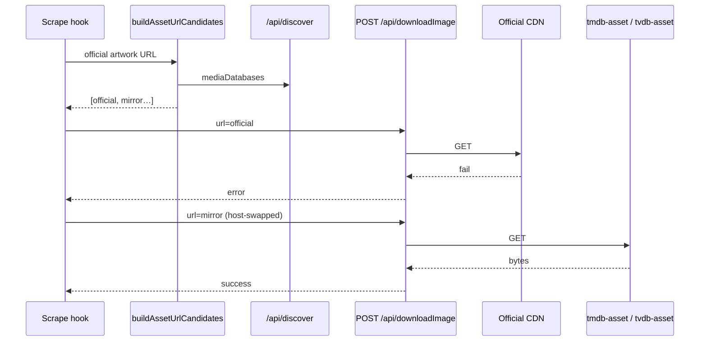

# Asset Image Multi-Server Failover (UI-side)

This design document describes scrape / proxied image download failover across official TMDB/TVDB CDN hosts and discover-configured asset mirrors.

## 1. Background

Scraping and some UI image loads download posters, fanart, thumbnails, and related artwork from hardcoded CDN hosts (`image.tmdb.org`, `artworks.thetvdb.com`). When those hosts are unreachable (common in some networks), scrape fails even though discover already advertises `tmdb-asset` / `tvdb-asset` mirror bases.

Metadata API traffic already fails over via discover `tmdb` / `tvdb` entries and `fetchWithFailover`. Image downloads do not: the UI builds one absolute URL and calls `POST /api/downloadImage` (or `GET /api/image` via `useImage`) once.

Discover currently drops unknown mediaDatabase types, so `tmdb-asset` / `tvdb-asset` never reach the UI.

**Constraints locked in brainstorming:**
- Failover lives on the **UI side**.
- `doDownloadImage` and `doDownloadImageAsFile` in `@smm/core-routes` stay unchanged.
- Scope: server-mediated fetches only (`POST /api/downloadImage`, `GET /api/image`). Direct browser `` is out of scope.
- Mirror URL construction: **host swap** (keep path/query).
- Candidate order: **official / original URL first**, then discover asset bases.

## 2. Architecture

## 2.1 Project Level Architecture

```
Remote config.json
  mediaDatabases: tmdb | tvdb | tmdb-asset | tvdb-asset
        │
        ▼
apps/cli  GET /api/discover  (normalize + return asset types)
        │
        ▼
apps/ui   fetchDiscoverConfig()
        │
        ├── buildAssetUrlCandidates(url)
        │         │
        │         ▼
        │   [official, mirror1, mirror2, …]
        │
        ├── downloadImageWithFailover → POST /api/downloadImage (unchanged core)
        └── fetchProxiedImageWithFailover → GET /api/image (unchanged core)
```

No changes to Electron / OHOS download core beyond consuming the same CLI discover payload when applicable.

## 2.2 App Level Architecture

### Discover (CLI + UI)

- Extend `MediaDatabaseType` with `'tmdb-asset' | 'tvdb-asset'`.
- CLI `normalizeMediaDatabaseEntry` keeps these types (same `url` / `authorizationMethod` normalization as `tmdb`/`tvdb`).
- UI Zod schema and `MediaDatabaseEndpoint` accept the new types.
- `authorizationMethod` is preserved for future use; v1 host-swap fetches do not require special auth headers for asset mirrors (mirrors are treated as public CDN replacements). If a mirror later needs date-token, that can be added without changing candidate ordering.

### Candidate builder (`apps/ui/src/lib/assetImageUrls.ts`)

Pure helpers:

- `TMDB_IMAGE_HOSTS` — e.g. `image.tmdb.org`
- `TVDB_ARTWORK_HOSTS` — e.g. `artworks.thetvdb.com` (and any other known TVDB artwork hosts already used by the app)
- `buildAssetUrlCandidates(url: string, config: DiscoverConfig): string[]`
  - Normalize protocol-relative `//…` to `https://…`.
  - If host matches TMDB image CDN → candidates = `[original, …hostSwap(each tmdb-asset base)]`.
  - If host matches TVDB artwork CDN → same with `tvdb-asset`.
  - Otherwise → `[original]` only.
  - Deduplicate identical URLs; skip invalid bases.

Host-swap: replace `origin` of the original URL with the asset `baseUrl` origin; preserve `pathname` + `search` + `hash`.

### Download wrappers

- `apps/ui/src/api/downloadImageWithFailover.ts`
  - Loads discover config (injectable for tests).
  - For each candidate, calls existing `downloadImageApi`.
  - Stop on success (no `error`), or on `ExistedFileError`, or on abort.
  - On other errors, try next candidate; if all fail, return the last response/error.

- `useImage` uses the same candidate list against `/api/image?url=…` until a blob succeeds or abort/placeholder.

### Call sites

Replace `downloadImageApi` with `downloadImageWithFailover` in:

- `useScrapePosterMutation`
- `useScrapeFanartMutation`
- `useDownloadThumbnailFromTMDB` / `useDownloadThumbnailFromTVDB`
- `downloadSeasonPoster` (`apps/ui/src/lib/utils.ts`)

Keep raw `downloadImageApi` exported for intentional single-URL / non-CDN cases.

## 2.3 Key Design

| Piece | Role |
|-------|------|
| `buildAssetUrlCandidates` | Single source of truth for rewrite + ordering; unit-tested |
| `downloadImageWithFailover` | Scrape / file persistence path |
| `useImage` candidate loop | Display path that already goes through `/api/image` |
| Discover type widen | Unblocks reading asset servers from remote config |
| Unchanged core-routes | Download remains a dumb single-URL fetcher |

**Non-goals:** rewriting direct CDN `` tags; putting failover inside `doDownloadImage*`; changing metadata API failover.

## 3. User Stories

### 3.1 Scrape poster when official CDN is blocked

* **Given** a TV show/movie folder recognized via TMDB or TVDB, and discover lists at least one matching `*-asset` base
* **When** scrape downloads a poster and `image.tmdb.org` / `artworks.thetvdb.com` fails
* **Then** the UI retries the same path on the asset mirror and the file is written successfully



### 3.2 useImage proxied load with failover

* **Given** a remote HTTP(S) artwork URL for a CDN host known to the candidate builder
* **When** `useImage` loads via `/api/image` and the official host fails
* **Then** it retries with host-swapped mirror URLs before falling back to the placeholder

### 3.3 Unknown / local URLs unchanged

* **Given** a `file://` URL or an unrecognized image host
* **When** download or `useImage` runs
* **Then** only the original URL is attempted (no discover asset rewrite)

## 4. Testing

- Unit tests for `buildAssetUrlCandidates` (TMDB, TVDB, unknown host, empty discover, dedupe).
- Unit tests for `downloadImageWithFailover` (first fail → second ok; ExistedFile stops; abort stops).
- Existing `Scrape.e2e.ts` remains the integration smoke test; optionally later relax the hard skip that probes only the official TVDB CDN when mirrors are available.
