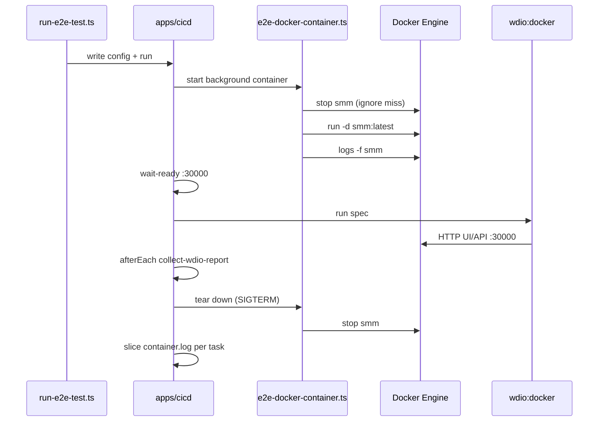

# Docker E2E Platform Support

This design document describe the high level design of a feature.
The design document is golden source and reference by one or more features.

Date: 2026-07-29
Status: Approved for implementation planning

## 1. Background

`ci/run-e2e-test.ts` already drives e2e against three platforms: `desktop` (local cli + ui), `ohos` (device attach), and `electron` (installed app). Common specs under `apps/e2e/common/` are intended to also run against the Docker distribution of SMM (`smm:latest`), which serves the Web UI on host port `30000`.

Today there is no `--platform docker` profile: no container lifecycle, no WDIO config aimed at the container UI, and no cicd artifact path for container stdout.

## 2. Architecture

## 2.1 Project Level Architecture

```
ci/run-e2e-test.ts  --platform docker --spec <required>
        │
        ▼
artifacts/e2e/config.json  →  apps/cicd/run.ts
        │
        ├── background: container  →  ci/e2e-docker-container.ts
        │                             (docker stop/run + docker logs -f)
        ├── wait-ready             →  poll http://localhost:30000
        ├── tasks                  →  pnpm wdio:docker --spec ...
        └── afterEach              →  ci/collect-wdio-report.ts
```

- **apps/docker** — produces `smm:latest` (out of scope for this feature; must already exist).
- **apps/e2e** — new `docker/wdio.conf.ts` + `wdio:docker` script; URL/platform helpers learn `E2E_PLATFORM=docker`.
- **apps/cicd** — unchanged; time-slices background named `container` into `{task}/container.log`.
- **ci/** — runner + container lifecycle + docker wait-ready.

## 2.2 App Level Architecture

### `ci/run-e2e-test.ts`

- Extend `Platform` with `'docker'`.
- `--platform docker` requires at least one `--spec` (no default suite).
- Spec rules: allow `common/**` and other non-exclusive paths passed explicitly; reject `ohos/` and `electron/` exclusives (same spirit as desktop vs platform-specific specs).
- `buildDockerConfig(specs)` writes cicd JSON:
  - `env`: `E2E_PLATFORM=docker`, `BROWSER_LOG_ENABLED=true`, `NETWORK_LOG_ENABLED=true`, `SMM_AUTH_TOKEN` (default `ChangeMe123`), optional `EXTERNAL_CONFIG_FILE_URL`.
  - `background`: one entry `{ name: 'container', command: 'bun ci/e2e-docker-container.ts' }`.
  - `tasks`: wait-ready, then one WDIO task per spec via `pnpm wdio:docker --spec ./...`.
  - `afterEach`: `collect-wdio-report` (html + network), same as desktop.

### `ci/e2e-docker-container.ts`

Long-lived cicd background process:

1. Ensure host media dir: `path.join(os.tmpdir(), 'smm')`.
2. `docker stop smm` (ignore if missing).
3. `docker run -d --rm --name smm -p 30000:30000 -p 30002:30002 -e SMM_AUTH_TOKEN=... -v <media>:/media smm:latest`.
4. `docker logs -f smm` — stdout/stderr become the cicd timeline for background `container`.
5. On process signal / exit: stop following logs and `docker stop smm` (`--rm` removes the container).

Assumes Docker CLI is available and `smm:latest` is present. Does not build the image.

### Wait-ready

Docker wait probes only `http://localhost:30000` with Bearer `SMM_AUTH_TOKEN` (UI and API share this port in the image). Does not wait for Vite.

Use a dedicated `ci/wait-for-docker-e2e-ready.ts` (do not extend the Vite-aware desktop wait script).

### `apps/e2e/docker/wdio.conf.ts`

Isolated Chrome WDIO config (Approach 2), analogous to `electron/` and `ohos/`:

- Shared `WDIO_CACHE_DIR`, mocha, reporters patterns appropriate for browser against a remote HTTP UI.
- BiDi browser console capture when `BROWSER_LOG_ENABLED=true` (streams into WDIO stdout → `{task}/main.log`).
- Network log hooks when `NETWORK_LOG_ENABLED=true`.
- Specs opened via `resolveUiPageUrl` with docker origin.

Package script: `"wdio:docker": "wdio run ./docker/wdio.conf.ts"`.

### URL / platform helpers

- `E2E_PLATFORM=docker` → UI origin `http://localhost:30000/` (+ `?token=` when `SMM_AUTH_TOKEN` set).
- `testbedOs` remains `undefined` / `general` for docker: fixture paths come from container `/api/hello` (`tmpDir`), not host Vite paths.

## 2.3 Key Design

1. **Container as cicd background** — align with desktop’s `cli` background: stream `docker logs -f`, let cicd slice per-task `{task}/container.log`. Do not dump full `docker logs` only in `afterEach`.
2. **Browser console via BiDi** — same as desktop `BROWSER_LOG_ENABLED`; do not `docker cp` the in-container `browser.log` file.
3. **Dedicated WDIO config** — `apps/e2e/docker/wdio.conf.ts` keeps docker Chrome/baseUrl concerns out of the main desktop conf.
4. **Explicit specs only** — no default glob for docker; CI/agents must pass `--spec`.
5. **Full lifecycle** — runner starts and stops the named container `smm`; no attach-only mode in this design.

## 3. User Stories

### 3.1 Run a common spec against Docker

* **Given** - `smm:latest` exists and Docker is available
* **When** - developer runs `bun ci/run-e2e-test.ts --platform docker --spec ./common/movie/SearchMovie.e2e.ts`
* **Then** - container starts, UI is reachable on `:30000`, WDIO runs the spec, artifacts include `main.log`, `container.log`, `wdio-report/`, and `network-log/`, and the container is stopped afterward



### 3.2 Reject docker run without --spec

* **Given** - user invokes `--platform docker` with no `--spec`
* **When** - argv is parsed
* **Then** - runner exits with a clear usage error before writing cicd config

### 3.3 Per-spec container log alignment

* **Given** - a docker e2e run with multiple specs
* **When** - cicd finishes and slices background timelines
* **Then** - each task directory contains `container.log` covering that task’s time window (same mechanism as desktop `cli.log`)

## 4. Artifacts

```
artifacts/cicd/<commandId>/
└── <SpecFile.e2e.ts>/
    ├── main.log          # WDIO + BiDi browser console
    ├── container.log     # sliced docker logs
    ├── wdio-report/
    └── network-log/
```

## 5. Non-Goals

- Building or publishing `smm:latest`
- Attach-to-existing-container mode
- Collecting the CLI file `browser.log` from inside the container
- A dedicated `apps/e2e/docker/**/*.e2e.ts` exclusive suite (use `common/` + `--spec`)
- Changing ohos/electron log collection

## 6. Verification

- Unit/light tests for docker argv rules (`--spec` required, platform parsing) and container-script helpers where practical (red-green).
- Manual smoke when image is available: one short `common/` spec under `--platform docker`.
