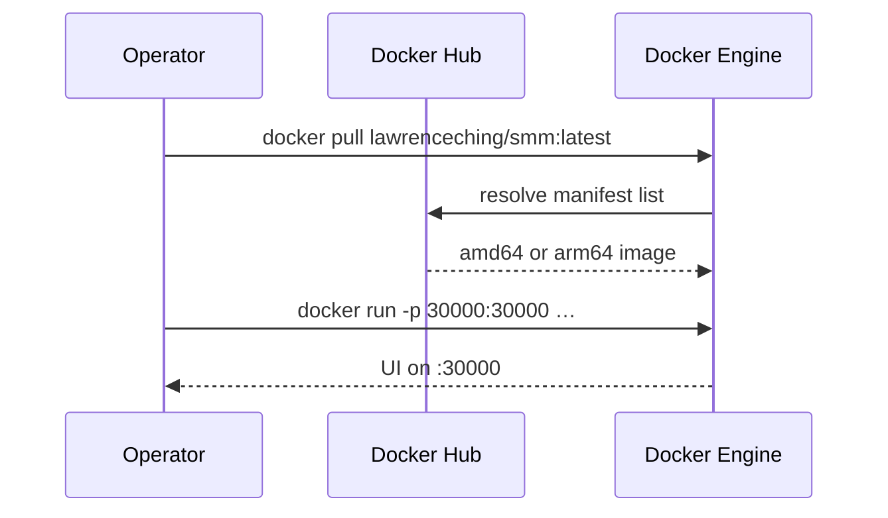
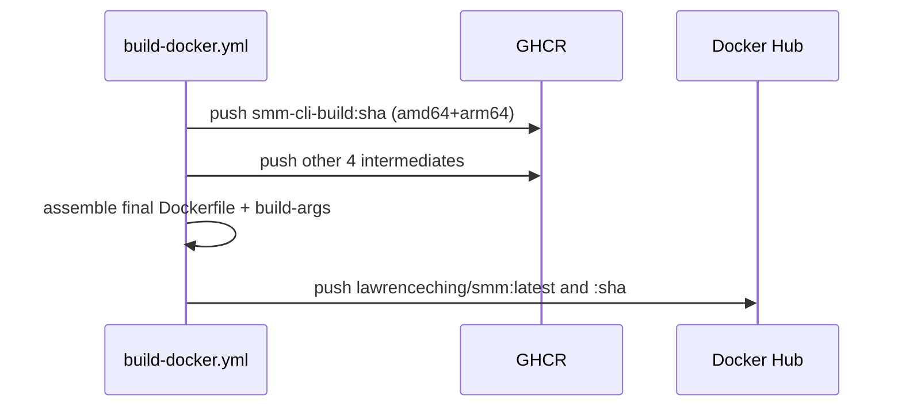

# Publish SMM Docker image to Docker Hub (multi-arch via GHCR intermediates)

This design document describe the high level design of a feature.
The design document is golden source and reference by one or more features.

## 1. Background

Operators should install SMM with `docker pull lawrenceching/smm:latest` instead of assembling intermediate images locally. The monorepo already builds a final image from five local intermediate tags (`smm-cli-build`, `smm-ui-build`, `smm-ffmpeg`, `smm-ytdlp`, `smm-videocaptioner`) via `apps/docker/Dockerfile`.

`.github/workflows/build-docker.yml` currently builds only the final Dockerfile with `push: false` and cannot produce a complete image (missing intermediates) or publish to Docker Hub. Docker e2e (`e2e-docker.yml`) continues to build `smm:latest` in-job and is **out of scope**.

**Decisions (locked):**
- Publish **multi-arch** `linux/amd64` + `linux/arm64` to Docker Hub as `lawrenceching/smm:latest` (also tag `lawrenceching/smm:<git-sha>`).
- Stage intermediate multi-arch images on **GHCR**; only the final image is user-facing on Docker Hub.
- Scope **A**: publish + docs only; e2e keeps local `smm:latest`.

## 2. Architecture

## 2.1 Project Level Architecture

```
apps/docker/*Dockerfiles*  →  CI (build-docker.yml)
        │
        ├─ intermediate images ──push──► ghcr.io/<owner>/smm-*-build:<sha>
        │                                      │
        └─ final Dockerfile ◄──FROM (build-arg)─┘
                    │
                    └──push──► docker.io/lawrenceching/smm:latest
                               docker.io/lawrenceching/smm:<sha>

docs/docker-install.md  →  operators pull Hub image
apps/e2e + e2e-docker.yml  →  unchanged (local smm:latest)
```

- **apps/docker** — intermediate + final Dockerfiles; final `FROM` targets become build-arg defaults for local tags.
- **`.github/workflows/build-docker.yml`** — sole publish path (`workflow_dispatch`).
- **docs** — install guide prefers Hub pull.
- **e2e / ci e2e docker** — no change.

## 2.2 App Level Architecture

### Final Dockerfile (`apps/docker/Dockerfile`)

Replace hard-coded local intermediate names with build-args (defaults preserve local workflow):

```dockerfile
ARG SMM_CLI_IMAGE=smm-cli-build:latest
ARG SMM_UI_IMAGE=smm-ui-build:latest
ARG SMM_FFMPEG_IMAGE=smm-ffmpeg:latest
ARG SMM_YTDLP_IMAGE=smm-ytdlp:latest
ARG SMM_VIDEOCAPTIONER_IMAGE=smm-videocaptioner:latest

FROM ${SMM_CLI_IMAGE} AS cli
FROM ${SMM_UI_IMAGE} AS ui
FROM ${SMM_FFMPEG_IMAGE} AS ffmpeg
FROM ${SMM_YTDLP_IMAGE} AS ytdlp
FROM ${SMM_VIDEOCAPTIONER_IMAGE} AS videocaptioner
# … unchanged COPY / CMD …
```

Local: `pnpm --filter docker build:*` then `build` — unchanged tags.  
CI: pass `--build-arg SMM_*_IMAGE=ghcr.io/<owner>/…:<sha>`.

### Workflow (`build-docker.yml`)

1. Checkout; QEMU; Buildx with **docker-container** driver (required for multi-platform `--push`).
2. Login Docker Hub (`DOCKERHUB_USERNAME` + `DOCKERHUB_TOKEN`).
3. Login GHCR (`GITHUB_TOKEN`); job permission `packages: write`.
4. For each intermediate Dockerfile, `docker buildx build --platform linux/amd64,linux/arm64 --push -t ghcr.io/<owner>/<name>:${{ github.sha }}`.
5. Assemble final image with the five build-args, `--platform linux/amd64,linux/arm64 --push`, tags:
   - `lawrenceching/smm:latest`
   - `lawrenceching/smm:${{ github.sha }}`
6. Do not upload image tarball artifacts for publish (unlike e2e).

`<owner>` = `github.repository_owner` (lowercase as required by GHCR).

Suggested GHCR image names (aligned with local tags):

| Local tag | GHCR repository |
|-----------|-----------------|
| `smm-cli-build:latest` | `ghcr.io/<owner>/smm-cli-build` |
| `smm-ui-build:latest` | `ghcr.io/<owner>/smm-ui-build` |
| `smm-ffmpeg:latest` | `ghcr.io/<owner>/smm-ffmpeg` |
| `smm-ytdlp:latest` | `ghcr.io/<owner>/smm-ytdlp` |
| `smm-videocaptioner:latest` | `ghcr.io/<owner>/smm-videocaptioner` |

GHCR package visibility: leave default (typically private for private repos / follow org settings). Not documented for end users.

### Secrets / permissions

| Name | Purpose |
|------|---------|
| `DOCKERHUB_USERNAME` | Hub login |
| `DOCKERHUB_TOKEN` | Hub access token (write to `lawrenceching/smm`) |
| `GITHUB_TOKEN` | GHCR push (built-in) |

Job: `permissions: contents: read`, `packages: write`.

### Docs

- `docs/docker-install.md`: primary path = `docker pull lawrenceching/smm:latest` / compose `image: lawrenceching/smm:latest`; note amd64+arm64; move local assemble to a “Build from source” appendix.
- `apps/docker/README.md`: one-line pointer that published image is on Docker Hub; local scripts remain for developers.

### Out of scope

- Changing e2e compose / `DOCKER_IMAGE` / `e2e-docker.yml`.
- Deleting old GHCR intermediate tags automatically (optional follow-up).
- Replacing `latest` with semver-only tags (sha tag is enough for rollback).

## 2.3 Key Design

- **Registry split**: GHCR = CI plumbing; Docker Hub = product image.
- **Build-args on final Dockerfile**: one file serves local e2e/dev and Hub publish.
- **Buildx docker-container + QEMU**: multi-arch push without host `--load` of both platforms.
- **Sha co-tag**: `lawrenceching/smm:<sha>` for pin/rollback beside `latest`.

## 3. User Stories

### 3.1 Operator pulls published image

* **Given** - `lawrenceching/smm:latest` exists on Docker Hub as a multi-arch manifest (amd64 + arm64)
* **When** - an operator runs `docker pull lawrenceching/smm:latest` and `docker run … lawrenceching/smm:latest`
* **Then** - Docker selects the matching architecture and the container serves the UI on port 30000



### 3.2 Maintainer publishes via Actions

* **Given** - repo secrets `DOCKERHUB_USERNAME` / `DOCKERHUB_TOKEN` are set and the workflow has `packages: write`
* **When** - a maintainer runs **Build Docker** (`workflow_dispatch`)
* **Then** - five multi-arch intermediates are pushed to GHCR tagged with `github.sha`, and `lawrenceching/smm:latest` plus `lawrenceching/smm:<sha>` are pushed to Docker Hub



### 3.3 Local / e2e build unchanged

* **Given** - a developer has built local intermediate tags `smm-*-build:latest` (or e2e CI does the same)
* **When** - they run the final `apps/docker/Dockerfile` assemble without CI build-args
* **Then** - defaults resolve to local tags and produce `smm:latest` as today
