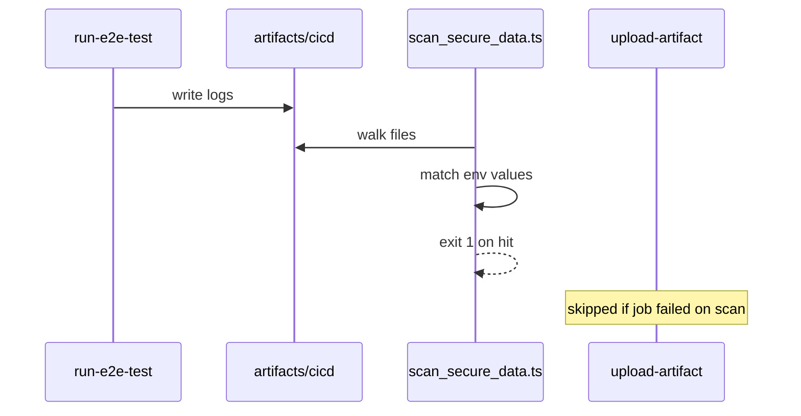

# Scan e2e artifacts for secret leaks (`scan_secure_data.ts`)

This design document describe the high level design of a feature.
The design document is golden source and reference by one or more features.

## 1. Background

E2E runs in GitHub Actions inject real secrets into the job environment (`TMDB_API_KEY`, `TVDB_API_KEY`) and a test auth token (`SMM_AUTH_TOKEN`). Logs under `artifacts/cicd/` are uploaded as Actions artifacts and may be downloaded by anyone with access. If a secret value appears in those logs (CLI stdout, WDIO reports, network dumps, etc.), it is a credential leak.

**Decisions (locked):**
- Detection strategy **A**: substring match against known non-empty environment variable **values** (not pattern heuristics).
- Integration **2**: a dedicated GitHub Actions step **before** `upload-artifact`, with `if: always()` when the e2e step was not skipped.
- Fixed secret name list **A**: `TMDB_API_KEY`, `TVDB_API_KEY`, `SMM_AUTH_TOKEN`.
- Not wired into `apps/cicd` `onArtifactsReady` in this scope (local opt-in via CLI is fine).

## 2. Architecture

## 2.1 Project Level Architecture

```
e2e GHA job
  → bun ci/run-e2e-test.ts  →  artifacts/cicd/<commandId>/…
  → bun ci/scan_secure_data.ts --dir artifacts/cicd   (fail job on hit)
  → actions/upload-artifact
```

- **`ci/scan_secure_data.ts`** — CLI entry.
- **`ci/scan-secure-data-lib.ts`** (or equivalent export from the same module tree) — pure scan logic for unit tests.
- **Workflows:** `.github/workflows/e2e-test.yml`, `e2e-docker.yml`, `e2e-http-proxy.yml`.
- **Out of scope:** gitleaks, cicd hooks, expanding the env name list beyond the three names above.

## 2.2 App Level Architecture

### Secret sources

For each name in `['TMDB_API_KEY', 'TVDB_API_KEY', 'SMM_AUTH_TOKEN']`:
1. Read `process.env[name]`, trim.
2. Skip if empty.
3. Skip if length &lt; 8 (noise floor; `ChangeMe123` is length 11 and remains in scope).
4. Collect `{ name, value }` for scanning.

If the collected list is empty: print that there is nothing to scan and exit `0` (do not fail CI when secrets are unset for suites that do not need them).

### Scan

- Root directory: CLI `--dir` (default `artifacts/cicd`), resolved from process cwd (repo root in CI).
- If the directory does not exist: exit `0` with a clear message (no artifacts to scan), unless a future flag requires fail — default soft-skip avoids failing jobs that never produced logs.
- Walk files recursively. Skip:
  - non-files / broken symlinks
  - likely binary (NUL byte in first chunk, or non-text extensions if a small deny/allow list is used)
  - files larger than a cap (e.g. 32 MiB) with a warning line
- For each text file, scan line-by-line for each secret value as a literal substring.
- On hit: record `{ envName, relativePath, lineNumber }` — **never print the full secret**; optionally print a short redacted preview (e.g. first 2 + last 2 chars).

### Exit codes

| Code | Meaning |
|------|---------|
| 0 | No hits (or nothing to scan / no dir) |
| 1 | One or more hits |
| 2 | Usage / unexpected I/O error |

### CLI

```bash
bun ci/scan_secure_data.ts [--dir <path>]
```

### CI step (each e2e workflow, before Upload)

```yaml
- name: Scan e2e logs for secret leaks
  if: always() && steps.e2e.outcome != 'skipped'
  run: bun ci/scan_secure_data.ts --dir artifacts/cicd
```

The job must already expose the three env vars when they are set (existing secrets / workflow `env`).

### Tests

Unit tests under `ci/scan-secure-data*.test.ts` (or colocated):
- Fixture dir with a log line containing a fake `TMDB_API_KEY` value → exit/result indicates failure; report includes env name + path + line, not the full value.
- Clean logs → success.
- Empty/missing secrets → success (skip).
- Value shorter than min length → ignored.

### Known consequence

CI often sets `SMM_AUTH_TOKEN=ChangeMe123`. If that string appears in logs or captured URLs (`?token=`), the scan **fails by design**. Fixing leaks (redaction) is a follow-up; this feature’s job is to detect them.

## 2.3 Key Design

- **Value equality / substring against env**, not regex guessing.
- **Fail closed on hits**, fail open when there are no secrets or no artifact dir.
- **Redacted reporting** so the scanner itself does not re-leak into Actions logs.
- **Workflow step placement** guarantees scan runs even when tests fail, before artifacts are published.

## 3. User Stories

### 3.1 CI catches leaked API key in e2e logs

* **Given** - `TMDB_API_KEY` is set in the job and its value appears in `artifacts/cicd/.../main.log`
* **When** - the Scan e2e logs step runs
* **Then** - the step fails with exit code 1 and names the env var, file, and line without printing the full key



### 3.2 Clean run uploads artifacts

* **Given** - secrets are set but no log file contains their values
* **When** - the scan step runs
* **Then** - exit 0 and upload-artifact proceeds

### 3.3 Suite without API keys

* **Given** - `TMDB_API_KEY` and `TVDB_API_KEY` are unset and `SMM_AUTH_TOKEN` is empty or below min length
* **When** - the scan step runs
* **Then** - exit 0 (nothing to scan)
