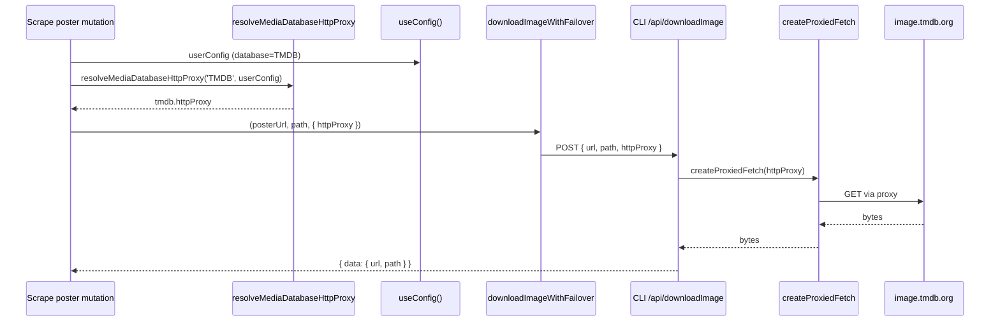

# ScrapeDialog 图片下载走 HTTP 代理

## 1. Background

ScrapeDialog（刮削对话框）已完整实现（`useScrapeDialog` 逻辑容器 + `UIScrapeDialog` + poster/fanart/thumbnails/nfo 四个 mutation）。

现状：

- **API 请求已支持代理**：`fetchTmdb` / `fetchTvdb` 在用户配置了自定义 host（`host` 非空且可解析）时，通过 `fetchByInternalReverseProxy` 携带 `httpProxy` 走代理；否则使用 discover 配置的默认上游（`mediadb.vercel.app`）直连。
- **图片下载不走代理（缺口）**：ScrapeDialog 的 poster / fanart / 剧集缩略图全部走 `downloadImageWithFailover` → `POST /api/downloadImage` → 后端 `doDownloadImageAsFile` 直接 `fetch`，没有代理。在 TMDB/TVDB 被屏蔽的网络环境下，API 请求能通过代理成功，但图片下载失败。

目标：当用户为 TMDB/TVDB 配置了「自定义 host + HTTP 代理」时，ScrapeDialog 的图片下载也走该代理。

**约束（brainstorming 已锁定）：**

- 代理与自定义 host 是强绑定的一对一关系：仅当 `用户配置了自定义 host && httpProxy 非空` 时才走代理，否则直连（完全镜像 `fetchTmdb`/`fetchTvdb` 的现有规则）。
- 范围**仅限 ScrapeDialog 的图片下载任务**（poster / fanart / thumbnails），不涉及 `useImage`/`GET /api/image` 预览、nfo 任务、季海报（`lib/utils.ts`）。
- `@smm/core-routes` 的 `doDownloadImageAsFile` 保持零改动。

## 2. Architecture

### 2.1 Project Level Architecture

```
apps/ui (Scrape 图片 mutation)
  │  解析代理(纯函数) → httpProxy
  ▼
POST /api/downloadImage  { url, path, httpProxy? }
  │
  ▼
apps/cli route/DownloadImageAsFile.ts
  │  body.httpProxy ? createProxiedFetch(httpProxy) : 全局 fetch
  ▼
@smm/core-routes doDownloadImageAsFile(不变)
```

不涉及 Electron / OHOS 的下载核心改动；`DownloadImageRequestBody` 新增可选字段对 OHOS 无影响。

### 2.2 App Level Architecture

#### 代理解析纯函数（`apps/ui/src/lib/mediaDatabaseAccess.ts`）

```ts
export function resolveMediaDatabaseHttpProxy(
  database: 'TMDB' | 'TVDB',
  userConfig: UserConfig,
): string | undefined {
  const cfg = database === 'TMDB' ? userConfig.tmdb : userConfig.tvdb
  if (!cfg) return undefined
  if (isEmpty(cfg.host)) return undefined
  if (!URL.canParse(cfg.host!)) return undefined
  const proxy = cfg.httpProxy?.trim()
  return proxy || undefined
}
```

规则与 `fetchTmdb` / `fetchTvdb` 完全一致：`host 非空 && 可解析 && httpProxy 非空` → 返回代理，否则 `undefined`（直连）。

#### 下载链路透传

- `downloadImageApi(url, path, httpProxy?)`：`httpProxy` 非空时写入 `POST /api/downloadImage` 请求体。
- `downloadImageWithFailover(url, path, deps)`：`deps` 新增可选 `httpProxy`，对每个 candidate 的下载调用原样透传。
- 三个 Scrape mutation 用 `useConfig()` 读取 `userConfig` + 纯函数解析代理：
  - `useScrapePosterMutation` / `useScrapeFanartMutation`：按 `mediaMetadata.database` 解析，传给 `downloadImageWithFailover`。
  - `useScrapeThumbnailMutation`：解析代理后放进 `DownloadThumbnailFromTMDBVariables` / `DownloadThumbnailFromTVDBVariables`（新增可选 `httpProxy`），由 `useDownloadThumbnailFromTMDB` / `useDownloadThumbnailFromTVDB` 透传给 `downloadImageWithFailover`。

#### 后端（`apps/cli/src/route/DownloadImageAsFile.ts`）

```ts
const fetchImpl = body.httpProxy
  ? createProxiedFetch(body.httpProxy, coreRoutesLogger)
  : undefined
return doDownloadImageAsFileCore(body, { allowlist, logger: coreRoutesLogger, fetchImpl })
```

`createProxiedFetch` 已由 `@smm/core-routes` 导出，与 reverse proxy 共用同一实现（Bun 原生 / Node agent / SOCKS5）。

### 2.3 Key Design

| 要素 | 角色 |
|------|------|
| `resolveMediaDatabaseHttpProxy` | 唯一的代理判定点，纯函数可单测，镜像 API 规则 |
| 请求体 `httpProxy` | UI → CLI 的代理传递通道 |
| `createProxiedFetch` | 复用现有代理 fetch 基础设施，零重复实现 |
| `doDownloadImageAsFile` | 保持零改动（沿用 asset-image-failover 的非目标约定） |

**日志/安全**：`httpProxy` 可能含凭据。`createProxiedFetch` 内部已用 `formatProxyHostForLog` 脱敏；CLI 路由与 `doDownloadImageAsFile` 不记录原始 proxy 值。

## 3. User Stories

### 3.1 自定义 TMDB host + 代理时，poster 走代理下载

* **Given** 用户配置了 `tmdb.host`（自定义）+ `tmdb.httpProxy`，且网络无法直连 `image.tmdb.org`
* **When** ScrapeDialog 下载 poster
* **Then** `POST /api/downloadImage` 携带 `httpProxy`，后端经代理下载成功写入 `poster.{ext}`



### 3.2 未配置自定义 host 时保持直连

* **Given** 用户未配置自定义 `tmdb.host`（使用默认 `mediadb.vercel.app` 上游），即使 `httpProxy` 为空
* **When** ScrapeDialog 下载图片
* **Then** 请求体不含 `httpProxy`，后端全局 `fetch` 直连（与现状一致）

### 3.3 范围外调用点不受影响

* **Given** 季海报下载（`lib/utils.ts`）或 `useImage` 预览
* **When** 用户配置了自定义 host + 代理
* **Then** 仍直连，行为不变（本次不改造）

## 4. Testing

| 文件 | 覆盖 |
|------|------|
| `lib/mediaDatabaseAccess.test.ts`（新增） | `resolveMediaDatabaseHttpProxy`：TMDB/TVDB、host 为空、host 非法、httpProxy 为空 |
| `api/downloadImageWithFailover.test.ts`（扩展） | 传入 `httpProxy` 时透传给 `downloadImageApi`（每个 candidate） |
| `api/downloadImage.test.ts`（新增） | `downloadImageApi` 传入 `httpProxy` 时 body 包含该字段 |
| `apps/cli/src/route/DownloadImageAsFile.test.ts`（新增） | body 带 `httpProxy` 时用代理 fetch；不带时用全局 fetch |
| Scrape mutation 测试 | 同步 mock `useConfig`；断言解析出的代理被传入下载函数 |

## 5. 非目标

- `useImage` / `GET /api/image` 预览路径走代理。
- nfo 任务改造（不下载图片）。
- 季海报下载（`lib/utils.ts`）走代理。
- `@smm/core-routes` 的 `doDownloadImageAsFile` / `doDownloadImage` 改动。
- 修改 `DownloadImageRequestBody` 之外的类型或路由语义。

## 6. OHOS 打包产物说明

Task 6 为安全修复把共享 node handler（`packages/core-routes/src/routes/downloadImageAsFileRoute.ts`）的 `POST /api/downloadImage` 日志从记录完整 `rawBody` 改为只记录 `{ url, path }`（`httpProxy` 可能含 `user:pass@` 凭据）。

已检入的鸿蒙打包产物 `apps/ohos/web_engine/src/main/resources/resfile/resources/app/core-routes.js` 仍含旧版 `{ rawBody }` 日志。**需在鸿蒙发版/构建时用鸿蒙构建工具链重新生成该 bundle**（`pnpm --filter @smm/core-routes build:ohos`）以同步此安全修复。本地直接重新生成会产生约 7.2 万行的工具链版本差异（非本功能改动），故本次不并入。当前鸿蒙 UI 尚未发送 `httpProxy` 字段，该问题为潜在风险而非活跃泄漏。
