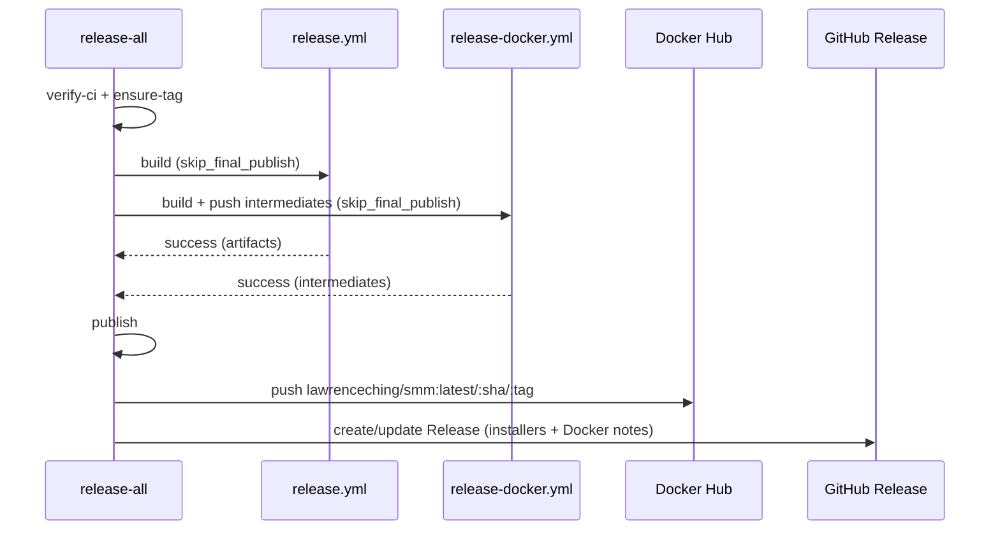

# Unified Release Gate: push Docker image + GitHub Release only after all builds succeed

This design document describe the high level design of a feature.
The design document is golden source and reference by one or more features.

## 1. Background

The Release CI lets expensive builds run even when a prerequisite check fails, and can publish artifacts before all builds have succeeded. Current dependency chains:

- **release.yml** (Electron): `verify-ci → ensure-tag → 5× build-electron-* → release-electron`. The five builds already gate on `ensure-tag`.
- **release-docker.yml** (Docker): `verify-ci → build-push → ensure-tag → release-github`. `build-push` runs **before** `ensure-tag`, so a tag failure does not stop the Docker build + image push.
- **release-all.yml**: launches both sub-workflows in parallel and only reports results; a Docker release page can be published even when an Electron build later fails.

**Decisions (locked):**
1. If a prerequisite check (`verify-ci`, `ensure-tag`) fails, do not run builds.
2. **Cross-product unified gate**: only when *all* builds succeed (5 Electron platforms + Docker image), push the `lawrenceching/smm` release image and publish/update the single GitHub Release page.
3. **Approach**: sub-workflows support a `skip_final_publish` build-only mode; `release-all.yml` runs both build-only and adds one `publish` job that waits for both, then pushes the Docker image and publishes the Release page.

## 2. Architecture

## 2.1 Project Level Architecture

```
Before:
release-all ──► release.yml       (verify → ensure-tag → 5×build → release-electron)  ─┐
            └─► release-docker.yml (verify → build-push → ensure-tag → release-github) ─┘
   each publishes independently; no unified gate; docker builds before tag check

After:
release-all (unified gate)
  ├──► release.yml        → verify-ci → ensure-tag → 5× build-electron-* (upload artifacts; publish skipped)
  └──► release-docker.yml → verify-ci → ensure-tag → build-push (intermediates only; publish skipped)
           │
           ▼
  publish (needs [release-electron, release-docker] — both sub-workflows)
    ├─ download Electron artifacts (smm-v*)
    ├─ assemble + push lawrenceching/smm:latest / :<sha> / :<tag>
    └─ create/update GitHub Release (installers + Docker notes)
```

Standalone single-product releases keep their capability with per-product gating:

- **release.yml**: `verify-ci → ensure-tag → 5× build → release-electron`
- **release-docker.yml**: `verify-ci → ensure-tag → build-push → release-github` (ensure-tag moved before the build)

## 2.2 App Level Architecture

Per-file changes:

### `.github/workflows/_ensure-release-tag.yml`

Make the "Create annotated tag" step race-safe. Under release-all the two sub-workflows run ensure-tag concurrently and can both observe `tag_exists=false`. Re-check the ref before creating; if the ref POST fails (409 — a sibling workflow created it concurrently), confirm the ref now exists and treat as success.

### `.github/workflows/_build-docker-push.yml`

Add input `push_release_image: boolean` (default `true`). When `false`, skip the final "Assemble and push lawrenceching/smm" step; the intermediate images (`ghcr.io/<owner>/smm-*-build:<sha>`) are still built and pushed — they are assemble inputs for the later publish job.

### `.github/workflows/release.yml`

- Add `skip_final_publish` input (default `false`; declared for both `workflow_dispatch` and `workflow_call`).
- Gate `release-electron` with `if: ${{ !inputs.skip_final_publish }}`.
- The five build jobs still run and upload installer artifacts.

### `.github/workflows/release-docker.yml`

- Add `skip_final_publish` input (default `false`).
- Move `ensure-tag` before `build-push` (`needs: verify-ci`, same `if` as release.yml's ensure-tag) so a tag failure skips the build.
- `build-push` → `needs: [verify-ci, ensure-tag]`, `if` requires `ensure-tag` success, and passes `push_release_image: ${{ !inputs.skip_final_publish }}`.
- Gate `release-github` with `if: ${{ !inputs.skip_final_publish }}`.

### `.github/workflows/release-all.yml`

- Call both sub-workflows with `skip_final_publish: true`.
- Add `publish` job (`needs: [release-electron, release-docker]`, runs only when both succeed):
  1. Download Electron artifacts (`pattern: smm-v*`, `merge-multiple`).
  2. Setup QEMU + Buildx; login Docker Hub and GHCR.
  3. Assemble + push `lawrenceching/smm:latest`, `:<sha>`, `:<tag>` from the intermediates pushed by `build-push`.
  4. Publish the GitHub Release. Decide create-vs-edit by whether a Release page already exists (`gh release view`), not by tag existence — the tag is always present by this point.

### Docs

- `docs/dev/release.md`: update the Docker-flow description (ensure-tag before build; combined release publishes centrally after all builds).

## 2.3 Key Design

- **build-only mode** (`skip_final_publish`): sub-workflows keep their build jobs; publication is centralized in release-all.
- **Unified gate**: `publish` depends on both sub-workflow results, so any build failure skips it.
- **Race-safe tag creation**: concurrent ensure-tag is tolerated.
- **Registry split**: intermediates on GHCR (plumbing), `lawrenceching/smm` on Docker Hub (product).
- **Create-vs-edit by release existence** rather than tag existence.

## 3. User Stories

### 3.1 Pre-check failure skips builds

* **Given** - `verify-ci` or `ensure-tag` fails during a release run
* **When** - the workflow proceeds
* **Then** - no build job starts and the release fails fast, without building Electron or Docker artifacts

### 3.2 Combined release publishes only after all builds succeed

* **Given** - a maintainer runs **Release** (release-all) with a new tag
* **When** - all 5 Electron builds and the Docker build succeed
* **Then** - the `publish` job pushes `lawrenceching/smm:latest`, `:<sha>`, `:<tag>` and creates a GitHub Release with installers + Docker notes



### 3.3 Standalone single-product release unchanged

* **Given** - a maintainer runs **Release Electron** or **Release Docker** alone
* **When** - its own pre-checks and builds succeed
* **Then** - the product's Release page / assets are published as today

### 3.4 Concurrent ensure-tag is safe

* **Given** - release-all runs both sub-workflows in parallel and neither finds the tag
* **When** - both attempt to create the tag
* **Then** - one wins; the other detects the existing ref and succeeds
