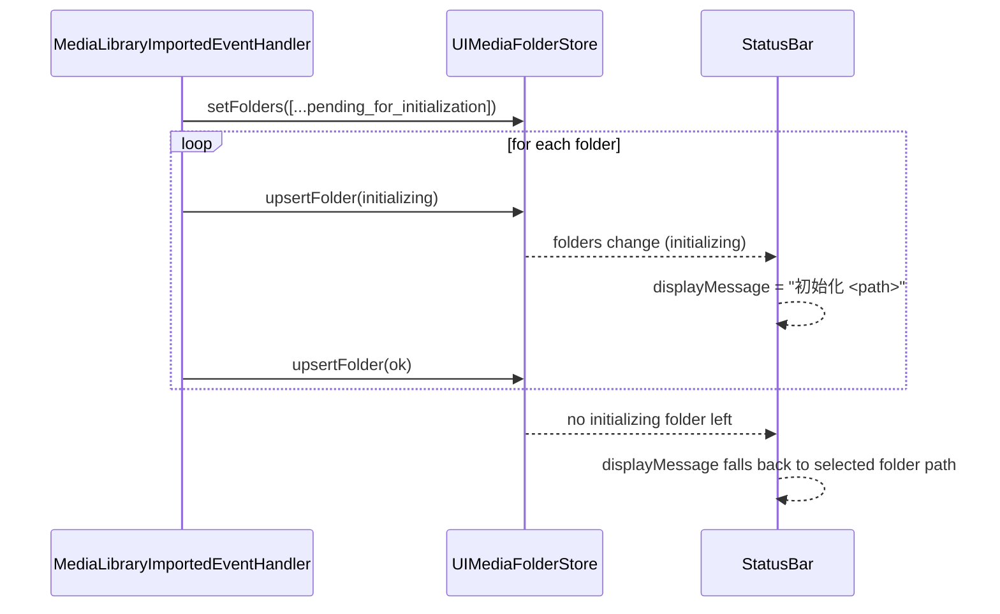

# Media Folder Pending-Initialization UI/UX

This design document describe the high level design of a feature.
The design document is golden source and reference by one or more features.

> **Status:** Implemented (2026-08-10, commits `48a6ad83`..`f5872859`)

## 1. Background

During **Import Media Library**, `MediaLibraryImportedEventHandler` lists the subfolders of the chosen library and adds each new folder to `UIMediaFolderStore` with `status: "pending_for_initialization"`, then sequentially initializes each one (transitioning `initializing` → `ok` via `useInitializeImportedMediaFolder`).

Today the UI gives **no feedback** for the pending state:

- **StatusBar** shows only the selected folder path; during a library import nothing is auto-selected, so the user sees no signal that initialization is running or which folder is being processed.
- **Sidebar** `MediaFolderListItemV2` collapses `pending_for_initialization` to `idle` via `mapFolderStatusToItemStatus` (`apps/ui/src/lib/sidebarRowUtils.ts`), so pending folders are visually indistinguishable from ready ones.
- **Content area** (`AppV2.tsx`) renders blank when a pending folder (which has no metadata yet) is selected.

Goal: surface the pending/initializing state across StatusBar, Sidebar, and the content area during import.

**Decisions (locked):**
- `pending_for_initialization` **is** the folder's pending status — there is no separate short `pending` value in `UIMediaFolderStatus`. It is reused as the single trigger for the new hints.
- StatusBar message is driven by the **currently-initializing folder** (`status === "initializing"`), not by the user's selection, so import progress is visible without user interaction.
- Sidebar badge covers `pending_for_initialization` only; `initializing` keeps the existing spinner.
- Content area covers `pending_for_initialization` only.

## 2. Architecture

## 2.1 Project Level Architecture

Pure `apps/ui` feature. No changes to `packages/core`, `apps/cli`, or other apps.

i18n keys are added to `apps/ui/public/locales/{en,zh-CN,zh-HK,zh-TW}/components.json`:

- `statusBar.messages.initializingFolder` — StatusBar message (`初始化 {{path}}` / `Initializing {{path}}` …)
- `mediaFolder.pendingForInitialization` — Sidebar badge (`等待初始化` / `Pending initialization` …)
- `pendingInitializationPanel.title` / `.description` — content-area panel

## 2.2 App Level Architecture

Three touch points, each driven by the existing `UIMediaFolderStore` state.

### StatusBar — `apps/ui/src/components/StatusBar.tsx`

- Read `folders` from `useUIMediaFolderStoreState()` (already subscribed).
- Derive the currently-initializing folder:
  `const initializingFolder = folders.find((f) => f.status === "initializing")`.
- Extend the `displayMessage` priority to: prop `message` > bootstrap `initializing`/`error` > **`initializingFolder`** > `folderPathMessage`.
- When `initializingFolder` exists, return `t("statusBar.messages.initializingFolder", { path: Path.toPlatformPath(initializingFolder.path) })`.

### Sidebar — `apps/ui/src/components/sidebar/MediaFolderListItemV2.tsx` + `apps/ui/src/lib/sidebarRowUtils.ts`

- Add `"pending_for_initialization"` to `MediaFolderListItemV2Props["status"]`.
- `mapFolderStatusToItemStatus`: pass `pending_for_initialization` through (remove the existing `return "idle"` branch for it).
- In `MediaFolderListItemV2`, when `status === "pending_for_initialization"`, render a small muted badge with `t("mediaFolder.pendingForInitialization")` in the flex-shrink-0 status slot (same slot as the `initializing` spinner and the `folder_not_found` alert), so it is not truncated by the `truncate` title.

### Content area — `apps/ui/src/AppV2.tsx` + new `apps/ui/src/components/PendingInitializationPanel.tsx`

- New panel modeled on `FolderNotAvailablePanel.tsx` (centered layout, `useTranslation("components", { keyPrefix: "pendingInitializationPanel" })`), showing the title, description, and the selected folder path.
- In `AppV2.tsx`, before the metadata-driven panel branches, render it when
  `uiFolders.length > 0 && selectedFolder && folderStatus === "pending_for_initialization"`.

## 2.3 Key Design

- **Single trigger**: reuse `pending_for_initialization` everywhere; do not introduce a new status value or a parallel boolean prop.
- **StatusBar = live progress**: the message follows the folder currently being initialized, so a media-library import shows progress even when nothing is selected.
- **Non-truncating badge**: the Sidebar badge lives in the `shrink-0` status slot rather than inline with the truncated folder name.
- **Decoupled panel**: the content-area message is its own component, keeping `AppV2`'s branch logic readable and testable.

## 3. User Stories

### 3.1 StatusBar shows the folder being initialized during import

* **Given** - a media library import is running and one folder has status `initializing`
* **When** - the StatusBar renders
* **Then** - it shows `初始化 <folder path>` (i18n `statusBar.messages.initializingFolder`) instead of the selected folder path

### 3.2 Sidebar shows "等待初始化" on pending folders

* **Given** - a folder has status `pending_for_initialization`
* **When** - its sidebar item renders
* **Then** - a `等待初始化` badge appears in the status slot next to the folder name

### 3.3 Sidebar keeps the spinner while a folder is initializing

* **Given** - a folder has status `initializing`
* **When** - its sidebar item renders
* **Then** - it shows the existing `Loader2` spinner and not the pending badge

### 3.4 Content area shows "等待初始化" for a selected pending folder

* **Given** - the user selects a folder with status `pending_for_initialization`
* **When** - the content area renders
* **Then** - it shows the `PendingInitializationPanel` with the title, description, and folder path
