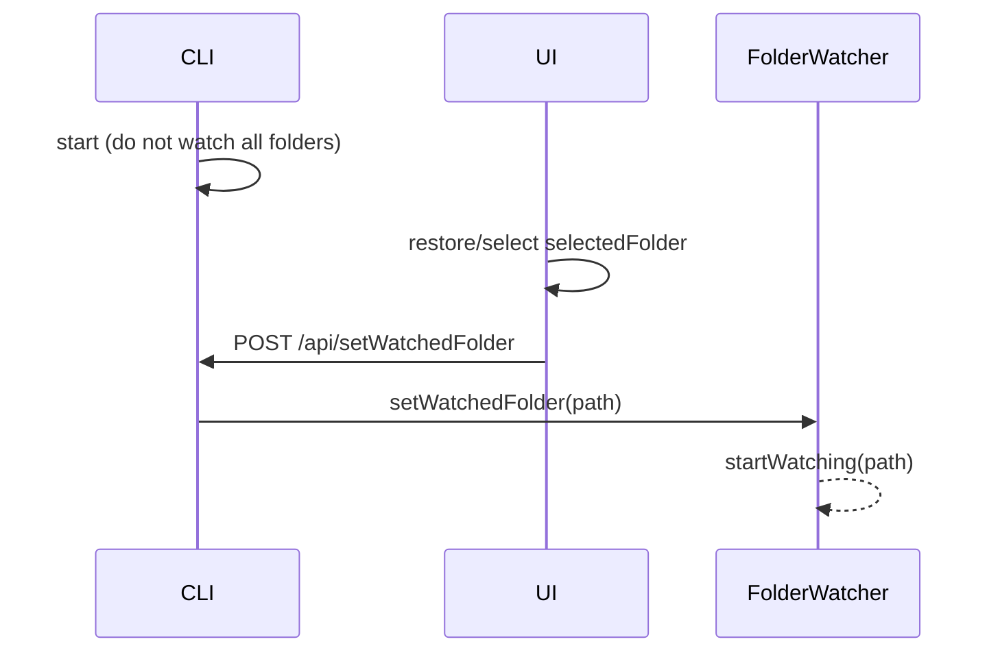
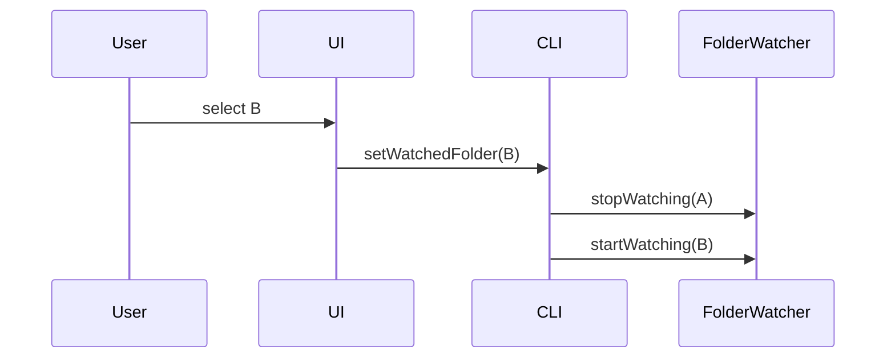

# Selected Folder Watcher

This design document describe the high level design of a feature.
The design document is golden source and reference by one or more features.

## 1. Background

Today the CLI starts `FolderWatcher` for **every** path in `userConfig.folders` during server startup. With large libraries this creates many `fs.watch` handles and noisy logs (`Started watching folder` for each import).

Users only need live folder-content events for the media folder they are currently viewing. The UI already owns that state as `selectedFolder` in `uiMediaFolderStore`. Watching should follow that single primary selection: start when a folder is selected, stop when it is deselected or replaced, and watch nothing when nothing is selected.

## 2. Architecture

## 2.1 Project Level Architecture

| Layer | Role |
|-------|------|
| `apps/ui` | Owns `selectedFolder`; on change calls `POST /api/setWatchedFolder` |
| `apps/cli` | Hosts `FolderWatcher` and the new RPC; removes startup “watch all folders” |
| `packages/core` | Unchanged event type `FOLDER_CONTENT_CHANGED_EVENT` |
| `packages/core-routes` | Out of scope — `fs.watch` is desktop CLI–specific |

Flow:

```
UI selectedFolder ──(change)──► POST /api/setWatchedFolder { folderPath }
                                        │
                                        ▼
                              FolderWatcher.setWatchedFolder()
                              - stop previous (if any)
                              - start new (if non-null)
                                        │
                                        ▼
                         FOLDER_CONTENT_CHANGED_EVENT → UI (unchanged)
```

## 2.2 App Level Architecture

### CLI (`apps/cli`)

- Remove `initializeFolderWatcherAsync()` watching all `userConfig.folders` from server startup (or make it a no-op that only ensures the singleton exists).
- Add `FolderWatcher.setWatchedFolder(folderPath: string | null)`:
  - `null` / empty → `stopAllWatching()` (or stop the single active watch).
  - non-empty → stop any path that is not the target, then `startWatching(target)` (idempotent if already watching that path).
- Add Hono route `POST /api/setWatchedFolder` registered from `server.ts`.
- Existing `startWatching` / `stopWatching` / ignore patterns / debounce / broadcast remain as-is.

### UI (`apps/ui`)

- Add `apps/ui/src/api/setWatchedFolder.ts` using `apiFetch`.
- Add `useSyncWatchedFolder` (or equivalent effect next to store initialization) that:
  - depends on `selectedFolder` from `useUIMediaFolderStore`;
  - calls the API with the path or `null` when empty;
  - uses a request generation / AbortSignal so only the latest switch wins.
- Multi-select (`selectedFolders`) is ignored for watching; only `selectedFolder` matters.
- Selection restore from localStorage / default first folder naturally triggers one sync after init.

## 2.3 Key Design

- **UI owns selection; CLI owns watchers.** No persistence of “currently watched folder” in userConfig.
- **Single watched folder** at a time (primary selection only).
- **Startup default:** watch nothing until UI reports a selection.
- **Idempotent set:** same path twice does not restart the watcher.
- **Missing directory:** API returns success; `startWatching` skips non-existent paths (existing behavior); logged at debug/info. Response `data.watchedFolder` is the requested path (or `null`), not a guarantee that `fs.watch` is active.
- **API errors:** UI selection is not rolled back; log to console; no toast (avoid interrupting folder clicks).

## 3. User Stories

### 3.1 App starts with many imported folders

* **Given** - userConfig has many media folders
* **When** - CLI starts
* **Then** - no folder is watched until the UI reports a selected folder



### 3.2 User switches selected folder

* **Given** - folder A is selected and watched
* **When** - user selects folder B in the sidebar
* **Then** - A is unwatched and B is watched



### 3.3 User clears selection

* **Given** - a folder is selected and watched
* **When** - selection becomes empty (e.g. delete selected folder)
* **Then** - CLI watches nothing (`folderPath: null`)

### 3.4 Rapid selection changes

* **Given** - user clicks several folders quickly
* **When** - multiple setWatchedFolder requests are in flight
* **Then** - only the latest selection remains watched; stale responses are ignored on the UI side

## 4. API

### `POST /api/setWatchedFolder`

- **Request:** `{ folderPath: string | null }` — platform absolute path, or `null`/empty to stop watching
- **Response (200):** `{ data: { watchedFolder: string | null }, error?: string }`
- **Docs:** `docs/api/index.md`

## 5. Out of scope

- Watching all multi-selected folders (`selectedFolders`)
- Persisting watched path in userConfig
- Changing `FOLDER_CONTENT_CHANGED` payload or UI listeners
- Porting watcher into `packages/core-routes` / HarmonyOS
