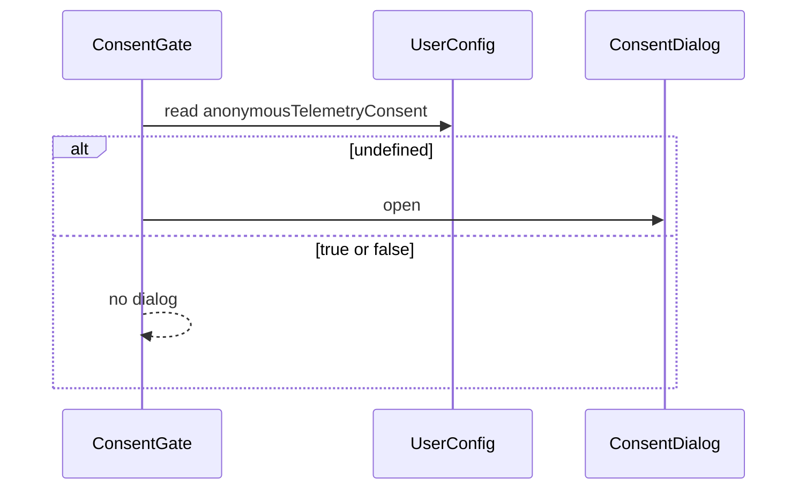

# Anonymous Telemetry Consent Dialog

This design document describe the high level design of a feature.
The design document is golden source and reference by one or more features.

> **Status:** Draft (2026-08-15)

## 1. Background

SMM currently has no analytics / telemetry pipeline and no first-run privacy consent UX. Before any future anonymous usage reporting lands, the app should ask the user once and persist the choice.

**Scope for this feature (locked):**

- **In scope:** first-launch consent dialog; persist agree / disagree; General Settings toggle to change the choice later; i18n copy describing anonymous collection at a high level.
- **Out of scope:** actually collecting or uploading anonymous data; privacy-policy page; crash reporters; network calls gated on the consent flag.

**Decisions (locked):**

- Approach: store consent on `UserConfig` (not localStorage-only, not a blocking full-screen onboarding wizard).
- Dismiss (overlay click / Esc) is treated as **disagree**.
- Settings: a General Settings switch can change the preference anytime after the first choice.
- Copy style: general description (app version, OS, crash/usage stats; no personal identity; no media file contents) — not a field-by-field inventory and not a privacy-policy link (none exists yet).

## 2. Architecture

## 2.1 Project Level Architecture

Primary work is in `apps/ui`. The consent preference is typed on shared `UserConfig` in `packages/core` so Electron / CLI / OHOS share the same `smm.json` field.

| Package / App | Change |
|---------------|--------|
| `packages/core` | Add optional `anonymousTelemetryConsent?: boolean` on `UserConfig` |
| `apps/ui` | Consent dialog, gate component, General Settings toggle, locales |
| `apps/cli` / routes | No new API; existing read/write userConfig persists the field as JSON |
| Reporting / telemetry clients | **Not** introduced in this feature |

i18n keys go under `apps/ui/public/locales/{en,zh-CN,zh-HK,zh-TW}/` (dialog + settings namespaces as appropriate).

## 2.2 App Level Architecture

### Config field

```ts
// packages/core/types.ts — UserConfig
anonymousTelemetryConsent?: boolean
```

| Value | Meaning |
|-------|---------|
| `undefined` | Never answered → show consent dialog after `userConfig` is loaded |
| `true` | User agreed to anonymous telemetry (future use) |
| `false` | User declined (including dismiss) |

`DEFAULT_USER_CONFIG` / `defaultUserConfig` **must omit** this property (leave it `undefined`) so first install and upgrades both trigger the dialog once.

### Consent dialog — `AnonymousTelemetryConsentDialog`

- Location: `apps/ui/src/components/dialogs/`
- Uses existing shadcn `Dialog`
- Title + short description (general anonymous-info wording)
- Primary action: Agree → save `true`
- Secondary action: Disagree → save `false`
- `onOpenChange(false)` (mask / Esc) → same as Disagree → save `false`

### Consent gate — mount after config load

- Small component (e.g. under `apps/ui/src/components/initialization/` or next to dialog consumers) that:
  1. Waits until `userConfig` is loaded
  2. If `anonymousTelemetryConsent === undefined`, opens the dialog
  3. On choice, persists via existing `setAndSaveUserConfig`
- Does not block `AppInitializer` bootstrap / Welcome / folder init; dialog overlays the main UI
- Does not auto-open again once the field is `true` or `false`

### General Settings

- In `GeneralSettings`, add a switch labeled along the lines of “Allow anonymous usage information”
- Bound to the same `anonymousTelemetryConsent` field
- Follow the existing General Settings pattern: local form state + **Save** button (same as MCP / language controls). Turning the switch alone does not write `smm.json` until Save.

## 2.3 Key Design

- **Tri-state via optional boolean:** `undefined` means “ask”; never default the field to `false` in defaults, or upgrades would silently skip consent.
- **Dismiss = disagree:** avoids trapping the user and still records a durable choice.
- **Consent is preference only:** no code path in this feature may send telemetry; the flag is a forward-looking gate.
- **Optimistic UI:** follow app convention — update UI/config cache first, save async, toast + rollback on failure.

## 3. User Stories

### 3.1 First launch shows consent dialog

* **Given** - `userConfig` has loaded and `anonymousTelemetryConsent` is `undefined`
* **When** - the consent gate runs
* **Then** - the anonymous telemetry consent dialog is open



### 3.2 Agree persists true

* **Given** - the consent dialog is open
* **When** - the user clicks Agree
* **Then** - `anonymousTelemetryConsent` is saved as `true`, dialog closes, and it does not auto-open on later startups

### 3.3 Disagree or dismiss persists false

* **Given** - the consent dialog is open
* **When** - the user clicks Disagree, or dismisses via overlay / Esc
* **Then** - `anonymousTelemetryConsent` is saved as `false`, dialog closes, and it does not auto-open on later startups

### 3.4 Settings can change the choice later

* **Given** - the user previously chose agree or disagree
* **When** - they change the General Settings switch
* **Then** - `anonymousTelemetryConsent` updates to `true` or `false` and no automatic dialog is shown

### 3.5 No telemetry network activity in this feature

* **Given** - consent is `true` or `false`
* **When** - the app runs after this feature ships
* **Then** - no new anonymous telemetry upload is performed (collection remains unimplemented)

## 4. Testing notes

- **Exploration phase:** manual verification is enough (first run with unset field; agree; disagree; dismiss; settings toggle; restart).
- **Delivery phase (later):** optional unit tests for gate open/close conditions; optional e2e that seeds `smm.json` without the field and asserts dialog `data-testid`.

## 5. Non-goals

- Implementing PostHog / Sentry / custom analytics endpoints
- Privacy policy URL or legal document hosting
- Re-prompting after a choice unless the field is cleared from config
- Blocking the entire app behind a mandatory wizard
