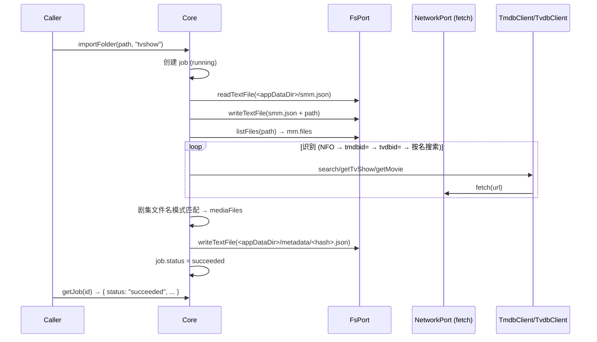

# apps/core importFolder 核心层设计

本设计文档描述 3 层重构中「Layer 2 Core」的第一块基石：`apps/core` 包的媒体目录导入功能。
它是后续 HTTP / UI / MCP 接入的统一业务入口，也是把业务逻辑从 UI 层剥离的第一步。

## 1. Background

当前媒体目录初始化的整套流程（更新用户配置、识别媒体文件夹、识别剧集、持久化元数据、任务状态管理）全部实现在 UI 侧
（`apps/ui/src/hooks/initialization/useInitializeImportedMediaFolder.ts` 及 `apps/ui/src/lib/*`），导致：
- 该流程无法被外部 HTTP API 或 MCP 调用；
- 无法脱离 React 环境进行单元测试；
- UI 与业务逻辑强耦合，难以扩展。

按 [refactoring.md](../../../refactoring.md) 的目标架构，业务逻辑应下沉到 **Layer 2 Core**（headless TypeScript，
运行时无关，通过适配器访问 fs / 网络 / 日志），表现层只负责交互与状态同步。

本设计创建 `apps/core`，提供 `core.importFolder(path, type)` 函数接口，在核心层完整实现「媒体目录初始化」流水线。

## 2. Architecture

### 2.1 Project Level Architecture

`apps/core` 是 monorepo 中的一个纯 TypeScript 库式应用，运行时无关，不 import 任何平台 API（`node:fs`、`window` 等）。

```
┌─────────────────────────────────────────────────────────────┐
│  Layer 1 (表现层): apps/ui / MCP / External HTTP API        │  ← 未来接入
└───────────────────────────────┬─────────────────────────────┘
                                │ 函数调用 (core.importFolder)
┌───────────────────────────────▼─────────────────────────────┐
│  Layer 2 (Core): apps/core                                  │
│   Core 类 · importFolder 流水线 · 识别 · 剧集匹配 · Job 状态  │
└───────────────┬──────────────────────────────┬──────────────┘
                │ 依赖注入                       │
        ┌───────▼───────┐  ┌────────▼───────┐  ┌▼────────────┐
        │  FsPort       │  │  NetworkPort   │  │ LoggerPort  │
        │  (适配器实现)   │  │  (薄 fetch)    │  │             │
        └───────┬───────┘  └────────┬───────┘  └─────────────┘
   ┌────────────┼─────────────┐     │
   │ NodejsFsAdapter           │     │
   │ (node 运行时)              │     │
   │ NetworkFsAdapter          │     │
   │ (浏览器运行时 → 内部HTTP)   │     │
   └───────────────────────────┘     └── TmdbClient / TvdbClient
```

**依赖关系**：
- `apps/core` 依赖 `@smm/core`（领域类型：`MediaMetadata`、`UserConfig`、`FolderType` 等）与 `@smm/utils`
- core 逻辑只依赖 Ports 接口，不感知具体适配器
- TMDB / TVDB 客户端是 core 内部模块，构建在 NetworkPort（薄 fetch）之上，负责 URL 构造、鉴权、响应解析
- 适配器与 core 逻辑解耦，各自隔离平台依赖

**命名澄清**：`NetworkPort` 的适配器（`NodeNetworkAdapter` / `BrowserNetworkAdapter`）包装 fetch，是「网络能力适配器」；
`NetworkFsAdapter` 是 `FsPort` 的一种实现，指「通过内部 HTTP API 访问文件系统」，二者针对不同端口，不要混淆。

### 2.2 App Level Architecture

```
apps/core/src/
  index.ts                 // 导出 Core、Ports 接口、适配器
  Core.ts                  // Core 类：job store + importFolder 编排
  ports/
    FsPort.ts              // readTextFile / writeTextFile / exists / listFiles
    NetworkPort.ts         // fetch(input, init): Promise<HttpResponse>  （薄层）
    LoggerPort.ts          // info / warn / error
  adapters/
    node/NodejsFsAdapter.ts       // 基于 node:fs/promises，仅 Node 宿主 import
    network/NetworkFsAdapter.ts   // 浏览器运行时：映射到内部 HTTP API 的 fs 端点
    ConsoleLoggerAdapter.ts       // 默认 console 实现
  clients/
    TmdbClient.ts          // 基于 NetworkPort，search/getTvShow/getMovie
    TvdbClient.ts          // 基于 NetworkPort，search/getTvShow/getMovie
  pipeline/
    importFolderPipeline.ts  // importFolder 阶段编排
    recognizeMediaFolder.ts  // 识别方法：NFO → tmdbid= → tvdbid= → 按名搜索
    recognizeEpisodes.ts     // 剧集文件名模式匹配
    nfo.ts                   // NFO (XML) 解析
    paths.ts                 // smm.json 与 metadata 缓存路径解析
  jobs/
    jobStore.ts            // 内存 job 存储
    types.ts               // ImportJob / JobStatus / JobStage
  __tests__/               // vitest
```

**本版适配器实现范围**：
- `NodejsFsAdapter` 完整实现（用于开发、测试与 Node 运行时）
- `NetworkFsAdapter` 完整实现为薄映射，指向 core-routes 现有的 fs 端点（`readFile` / `writeFile` / `listFiles`），实现时以实际端点契约为准
- `NodeNetworkAdapter` / `BrowserNetworkAdapter` 完整实现（包装全局 / `window` fetch）
- `ConsoleLoggerAdapter` 完整实现

### 2.3 Key Design

#### Ports（依赖注入）

```ts
interface FsPort {
  readTextFile(path: string): Promise<string>
  writeTextFile(path: string, content: string): Promise<void>
  exists(path: string): Promise<boolean>
  listFiles(dir: string): Promise<string[]>   // 递归列出目录下所有文件
}

interface NetworkPort {
  fetch(input: string, init?: FetchInit): Promise<HttpResponse>  // 只做 HTTP，不含业务解析
}

interface LoggerPort {
  info(obj: unknown, msg: string): void
  warn(obj: unknown, msg: string): void
  error(obj: unknown, msg: string): void
}
```

#### Core 类

```ts
const core = new Core({
  fs: new NodejsFsAdapter(),       // node 运行时
  // fs: new NetworkFsAdapter(),   // 浏览器运行时：通过内部 HTTP API 访问 fs
  network: new NodeNetworkAdapter({ fetch }),  // 薄 fetch 包装
  logger: new ConsoleLoggerAdapter(),          // 可选，默认 noop
  appDataDir: "/path/to/smm-data",             // smm.json 与 metadata/ 的根目录
})

const job = core.importFolder(path, type)   // type: FolderType
const status = core.getJob(job.id)
```

core 内部路径解析（写死规则，通过 FsPort 访问）：
- userConfig → `<appDataDir>/smm.json`
- metadata 缓存 → `<appDataDir>/metadata/<posixPathHash>.json`（与现有 `metadataCacheFilePath` 一致）

#### importFolder 流水线

```
importFolder(path, type: FolderType)
  [1] config     → 把 path 加入 userConfig.folders（去重），写 smm.json
  [2] metadata   → 创建空白 MediaMetadata（type → "tvshow-folder"|"movie-folder"|"music-folder"，mediaFolderPath=posix）
  [3] listFiles  → 经 FsPort 递归列出目录全部文件 → mm.files
  [4] recognize  → 仅 tvshow/movie：
                    依次尝试 NFO → "tmdbid=" 文件夹名 → "tvdbid=" 文件夹名 → 按文件夹名搜索
                    （搜索顺序按 userConfig.primaryDatabase：TMDB→TVDB 或 TVDB→TMDB）
                    music 跳过
  [5] episodes   → tvshow：视频文件名模式匹配 SXXEYY / 第X季第Y集 / 第XX季第YY集 / <分隔符>N.ext
                   movie：取第一个视频文件作为 mediaFiles[0]
                   music：跳过
  [6] persist    → 写 metadata 缓存 <appDataDir>/metadata/<posixPathHash>.json
  done → job.status = "succeeded"
```

识别语言：`userConfig.preferMediaLanguage ?? 'en-US'`（headless core 无浏览器/OS locale，该解析留给上层注入）。

#### Job 模型

```ts
type JobStatus = "pending" | "running" | "succeeded" | "failed" | "aborted"
type JobStage = "config" | "metadata" | "listFiles" | "recognize" | "episodes" | "persist" | null

interface ImportJob {
  id: string
  folderPath: string      // posix
  type: FolderType
  status: JobStatus
  stage: JobStage
  progress: number        // 0–100，阶段边界更新
  error?: string
  createdAt: number
  updatedAt: number
}
```

- Core 持有内存 `Map<string, ImportJob>`
- `importFolder(path, type)` 立即创建 `status: "running"` 的 job，后台推进流水线，返回 `{ id }`
- `getJob(id)` 返回 job 快照（或 undefined）
- 失败 → `status: "failed"` + `error`
- 本版不持久化 job、不提供取消/超时

## 3. User Stories

### 3.1 导入并初始化电视剧文件夹

* **Given** - 一个包含电视剧视频文件的本地目录，`type="tvshow"`，网络可用（TMDB/TVDB 可访问）
* **When** - 调用 `core.importFolder(path, "tvshow")`
* **Then** - 目录加入 userConfig.folders；生成并识别 MediaMetadata（识别出 tvShow）；视频文件匹配到剧集（mediaFiles）；metadata 持久化；job 最终状态为 `succeeded`；`core.getJob(id)` 可查询到各阶段状态



### 3.2 导入并初始化电影文件夹

* **Given** - 一个包含单个电影的本地目录，`type="movie"`
* **When** - 调用 `core.importFolder(path, "movie")`
* **Then** - 目录加入 userConfig.folders；识别出 movie；取第一个视频文件作为 mediaFiles[0]；metadata 持久化；job 状态为 `succeeded`

### 3.3 初始化失败时 job 进入 failed

* **Given** - 网络不可用或文件夹不可访问
* **When** - 调用 `core.importFolder(path, "tvshow")` 且某阶段抛错
* **Then** - job 状态为 `failed`，`error` 包含错误信息，其余已完成阶段不产生副作用回滚（本版不实现回滚）

### 3.4 重复导入同一目录

* **Given** - 目录已在 userConfig.folders 中
* **When** - 再次调用 `core.importFolder(path, "tvshow")`
* **Then** - `userConfig.folders` 去重，不产生重复条目

### 3.5 音乐文件夹跳过识别

* **Given** - `type="music"`
* **When** - 调用 `core.importFolder(path, "music")`
* **Then** - 更新 config、创建 metadata、列出文件、持久化，跳过媒体识别与剧集匹配；job 状态为 `succeeded`
