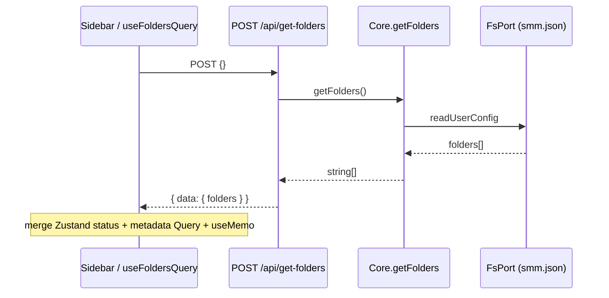

# Display Folders V3（get-folders + useFoldersQuery）

> **Status:** Implemented (2026-08-17). Tasks 1–6 completed on branch `core-layer`. Commits: `0ea4f5e1` (Core singleton) through `6d28212b` (folders query invalidation). Verification: GetFolders.test.ts (2), useFoldersQuery.test.ts (2), mergeFolderPathsWithUiStatus.test.ts (3). Do not re-run.

本设计描述「显示媒体文件夹列表」从 UI 直接读 `UserConfig` / Zustand，迁移到 **UI → Internal HTTP → Core** 的第一刀，并由 `localStorage["smm.v3.enabled"]` 控制新旧路径。

> 配套已实现：`Core.getFolders()`（见 [2026-08-17-core-read-apis-design.md](./2026-08-17-core-read-apis-design.md)）。

## 1. Background

现状 Sidebar 列表源：

1. `AppInitializer` → `UIMediaFolderStoreInitializer` 从 `useConfig().userConfig.folders`（`POST /api/readFile` 读 `userDataDir/smm.json`）一次性 `setFolders` 进 Zustand；
2. `Sidebar` 读 Zustand `folders`，再用 `useQueries(mediaMetadata…)` 拼 `mediaName` / `mediaType`，`useMemo` 做 search / filter / sort。

问题：列表 paths 与业务配置耦合在 UI 编排里，无法走 Layer 2 Core，也难以被 MCP / 外部 API 复用同一数据源。

目标（本切片范围，方案 A + 落地方式 1）：

- 新增 `POST /api/get-folders` → `Core.getFolders()`；
- UI 增加 `useFoldersQuery`；V3 下 Sidebar 以 query paths 为列表源；
- **status / selection 仍用 Zustand**；**metadata 仍用现有 `useQueries`**；
- flag 关闭时行为与今天完全一致。

## 2. Architecture

### 2.1 Project Level Architecture

```
apps/ui (Layer 1)
  useFoldersQuery ──POST /api/get-folders──► apps/cli (Layer 3 宿主)
                                              │
                                              ▼
                                         Core.getFolders()  (apps/core, Layer 2)
                                              │
                                              ▼
                                         FsPort → userDataDir/smm.json
```

依赖方向：`ui → cli HTTP → core-app → FsPort`。本切片不改 `packages/core` 领域类型。

### 2.2 App Level Architecture

| 层 | 新增 / 改动 |
|----|-------------|
| Layer 2 | 无新方法（复用已有 `Core.getFolders`） |
| Layer 3 cli | `POST /api/get-folders` 路由；懒创建/单例 `Core`（`NodejsFsAdapter`） |
| Layer 1 ui | `localStorage` flag、`getFolders` API client、`useFoldersQuery`、Sidebar 合并逻辑、folders 变更处 `invalidateQueries` |

### 2.3 Key Design

**Feature flag**

```ts
localStorage.getItem("smm.v3.enabled") === "true"
```

默认关闭。可挂在 `localStorages` 上作为 getter，非必须。

**数据职责拆分（方案 A）**

| 数据 | 来源（V3） | 来源（旧） |
|------|------------|------------|
| 列表 paths | `useFoldersQuery` → Core | Zustand `folders`（由 Initializer / import 写入） |
| status / type / test | Zustand（按 path 合并；缺失默认 `"ok"`） | 同左 |
| selection | Zustand + `localStorages.sidebarSelectedFolder` | 同左 |
| mediaName / mediaType | 现有 metadata `useQueries` | 同左 |
| search / filter / sort | `sidebarStore` + 现有 `useMemo` | 同左 |

**路径合并（V3 Sidebar）**

```ts
const paths = useFoldersQuery().data ?? []
const byPath = new Map(zustandFolders.map((f) => [Path.posix(f.path), f]))
const rows = paths.map((p) => {
  const platform = Path.toPlatformPath(p)
  const existing = byPath.get(Path.posix(p))
  return {
    path: platform,
    status: existing?.status ?? "ok",
    test: existing?.test,
    type: existing?.type,
  }
})
// 再接现有 metadata useQueries + filteredAndSortedFolders useMemo
```

**Core 构造时的目录参数（重要）**

生产环境：

- `smm.json` → **userDataDir**
- metadata 缓存 → **appDataDir**

Win / macOS 上二者通常相同；Linux 上 XDG 分离。`Core` 当前把 `appDataDir` 当作「持有 `smm.json` 的根」。本切片 `getFolders` 只读配置，cli 构造 Core 时传入：

```ts
appDataDir: getUserDataDir()
```

以保证读到与现 UI 相同的 `smm.json`。完整宿主拆分 `userDataDir` / `appDataDir` 不在本切片；不改 Core API。

## 3. HTTP 契约

### `POST /api/get-folders`

- **Request**：`{}`（允许空 body）
- **Success**：`{ data: { folders: string[] } }`
- **Failure**：`{ error: "Error Reason: …" }`，HTTP **200**（对齐现有 RPC 风格）
- `folders` 与 `UserConfig.folders` 一致；本接口不做 sort / filter / search

## 4. User Stories

### 4.1 Flag 关闭时行为不变

* **Given** `smm.v3.enabled` 未设或不为 `"true"`
* **When** 打开应用并查看 Sidebar
* **Then** 不发起 `/api/get-folders`；列表仍来自 Zustand，与改前一致

### 4.2 Flag 开启时从 Core 拉列表

* **Given** `smm.v3.enabled === "true"`，且 `smm.json` 含若干 folders
* **When** Sidebar 渲染
* **Then** `useFoldersQuery` 请求 `POST /api/get-folders`，列表 paths 与配置一致；search / filter / sort / 选中仍可用



### 4.3 导入 / 删除后列表刷新

* **Given** V3 已开启
* **When** import / delete / rename 成功修改了 `UserConfig.folders`
* **Then** 调用方 `invalidateQueries({ queryKey: ['folders'] })`（或等价 root key），Sidebar paths 更新；status 仍可由 Zustand 乐观更新

## 5. UI 细节

### 5.1 `useFoldersQuery`

- 仿 `usePlansQuery`：`queryKey: ['folders']`（或 `foldersQueryKey` 常量）
- `enabled: isSmmV3Enabled()`
- `queryFn`：调用 API client；`resp.error` 则 throw

### 5.2 Initializer / selection（V3）

| 职责 | V3 行为 |
|------|---------|
| 列表 paths | 来自 query，不依赖 Initializer `setFolders` 作为列表源 |
| status seed / availability | Initializer 仍可写 Zustand；缺失 path 默认 `"ok"` |
| selection | 不变（含 `sidebarSelectedFolder` 恢复） |
| 旧路径 | Initializer / Sidebar 逻辑不动 |

### 5.3 Invalidate 落点

在 V3 且成功改动 `UserConfig.folders` 的路径上失效 folders query，至少包括：

- 单目录 import / media library import
- Sidebar / AppV2 删除
- folder rename（Socket 或 mutation 成功后）

默认策略：**invalidate**（不做本切片强制的 `setQueryData` 乐观 paths）。

## 6. cli 细节

- 新路由文件（例如 `apps/cli/src/route/GetFolders.ts`）`handleGetFolders(app)`
- 在现有 Hono 注册处挂上该 handler
- 懒单例 `getCore()`：`new Core({ fs: new NodejsFsAdapter(), network: …, appDataDir: getUserDataDir(), userDataDir: getUserDataDir(), … })`
- `core-app` 加入 cli 的 workspace 依赖

NetworkPort：本切片 `getFolders` 不触网；可注入既有/最小 noop fetch 适配器以满足构造函数。

## 7. 测试计划

| 层 | 用例 |
|----|------|
| cli 路由 | 空 folders；有 folders；Core/fs 失败 → `error` 字段、HTTP 200 |
| UI hook / 合并 | flag off 不请求；flag on 合并 status；缺 Zustand 行时 status=`ok` |
| 回归 | flag off 下既有 Sidebar / Initializer 行为不变（单元或现有测试） |

`Core.getFolders` 单测已存在，本切片不重复。

## 8. 不做的事（YAGNI）

- 不用 Socket.IO 推送文件夹列表
- 不拆 Core 的 `userDataDir` / `appDataDir` 双根（仅构造时传 `getUserDataDir()`）
- 不移除 Zustand `folders` / 不迁移初始化流水线到 Core
- 不 enrich `get-folders` DTO（不加 status / type）
- 不改 MCP `get-media-folders` 工具（可后续改为同一 Core 调用）

## 9. 涉及文件（预期）

- 新：`apps/cli/src/route/GetFolders.ts`（+ 可选测试）
- 改：cli 路由注册、`apps/cli/package.json`（依赖 `core-app`）
- 新：`apps/ui/src/api/getFolders.ts`、`apps/ui/src/hooks/.../useFoldersQuery.ts`（及 query key）
- 改：`apps/ui/src/components/v2/Sidebar.tsx`（或薄 hook）
- 改：import / delete / rename 成功路径上的 invalidate
- 可选：`apps/ui/src/lib/localStorages.ts` 增加 v3 flag getter
- 文档：`docs/api/index.md` 增加条目（实现时）

## 10. 与现状代码流对照

**旧路径**：`useUserConfigQuery` → Initializer `setFolders` → Zustand → Sidebar `useMemo(filter/sort)` + metadata queries。

**新路径（flag on）**：`useFoldersQuery` → `POST /api/get-folders` → `Core.getFolders` → 合并 Zustand status → 同一套 metadata queries + `useMemo`。
