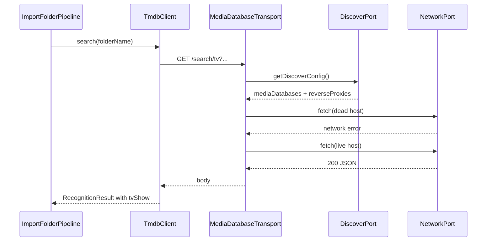

# Core media-database fetch failover (align with UI)

This design document describe the high level design of a feature.
The design document is golden source and reference by one or more features.

## 1. Background

Layer 2 `apps/core` runs `importFolder` recognition via `TmdbClient` / `TvdbClient` on a thin `NetworkPort`.
Today each client uses a **single** upstream:

- default: `https://mediadb.vercel.app/api/tmdb` (or `/api/tvdb`)
- or `userConfig.tmdb.host` / `userConfig.tvdb.host` when set

There is **no** discover-config host list, **no** multi-host failover, and **no** general reverse-proxy chain.

The UI path (`apps/ui/src/api/tmdb.ts` → `fetchTmdb` → `fetchWithFailover`) does the opposite for the default-upstream case:

1. Load discover config (`mediaDatabases` of type `tmdb` / `tvdb`, plus `reverseProxies`)
2. Try each host (and paired reverse proxies) until one connects
3. Only then treat recognition search as failed

So CLI / Core `smm add` can report “import succeeded” with empty `tvShow` / `mediaFiles` while the same folder would still recognize in the UI once failover finds a reachable host. That violates the Layer 2 goal: **one business path, logically consistent with existing initialization**.

Observed symptom (2026-08-18): folder `啾咪bady` — metadata cache has only `type` + empty `mediaFiles`; `mediadb.vercel.app` timed out from the machine; Core never tried other discover hosts.

## 2. Architecture

## 2.1 Project Level Architecture

```
UI today                          Core today (gap)
────────                          ────────────────
fetchTmdb / fetchTvdb             TmdbClient / TvdbClient
    │                                 │
    ├─ custom host → local SMM        ├─ custom host → direct NetworkPort
    │   reverse proxy                 │   (no local proxy headers)
    └─ default → discover hosts       └─ default → single SMM_TMDB/TVDB_DEFAULT
         + fetchWithFailover               (mediadb.vercel.app only)
```

**Target:** Core clients use the **same routing policy** as UI for media-database HTTP:

| Case | Behavior (must match UI) |
|------|---------------------------|
| Custom host (non-empty, parseable) | Request via local SMM reverse proxy (`X-SMM-Proxy-Upstream-BaseURL`); optional `httpProxy` as UI does |
| Default / empty host | Resolve candidate hosts from discover `mediaDatabases`; failover with `proxiableFetch` / equivalent; do not fail the whole chain on one dead node |

Discover config source for headless Core (CLI without UI):

- Prefer an injected **DiscoverPort** (or options on `NetworkPort` / client factory) so Layer 3 can supply the same JSON the UI gets from `/api/discover` / static bundled defaults
- Fallback list must include at least today’s `SMM_TMDB_DEFAULT_UPSTREAM` / `SMM_TVDB_DEFAULT_UPSTREAM` so unit tests and offline hosts stay deterministic

Shared building blocks already in monorepo:

- `packages/core/proxiableFetch.ts` — URL list + reverse-proxy failover
- UI `fetchWithFailover` / discover types — policy reference (prefer moving policy into `@smm/core` or `apps/core` so UI can later thin-wrap it)

```
apps/cli getCore()
    │
    ▼
apps/core ImportFolderPipeline
    │
    ├─ TmdbClient / TvdbClient  ──► MediaDatabaseTransport (new)
    │                                      │
    │                                      ├─ DiscoverPort.resolve()
    │                                      └─ NetworkPort.fetch (+ proxy headers)
    └─ recognizeMediaFolder (unchanged phases)
```

## 2.2 App Level Architecture

Proposed modules (names indicative):

| Piece | Location | Role |
|--------|----------|------|
| Transport | `apps/core/src/clients/mediaDatabaseTransport.ts` | Resolve base URL chain; perform one API path with failover |
| DiscoverPort | `apps/core/src/ports/DiscoverPort.ts` | `getDiscoverConfig(): Promise<DiscoverConfigSubset>` |
| StaticDiscoverAdapter | `apps/core/src/adapters/StaticDiscoverAdapter.ts` | Bundled / hardcoded hosts for tests + CLI without HTTP |
| HttpDiscoverAdapter (Layer 3) | `apps/cli` optional | Fetch live `/api/discover` when server or remote discover URL is available |
| TmdbClient / TvdbClient | existing | Call transport instead of raw `network.fetch(host + path)` |
| Pipeline | `importFolderPipeline.ts` | Pass `reverseProxyUrl` from `Core.getAppConfig()` into clients when custom host |

Recognition phases (`recognizeMediaFolder`) stay unchanged; only HTTP reliability improves.

## 2.3 Key Design

1. **Policy parity over code copy** — Encode the same decision tree as `fetchTmdb` / `fetchTvdb` (custom vs default; direct then proxies). Prefer one shared implementation in `@smm/core` or `apps/core` rather than diverging again.
2. **Single-node failure ≠ recognition failure** — Exhaust the host/proxy chain before returning empty search results from network errors. Empty **search results** after a successful HTTP 200 remain a soft miss (folder name not found).
3. **Swallow vs surface** — Today `searchInTmdb` / `searchInTvdb` catch all errors. After failover, log exhausted failover via `LoggerPort`; keep best-effort empty result for import success, unless a later product decision marks recognition-required.
4. **CLI without reverse proxy process** — Default-upstream failover must work with **general** discover reverse proxies alone (UI already supports this). Custom-host path still needs local reverse proxy URL from Layer 3 (`Core` already accepts `reverseProxyUrl`).
5. **Folder name quality is orthogonal** — Names like `啾咪bady` may still miss TMDB after network works; users rename / embed `{tmdbid=}`. Failover fixes connectivity, not fuzzy title matching.

## 3. User Stories

### 3.1 Default upstream: first host down, second host works

* **Given** - discover lists TMDB hosts `[dead.example, live.example]` and Core uses MediaDatabaseTransport
* **When** - `importFolder` recognizes a folder whose title exists on TMDB
* **Then** - Core obtains search/details from `live.example` and persists `tvShow` / `mediaFiles`; import job succeeds



### 3.2 Custom host uses local reverse proxy

* **Given** - `userConfig.tmdb.host` is a custom URL and Core has `reverseProxyUrl`
* **When** - recognition calls TMDB
* **Then** - request goes to local reverse proxy with `X-SMM-Proxy-Upstream-BaseURL` set to the custom host (same contract as UI `fetchByInternalReverseProxy`)

### 3.3 All hosts unreachable

* **Given** - every discover host and reverse proxy fails
* **When** - recognition runs
* **Then** - Logger records failover exhaustion; `tvShow` stays unset; import still completes; CLI progress shows recognition completed with no title (existing CLI wording)

### 3.4 UI and Core same folder, same network

* **Given** - mediadb.vercel.app is unreachable but another discover TMDB host is reachable
* **When** - user runs UI initialize and `smm add` on the same folder
* **Then** - both paths either recognize the show or both soft-miss on title; they must not diverge solely because Core skipped failover

## 4. Out of scope (this design)

- Fuzzy / alias matching for nicknames (`啾咪bady` → Kill Me Baby)
- Changing CLI progress exit codes when recognition soft-misses
- Removing UI `fetchTmdb` in the first PR (can thin-wrap shared transport later)
- Full migrate of scrape image CDN failover (separate design)

## 5. Implementation order (suggested)

1. Extract / implement `MediaDatabaseTransport` + DiscoverPort with StaticDiscoverAdapter (tests with fake multi-host NetworkPort)
2. Wire `TmdbClient` / `TvdbClient` through transport; keep single-host behavior when DiscoverPort returns one URL
3. CLI: inject StaticDiscoverAdapter (or HttpDiscover if available); pass `reverseProxyUrl` into Core when local proxy is running
4. Optional follow-up: UI `fetchTmdb` delegates to shared transport for one code path
