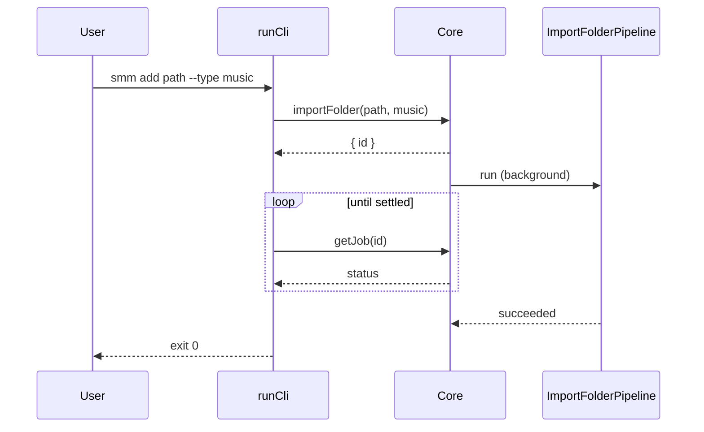

# `smm add` CLI command

This design document describe the high level design of a feature.
The design document is golden source and reference by one or more features.

## 1. Background

`smm list` already lists imported folders via Layer 2 `Core.getFolders()`. Operators also need a CLI to **import** a folder.

`Core.importFolder(path, type)` already starts the media-folder initialization pipeline in the background and exposes progress via `Core.getJob(id)` (in-memory `JobStore`). A separate `smm job` command is **not** required: in CLI mode the process stays alive until initialization finishes.

## 2. Architecture

## 2.1 Project Level Architecture

```
smm add <folder> --type tvshow|movie|music
    │
    ▼
apps/cli/index.ts          (argv[2] is list|add → runCli, else HTTP server)
    │
    ▼
apps/cli/src/cli/runCli.ts (Commander)
    │
    ▼
getCore().importFolder(path, type)   →  { id }
getCore().getJob(id)                 →  poll until not running
    │
    ▼
apps/core  ImportFolderPipeline  (config → metadata → listFiles → … → persist)
```

Same Core singleton as `smm list` / `POST /api/get-folders`. No HTTP. No new Core API.

## 2.2 App Level Architecture

| Piece | Location | Role |
|--------|----------|------|
| CLI program | `apps/cli/src/cli/runCli.ts` | Commander `list` + `add` |
| Entry | `apps/cli/index.ts` | If `argv[2]` is `list` or `add`, `runCli` then `process.exit` |
| Tests | `apps/cli/src/cli/add.test.ts` | Real temp folder + `USER_DATA_DIR`; `--type music` (no TMDB) |

## 2.3 Key Design

1. **`--type` is required** (`tvshow` \| `movie` \| `music` \| `anime`). `anime` is an alias for `tvshow`.
2. **Wait, then exit** — on success print necessary logs and exit 0. On failure, message on stderr, exit 1. Do not print a job id.
3. **Logging** — default prints necessary lines (`Adding …`, pipeline `importFolder: stage=…`, `Imported …`). `--verbose` also prints structured logger payloads (e.g. `folderPath`).
4. **Same-process poll** — `importFolder` is async; CLI polls `getJob` until `succeeded` / `failed` / `aborted` (or timeout). In-memory JobStore is enough because the process does not exit until the job settles.
5. **No `smm job`**.

**Out of scope:** JSON output, daemon/HTTP import, persisting JobStore to disk.

## 3. User Stories

### 3.1 Import a music folder and wait

* **Given** - a local folder with files
* **When** - the user runs `smm add <folder> --type music`
* **Then** - the process does not exit until initialization succeeds; the folder is in `smm.json`; exit code is 0



### 3.2 Initialization failure

* **Given** - a path the pipeline cannot initialize
* **When** - the user runs `smm add <path> --type music`
* **Then** - stderr has an error message; exit code is 1

### 3.3 Missing type

* **Given** - the user omits `--type`
* **When** - they run `smm add <folder>`
* **Then** - Commander reports the missing option; exit code is 1
