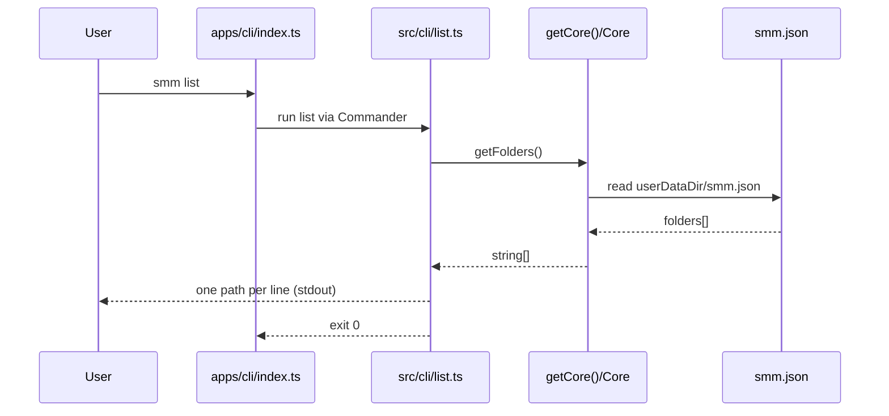

# `smm list` CLI command

This design document describe the high level design of a feature.
The design document is golden source and reference by one or more features.

## 1. Background

Imported media folder paths are persisted in `userDataDir/smm.json` and exposed by Layer 2 `Core.getFolders()` (`apps/core`, package name `core-app`). The HTTP surface already reuses this via `POST /api/get-folders` (`apps/cli/src/route/GetFolders.ts` → `getCore().getFolders()`).

Operators also need a terminal command to list those paths without starting (or talking to) the HTTP server. This feature adds `smm list` to `apps/cli`, using the Commander library and the same Core API.

**Agreed product behavior**

- Output: path only, one path per line on stdout.
- Empty list (including missing `smm.json`): empty stdout, exit 0.
- Data path: `getCore().getFolders()` (not a parallel read of `packages/core` / raw config).
- Scope: add `list` only; when argv is not `list`, keep today’s server startup and flag parsing unchanged.

## 2. Architecture

## 2.1 Project Level Architecture

```
apps/cli (entry + Commander `list`)
    │
    ▼
apps/cli/src/core/getCore.ts   (lazy Core singleton)
    │
    ▼
apps/core (package `core-app`)  Core.getFolders()
    │
    ▼
userDataDir/smm.json  →  folders: string[]
```

- `apps/cli` depends on workspace package `core-app` (directory `apps/core`).
- No new HTTP API. No change to `packages/core` for this feature.
- Server boot path remains the default when the first argument is not `list`.

## 2.2 App Level Architecture

| Piece | Location | Role |
|--------|----------|------|
| Dependency | `apps/cli/package.json` | Add `commander` |
| Entry branch | `apps/cli/index.ts` | If `process.argv[2] === 'list'`, run list CLI then exit; else existing `parseArgs()` + server |
| List command | `apps/cli/src/cli/list.ts` (new) | Commander program registering `list`; action calls `getCore().getFolders()` and prints paths |
| Core singleton | `apps/cli/src/core/getCore.ts` (existing) | Same as `/api/get-folders` |
| Tests | `apps/cli/src/cli/list.test.ts` (new) | Vitest; `USER_DATA_DIR` + `resetCoreForTests()` pattern from `GetFolders.test.ts` |

**Entry flow**

```
process.argv
    │
    ├─ [2] === 'list'  →  runListCli(argv)  →  process.exit(code)
    │
    └─ otherwise       →  parseArgs() + Server.start()  (unchanged)
```

## 2.3 Key Design

1. **Early argv branch (Approach A)** — Introduce Commander only for the `list` subcommand path. Avoid a full migration of `--staticDir` / `--port` in this change.
2. **Reuse Layer 2** — `getCore().getFolders()` is the single source of truth for imported folder paths (same as display-folders v3 HTTP route).
3. **In-process, no server** — `smm list` must work without the HTTP server listening.
4. **Stdout contract** — Each path is one `console.log` line. No headers, no JSON in v1.
5. **Errors** — Unexpected failures from `getFolders()`: message on stderr, exit code 1. Empty folders is success, not an error.

**Out of scope**

- Migrating server startup flags to Commander.
- JSON / table output flags.
- `smm import` / `smm unimport` or other folder management commands.

## 3. User Stories

### 3.1 List imported folders

* **Given** - `smm.json` under `USER_DATA_DIR` contains `folders: ["/media/A", "/media/B"]`
* **When** - the user runs `smm list` (or `bun run index.ts list` in `apps/cli`)
* **Then** - stdout is:

```
/media/A
/media/B
```

and the process exits with code 0; the HTTP server is not started.



### 3.2 Empty list is silent success

* **Given** - no `smm.json` or `folders` is `[]`
* **When** - the user runs `smm list`
* **Then** - stdout is empty, exit code is 0.

### 3.3 Failure surfaces on stderr

* **Given** - `getFolders()` throws (unexpected I/O or Core error)
* **When** - the user runs `smm list`
* **Then** - an error message is written to stderr and the process exits with code 1.

### 3.4 Default entry still starts the server

* **Given** - the user runs `smm` with no `list` subcommand (optional `--port` / `--staticDir` as today)
* **When** - the process starts
* **Then** - behavior matches the current server entry; Commander list code is not required to run.
