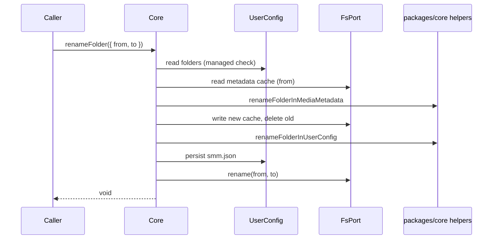

# Core.renameFolder

This design document describes migrating Sidebar folder rename (metadata cache + user config + on-disk rename) into Layer 2 `apps/core`, without changing existing UI or `packages/core-routes` source.

## 1. Background

Sidebar right-click **Rename** already renames a media folder end-to-end:

1. UI dialog / `useRenameMediaFolderMutation` builds `to = join(dirname(from), newName)`.
2. HTTP `POST /api/renameFolder` → `packages/core-routes` `doRenameFolder`.
3. That path updates the metadata cache, updates `UserConfig.folders`, then renames the directory on disk.
4. UI refreshes local state via `refreshUiAfterFolderRename`.

Layer 2 (`apps/core`) already owns import / unimport / metadata read. Operators and a future v3 path need the same rename semantics in-process. This change adds **`Core.renameFolder` only** — no HTTP/CLI/UI/v3 wiring yet. Existing UI and `doRenameFolder` remain the production path until a later integration.

**Constraints (from product):**

- Careful migration: preserve `doRenameFolder` step order and failure messages; do not “improve” behavior.
- Do not edit UI or `packages/core-routes` source while migrating.
- New callers under a v3 switch come later; out of scope here.

## 2. Architecture

## 2.1 Project Level Architecture

```
apps/ui (Sidebar Rename) ──unchanged──► POST /api/renameFolder
                                              │
packages/core-routes doRenameFolder ──unchanged──► fs + metadata + smm.json
                                              │
packages/core  renameFolderInMediaMetadata / renameFolderInUserConfig
                                              ▲
apps/core Core.renameFolder ──new──► FsPort + UserConfig + same pure helpers
```

- **Pure transforms** stay in `packages/core` (already used by core-routes).
- **Orchestration** is duplicated into `Core.renameFolder` for this milestone (Approach A). Shared extraction with core-routes is deferred so source stays untouched.
- **Disk rename** goes through `FsPort.rename` (new), not a direct `node:fs` import inside Core.

## 2.2 App Level Architecture

| Piece | Role |
|-------|------|
| `Core.renameFolder({ from, to })` | Orchestrates managed check → metadata cache move → user config → `FsPort.rename` |
| `FsPort.rename(from, to)` | Rename/move a path (POSIX in, adapter converts) |
| `NodejsFsAdapter.rename` | `fs.promises.rename` after `Path.toPlatformPath` |
| `NetworkFsAdapter.rename` | Throws Not Implemented (no browser wiring this round) |
| `renameFolderInMediaMetadata` | Existing pure helper — rewrite paths inside `MediaMetadata` |
| `renameFolderInUserConfig` | Existing pure helper — rewrite `folders` entries only |
| `metadataCachePath` | Existing Core cache path helper (same sanitization as core-routes) |

**Step order (must match `doRenameFolder`):**

1. `Path.posix(from)` / `Path.posix(to)`
2. Assert source is managed (`UserConfig.folders` compare platform + posix, same as `isMediaFolderManaged`)
3. Read metadata cache for `from`; fail if absent
4. `renameFolderInMediaMetadata` → write cache for new path → delete old cache
5. `renameFolderInUserConfig` → persist via `UserConfig.update` / write
6. `FsPort.rename(fromPosix, toPosix)`

## 2.3 Key Design

- **Signature:** `renameFolder(args: { from: string; to: string }): Promise<void>`
- **Errors:** throw `Error` (Core style). Messages aligned with `doRenameFolder`:
  - `{fromPosix} is not managed by SMM`
  - `Media metadata not found: {from}` (same string shape as today: original `from` in the message)
  - Other IO errors propagate
- **No behavior upgrades:** do not update `selectedFolder`; do not require destination parent to exist beyond what `fs.rename` already requires; do not reorder disk rename before config writes.
- **Tests:** unit tests in `apps/core` prove cache/config/rename side effects and rejection paths; adapter tests for `NodejsFsAdapter.rename` and Network NYI.

## 3. User Stories

### 3.1 Rename managed folder with metadata

* **Given** - a folder is listed in `UserConfig.folders` and has a metadata cache file
* **When** - `Core.renameFolder({ from, to })` runs
* **Then** - disk path is renamed, `folders` contains `to` (platform form via existing helper), new metadata cache exists with rewritten paths, old cache is gone



### 3.2 Reject unmanaged or missing metadata

* **Given** - folder is not in `folders`, or metadata cache is missing
* **When** - `Core.renameFolder` is called
* **Then** - it throws with the messages above and does not call `FsPort.rename` / does not persist a partial rename beyond what tests assert for early exits

## 4. Out of scope

- HTTP / CLI / MCP / UI integration and v3 feature-flag wiring
- Editing `packages/core-routes` `doRenameFolder` or UI rename mutation
- Implementing a real `NetworkFsAdapter.rename` HTTP mapping
- Transactional rollback if disk rename fails after config/metadata updates (existing `doRenameFolder` has the same gap; preserve it)

## 5. Implementation notes

- Prefer a small private helper on Core (or `pipeline/renameFolder.ts`) that mirrors `doRenameFolder` body so `Core.ts` stays thin.
- Update all `FsPort` implementors and in-memory test fakes so TypeScript stays green.
- Follow TDD: failing Core tests first, then minimal green implementation.
