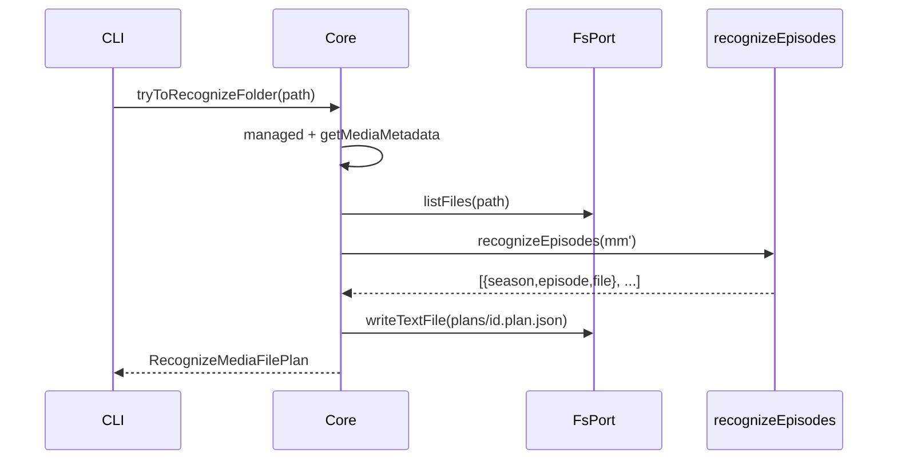

# Core.tryToRecognizeFolder / applyPlan

This design document describes migrating rule-based episode recognition (TvShowPanel `useRuleBasedRecognizeFlow`) into Layer 2 `apps/core`, exposing CLI commands for operators. UI and existing HTTP plan APIs stay unchanged in this milestone.

## 1. Background

Sidebar / TvShowPanel **rule-based recognize** today:

1. UI creates a `recognize-media-file` plan (`preparing`) via `POST /api/createPlan`.
2. `buildTemporaryRecognitionPlanAsync` runs `recognizeEpisodesAsync` against `MediaMetadata.files` + `tvShow.seasons`.
3. Plan moves to `pending` for user review; confirm calls `applyRecognizeMediaFilePlan` (rewrites `mediaFiles`) and marks plan `completed` (file deleted).

Layer 2 already has a synchronous `recognizeEpisodes` used by import. Operators need the same “preview plan → apply” loop without the UI. This change adds **Core + CLI only**.

**Constraints (from product):**

- Scope: Core + CLI. No UI / `smm.v3` / new HTTP routes this round.
- Do not edit `packages/core-routes` plan HTTP handlers or UI recognize hooks.
- Reuse `apps/core` `recognizeEpisodes`; do not re-port UI Worker copy.
- Zero matches → return a **pending** plan with `files: []` (do not throw solely for empty matches).
- `MediaMetadata.files` is deprecated: list files via `FsPort.listFiles` at recognize time (in-memory for matching only; do not persist `files`).

## 2. Architecture

## 2.1 Project Level Architecture

```
apps/ui useRuleBasedRecognizeFlow ──unchanged──► POST /api/createPlan|updatePlan
                                                      │
packages/core-routes Plans ──unchanged──► {userDataDir}/plans/*.plan.json
                                                      │
apps/cli  smm try-to-recognize / smm apply ──new──► Core
                                                      │
apps/core Core.tryToRecognizeFolder / getPlan / applyPlan ──new──► FsPort + recognizeEpisodes
```

Same on-disk plan layout as today: `{appDataDir}/plans/{id}.plan.json`.

## 2.2 App Level Architecture

| Piece | Role |
|-------|------|
| `Core.tryToRecognizeFolder(path)` | Managed check → metadata → listFiles → recognizeEpisodes → write pending plan → return |
| `Core.getPlan(id)` | Read plan JSON (CLI `apply`) |
| `Core.applyPlan(plan)` | This milestone: only `recognize-media-file` → merge `mediaFiles` → `setMetadata` → delete plan file |
| `pipeline/plans.ts` (new) | Path helpers + read/write/delete via `FsPort` |
| `pipeline/applyRecognizeMediaFilePlan.ts` (new) | Pure merge of plan files into `mediaFiles` (port of UI `updateMediaFileMetadatas` semantics) |
| Existing `recognizeEpisodes` | Pattern match SxxEyy / 第x季第y集 / single-season numeric |

**`tryToRecognizeFolder` step order:**

1. Normalize `path` to posix; assert managed (`UserConfig.folders`).
2. `getMediaMetadata(path)`; fail if missing.
3. Require `type === "tvshow-folder"` (or equivalent) and `tvShow.seasons` with episodes; otherwise throw.
4. `fs.listFiles(path)` → posix paths; build in-memory `mm` with `files` for `recognizeEpisodes` only.
5. `recognizeEpisodes(mm)` → `RecognizedFile[]` (may be empty).
6. Create plan: `id` (uuid), `task: "recognize-media-file"`, `status: "pending"`, `creator: "app"`, `mediaFolderPath`, `files` (possibly `[]`).
7. Persist plan file; return plan.

**`applyPlan` (recognize-media-file only):**

1. Validate `plan.task === "recognize-media-file"`.
2. Load metadata for `plan.mediaFolderPath`; fail if missing.
3. For each `plan.files` entry, merge into `mediaFiles` (same rules as UI `updateMediaFileMetadatas`: one path ↔ one S/E).
4. `setMetadata` (still strips deprecated `files` on write).
5. Delete plan file (terminal `completed`, same as core-routes `updatePlan`).

Empty `files: []` apply is a no-op on `mediaFiles` but still completes/deletes the plan.

## 2.3 Key Design

### Core signatures

```ts
tryToRecognizeFolder(path: string): Promise<RecognizeMediaFilePlan>
getPlan(id: string): Promise<Plan>  // RecognizeMediaFilePlan | RenameFilesPlan
applyPlan(plan: Plan): Promise<void>
```

- Prefer async (I/O). Return type of `tryToRecognizeFolder` is specifically `RecognizeMediaFilePlan`.
- `applyPlan` accepts the union `Plan`; unsupported tasks throw.

### Errors (throw)

| Case | Message shape (illustrative) |
|------|------------------------------|
| Not managed | `{path} is not managed by SMM` |
| No metadata | `Media metadata not found: {path}` |
| Not TV / no seasons | `Folder is not a TV show with episodes: {path}` |
| Plan missing | `Plan not found: {id}` |
| Unsupported apply task | `Unsupported plan task: {task}` |

Empty recognition is **not** an error.

### CLI

```bash
smm try-to-recognize <folder>
# stdout: plan id + detail (including files: [] case)

smm apply <plan-id>
# load via getPlan → applyPlan; print summary
```

### Out of scope

- UI / v3 switch / HTTP wrappers
- AI recognize (`creator: "ai"`)
- `applyPlan` for `rename-files`
- Changing import pipeline

## 3. User Stories

### 3.1 Try recognize with matches

* **Given** - an imported tvshow folder with metadata seasons/episodes and videos named `S01E01.mkv` …
* **When** - `Core.tryToRecognizeFolder(path)` runs
* **Then** - a pending plan file exists with matching `files`, and the returned plan matches the file



### 3.2 Try recognize with zero matches

* **Given** - imported tvshow metadata but no pattern-matching video names
* **When** - `tryToRecognizeFolder(path)` runs
* **Then** - returns pending plan with `files: []` and persists that plan (no throw)

### 3.3 Apply recognize plan

* **Given** - a pending recognize plan with one or more files
* **When** - `applyPlan(plan)` runs
* **Then** - metadata `mediaFiles` updated, plan file deleted

### 3.4 CLI round-trip

* **Given** - same as 3.1
* **When** - `smm try-to-recognize` then `smm apply <id>`
* **Then** - exit 0; `getMediaMetadata` reflects mappings; plan file gone
