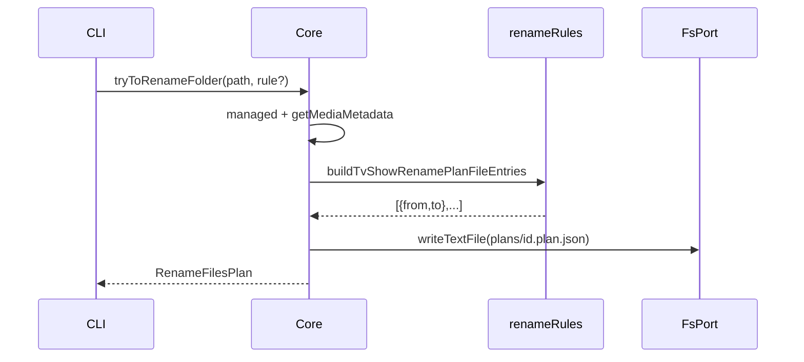

# Core.tryToRenameFolder / applyPlan (rename-files)

This design document describes migrating rule-based TV episode **file** renaming (TvShowPanel `useRuleBasedRenameFilesFlow`) into Layer 2 `apps/core`, exposing CLI commands for operators. UI and existing HTTP rename/plan APIs stay unchanged in this milestone.

## 1. Background

Toolbar / TvShowPanel **rule-based rename** today:

1. UI creates a `rename-files` plan (`preparing`) via `POST /api/createPlan`.
2. `buildTvShowRenamePlanFileEntries(mm, plex|emby)` builds video `from` → `to` pairs (skips already-matching names).
3. Plan moves to `pending` for review; confirm expands associated files (subs / nfo / jpg) via `buildTvShowRenameListForPlan`, calls `POST /api/renameFiles`, then updates `mediaFiles` paths.

Folder rename (`Core.renameFolder`) already exists and is **out of scope**. This change ports **episode file rename** only: **Core + CLI**, mirroring the recognize migration (`tryToRecognizeFolder` + `applyPlan`).

**Constraints (from product):**

- Scope: Core + CLI. No UI / `smm.v3` / new HTTP routes this round.
- Do not edit `packages/core-routes` or UI rename hooks.
- Align with recognize: `tryToRenameFolder` → pending plan; extend existing `applyPlan` for `rename-files`.
- Zero rename candidates → return a **pending** plan with `files: []` (do not throw solely for empty plans).
- Default naming rule: **`plex`** when CLI / API omit the rule.
- TV show only this milestone (not movie rename).
- Prerequisite: episodes should already be linked in `mediaFiles` (typically after recognize); empty `mediaFiles` yields `files: []`.

## 2. Architecture

## 2.1 Project Level Architecture

```
apps/ui useRuleBasedRenameFilesFlow ──unchanged──► POST /api/createPlan|updatePlan|/renameFiles
                                                         │
packages/core-routes ──unchanged──► plans + renameFiles
                                                         │
apps/cli  smm try-to-rename / smm apply ──new──► Core
                                                         │
apps/core Core.tryToRenameFolder + applyPlan(rename-files) ──new──► FsPort.rename + naming rules
```

Same on-disk plan layout: `{appDataDir}/plans/{id}.plan.json`.

## 2.2 App Level Architecture

| Piece | Role |
|-------|------|
| `Core.tryToRenameFolder(path, rule?)` | Managed check → metadata → build video rename entries → write pending `RenameFilesPlan` |
| `Core.applyPlan(plan)` | Extend: if `rename-files`, expand associates → rename on disk → rewrite `mediaFiles` → delete plan |
| Existing `applyPlan` recognize path | Unchanged |
| `pipeline/renameRules.ts` (new) | Port plex/emby `generateNewFileName` (TV) |
| `pipeline/buildTvShowRenamePlanFileEntries.ts` (new) | Port UI builder (omit unchanged paths) |
| `pipeline/buildTvShowRenameListForPlan.ts` (new) | Expand plan videos with associated files |
| `pipeline/applyRenameFilesPlan.ts` (new) | Orchestrate disk renames + metadata path rewrite |
| Existing `pipeline/plans.ts` | Reuse write/read/delete |

**`tryToRenameFolder` step order:**

1. Normalize `path`; assert managed.
2. `getMediaMetadata`; fail if missing.
3. Require TV show with seasons/episodes (same spirit as try-to-recognize); otherwise throw.
4. `rule = rule ?? "plex"`.
5. `buildTvShowRenamePlanFileEntries(mm, rule)` → `{ from, to }[]` (may be empty).
6. Create plan: `task: "rename-files"`, `status: "pending"`, `creator: "app"`, `files` (possibly `[]`).
7. Persist; return plan.

**`applyPlan` (rename-files branch):**

1. Validate `plan.task === "rename-files"`.
2. Load metadata; fail if missing.
3. `listFiles(mediaFolderPath)` for associate discovery.
4. Build full rename list (videos + associates), same semantics as UI `buildTvShowRenameListForPlan`.
5. For each pair: ensure destination parent exists as needed; `FsPort.rename(from, to)`. Empty list → skip disk ops.
6. Rewrite `mediaFiles[].absolutePath` where `from` matches a plan video (or expanded list video roots).
7. `setMetadata`; `deletePlan`.

Empty `files: []` apply: no disk renames; still deletes the plan file.

## 2.3 Key Design

### Core signatures

```ts
type RenameRuleName = "plex" | "emby"

tryToRenameFolder(path: string, rule?: RenameRuleName): Promise<RenameFilesPlan>
// existing:
getPlan(id: string): Promise<Plan>
applyPlan(plan: Plan): Promise<void>  // recognize-media-file | rename-files
```

### Naming rules (TV)

Port from `apps/ui/src/lib/renameRules.ts`:

- **plex:** `Season {SS}/{show} - S{SS}E{EE} - {episodeName}{ext}`
- **emby:** `Season {S}/{show} S{S}E{E} {episodeName}{ext}`

Omit entries where generated absolute path equals current video path (POSIX-normalized compare).

### Errors (throw)

| Case | Message shape |
|------|----------------|
| Not managed | `{path} is not managed by SMM` |
| No metadata | `Media metadata not found: {path}` |
| Not TV / no episodes | `Folder is not a TV show with episodes: {path}` |
| Invalid rule | `Unsupported rename rule: {rule}` |
| Plan missing | `Plan not found: {id}` (existing) |
| Unsupported apply task | `Unsupported plan task: {task}` (only if neither recognize nor rename) |

Empty rename candidates are **not** an error.

### CLI

```bash
smm try-to-rename <folder> [--rule plex|emby]
# stdout: plan id, task, status, folder, from → to lines (or (none))

smm apply <plan-id>
# already exists; must accept rename-files plans and print applied summary
```

Register `try-to-rename` in `apps/cli/index.ts` `cliCommands` (same pitfall as recognize).

### Out of scope

- UI / v3 switch / HTTP wrappers
- AI rename (`creator: "ai"`)
- Movie rename
- Changing `Core.renameFolder` (directory rename)

## 3. User Stories

### 3.1 Try rename with candidates

* **Given** - imported TV folder with `mediaFiles` linked to `S01E01.mkv` etc. and plex-style target names differ
* **When** - `Core.tryToRenameFolder(path)` or `smm try-to-rename path`
* **Then** - pending `rename-files` plan exists with non-empty `files`



### 3.2 Try rename with zero candidates

* **Given** - all video paths already match the selected rule (or no `mediaFiles`)
* **When** - `tryToRenameFolder` runs
* **Then** - returns pending plan with `files: []` (no throw)

### 3.3 Apply rename plan

* **Given** - pending rename plan with video entries and associated `.ass` / `.nfo` beside the videos
* **When** - `applyPlan(plan)` / `smm apply <id>`
* **Then** - videos and associates renamed on disk, `mediaFiles` paths updated, plan file deleted

### 3.4 CLI round-trip after recognize

* **Given** - folder imported with empty `mediaFiles`, then `try-to-recognize` + `apply`
* **When** - `try-to-rename --rule plex` then `apply`
* **Then** - on-disk names follow plex layout under `Season XX/`
