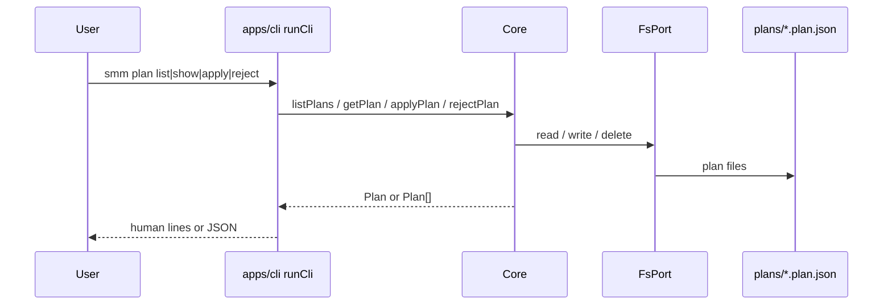
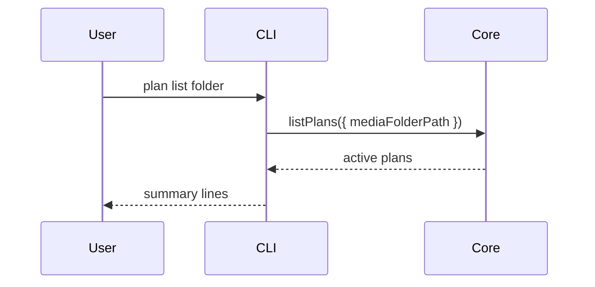

# CLI Manage Plan (`smm plan` / `reject`)

This design document describe the high level design of a feature.
The design document is golden source and reference by one or more features.

## 1. Background

[Manage Plan](../../dev/manage-plan.md) defines CLI commands to list, show, apply, and reject plans, plus creators `try-to-recognize` / `try-to-rename`.

**Already implemented**

- `smm try-to-recognize <folder>`
- `smm try-to-rename <folder> [--rule plex|emby]`
- `smm apply <planId>`
- Core: `tryToRecognizeFolder`, `tryToRenameFolder`, `getPlan`, `applyPlan`
- e2e: `apps/e2e/cli/recognize.test.ts` (and related rename coverage)

**Still missing**

```
smm plan list [-a|--all]
smm plan list <folder> [-a|--all]
smm plan show <planId>
smm plan apply <planId>
smm plan reject <planId>
smm reject <planId>   # alias to plan reject
```

Plans live at `{appDataDir}/plans/{planId}.plan.json`. Lifecycle: `preparing` → `pending` → `completed` (file deleted) | `rejected` (file kept). HTTP already supports folder-scoped active listing via `getActivePlansForFolder`; CLI needs Core-level list (optional folder + optional `--all`) and reject.

**Agreed product decisions**

- `--all` / `-a`: include `rejected` in addition to active (`preparing` / `pending`). `completed` plans are already deleted, so they never appear.
- Lifecycle APIs live on Core (`listPlans`, `rejectPlan`), matching `getPlan` / `applyPlan`.
- Output: human-readable default; `-f|--format json` for `plan list` and `plan show`.
- `plan list` summary: one line per plan `<id>  <task>  <status>  <folder>`; `plan show` matches try-to-* multi-line detail.

## 2. Architecture

## 2.1 Project Level Architecture



- No new HTTP endpoints for this feature.
- No UI changes.
- `try-to-recognize` / `try-to-rename` / top-level `apply` remain unchanged; `plan apply` is an alias of `apply`.

## 2.2 App Level Architecture

| Piece | Location | Role |
|--------|----------|------|
| Core list/reject | `apps/core/src/pipeline/plans.ts` (+ `Core.ts`) | Scan plan dir; reject patches status |
| CLI commands | `apps/cli/src/cli/runCli.ts` | Commander `plan` group + `reject` |
| Entry allowlist | `apps/cli/index.ts` | Add `plan`, `reject` to `cliCommands` |
| Format helpers | `apps/cli/src/cli/` (small helpers near runCli) | List line / show detail / JSON |
| Core unit tests | `apps/core` (`plans` / `Core` tests) | Filter + reject persistence |
| CLI e2e | `apps/e2e/cli/manage-plan.test.ts` | Full command flows |
| Docs | `docs/dev/manage-plan.md` | Align CLI section with `--format` if needed |

## 2.3 Key Design

### Core API

```ts
listPlans(options?: {
  mediaFolderPath?: string
  all?: boolean
}): Promise<Plan[]>

rejectPlan(id: string): Promise<Plan>
```

- `listPlans`: enumerate `{appDataDir}/plans/*.plan.json` via `FsPort`; skip unreadable files; optional POSIX folder equality filter; default filter = `isActivePlanStatus`; `all: true` also keeps `rejected`.
- `rejectPlan`: `getPlan` equivalent load → set `status: "rejected"` → write file (keep on disk) → return plan; missing id throws `Plan not found: …`.

### CLI surface

```bash
smm plan list [folder] [-a|--all] [-f|--format json]
smm plan show <planId> [-f|--format json]
smm plan apply <planId>
smm plan reject <planId>
smm apply <planId>
smm reject <planId>
smm try-to-recognize <folder>
smm try-to-rename <folder>
```

| Mode | `plan list` | `plan show` |
|------|-------------|-------------|
| default | one line: `id  task  status  folder` | multi-line like try-to-* |
| `--format json` | `{ "plans": Plan[] }` | `{ "plan": Plan }` |

- Empty list: exit 0, no lines / `"plans": []`.
- Errors: stderr message, exit 1 (missing plan, etc.).
- `apply` / `reject` confirmations: `applied <id> (N file(s))` / `rejected <id>`.

### Out of scope

- New HTTP APIs or changing `updatePlan` semantics
- UI / MCP / AI tool changes
- Changing try-to-* plan creation behavior

## 3. User Stories

### 3.1 List pending plans for a folder

* **Given** an imported TV folder and a pending recognize plan from `try-to-recognize`
* **When** user runs `smm plan list <folder>`
* **Then** stdout includes that plan’s id/task/status/folder; another folder’s list does not



### 3.2 Show plan detail (JSON)

* **Given** a known `planId`
* **When** user runs `smm plan show <planId> --format json`
* **Then** stdout is `{ "plan": … }` with files; missing id exits 1

### 3.3 Reject hides from default list, visible with `--all`

* **Given** a pending plan
* **When** user runs `smm reject <planId>` (or `plan reject`)
* **Then** plan file remains with `status: rejected`; `plan list` omits it; `plan list --all` includes it

### 3.4 Apply via `plan apply`

* **Given** a pending plan
* **When** user runs `smm plan apply <planId>`
* **Then** same as `smm apply`: domain apply runs, plan file deleted

## 4. Test Plan

**Core unit**

- `listPlans` default vs `all`, with/without folder filter
- `rejectPlan` writes rejected status; throws when missing

**e2e** (`apps/e2e/cli/manage-plan.test.ts`, same testbed as recognize)

1. try-to-recognize → list / list folder / list other folder
2. plan show + `--format json`
3. plan apply deletes plan file
4. reject / plan reject → list vs list `--all`
5. Smoke aliases (`plan apply` ↔ `apply`)
