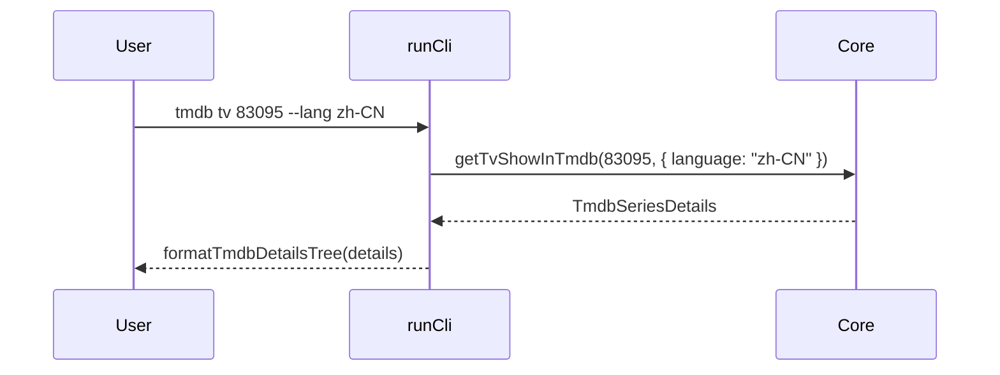

# CLI `smm tmdb tv` / `smm tmdb movie`

This design document describe the high level design of a feature.
The design document is golden source and reference by one or more features.

## 1. Background

`docs/dev/tmdb.md` already documents:

```bash
smm tmdb tv "<tmdbid>" -f|--format json|default --lang "<lang>"
smm tmdb movie "<tmdbid>" -f|--format json|default --lang "<lang>"
```

Today only `smm tmdb search` is implemented in `apps/cli/src/cli/runCli.ts`. Detail lookup already exists in Core (`getTvShowInTmdb` / `getMovieInTmdb`) and is used by HTTP / AI / MCP. This feature exposes the same Core methods as CLI subcommands so users can fetch full TMDB TV/movie details after a search, without going through the UI.

## 2. Architecture

## 2.1 Project Level Architecture

```mermaid
sequenceDiagram
  participant U as User
  participant CLI as apps/cli runCli
  participant C as Core
  participant TMDB as TMDB API

  U->>CLI: smm tmdb tv|movie &lt;id&gt; [options]
  CLI->>C: getTvShowInTmdb / getMovieInTmdb
  C->>TMDB: HTTP (via NetworkPort)
  TMDB-->>C: details payload
  C-->>CLI: TmdbSeriesDetails / TmdbMovieDetails
  CLI-->>U: default tree or pretty JSON
```

No new HTTP routes, AI tools, or MCP tools. CLI talks to Core in-process (same pattern as `smm tmdb search`).

## 2.2 App Level Architecture

| Piece | Location |
|-------|----------|
| Command registration | `apps/cli/src/cli/runCli.ts` under existing `tmdb` command |
| Human-readable formatter | `apps/cli/src/cli/tmdbDetailsFormat.ts` |
| Formatter unit tests | `apps/cli/src/cli/tmdbDetailsFormat.test.ts` |
| Optional command unit tests | `apps/cli/src/cli/tmdbGet.test.ts` (mock `getCore`, same style as `hello.test.ts`) |
| Live CLI e2e | Extend `apps/cli/test/tmdb.e2e.ts` and/or `apps/e2e/cli/tmdb.test.ts` |
| Docs | Update `docs/dev/tmdb.md` CLI section |

## 2.3 Key Design

### Command surface

```bash
smm tmdb tv <tmdbid> [-f|--format json|default] [--lang <lang>] [--host <url>] [--password <key>] [--proxy <url>]
smm tmdb movie <tmdbid> [-f|--format json|default] [--lang <lang>] [--host <url>] [--password <key>] [--proxy <url>]
```

- `tmdbid`: required positional; must parse as a positive integer. Invalid → stderr + exit code 1.
- `--format` / `-f`: choices `json` | `default`. Omitted → `default`.
- `--lang` / `--host` / `--password` / `--proxy`: same semantics and Core option mapping as `smm tmdb search` (`language` ← `--lang`).
- Errors thrown by Core: print message to stderr, exit 1.

### Output formats

**`json`**

Reuse existing `printJson` → `JSON.stringify(details, null, 2)` of the full Core return value.

**`default` (human-readable tree of all fields)**

`formatTmdbDetailsTree(value: unknown): string` recursively formats the entire payload:

- Primitives: `key: value`
- `null`: `key: null`
- `undefined`: omit the key
- Objects: `key:` then indented children (`  ` × depth)
- Arrays: `key:` then indented `[0]:`, `[1]:`, … (nested objects under each index)

No curated field subset — every enumerable field is printed so the CLI stays complete as TMDB payloads evolve.

### Out of scope

- MCP / AI tool / HTTP API changes (already implemented)
- Changing `smm tmdb search` output
- TVDB get-by-id CLI commands

## 3. User Stories

### 3.1 Fetch TV show details (default format)

* **Given** - Core can reach TMDB (userConfig or CLI overrides)
* **When** - user runs `smm tmdb tv 83095 --lang zh-CN`
* **Then** - exit 0; stdout is an indented key/value tree including at least `id` and localized `name` / overview fields from the full TMDB series details payload



### 3.2 Fetch movie details as JSON

* **Given** - Core can reach TMDB
* **When** - user runs `smm tmdb movie 550 -f json`
* **Then** - exit 0; stdout is valid pretty-printed JSON of the full `TmdbMovieDetails` object

### 3.3 Custom host / proxy (parity with search)

* **Given** - official TMDB requires proxy / custom host in restricted networks
* **When** - user runs `smm tmdb tv <id> --host ... --password ... --proxy ...`
* **Then** - options are forwarded to Core the same way as `smm tmdb search`; success prints details; failures surface on stderr with exit 1

### 3.4 Invalid id

* **Given** - user passes a non-positive or non-integer id
* **When** - `smm tmdb tv abc` or `smm tmdb movie 0`
* **Then** - stderr explains the id is invalid; exit code 1; Core is not called (or Core throws equivalently and CLI maps to exit 1)
