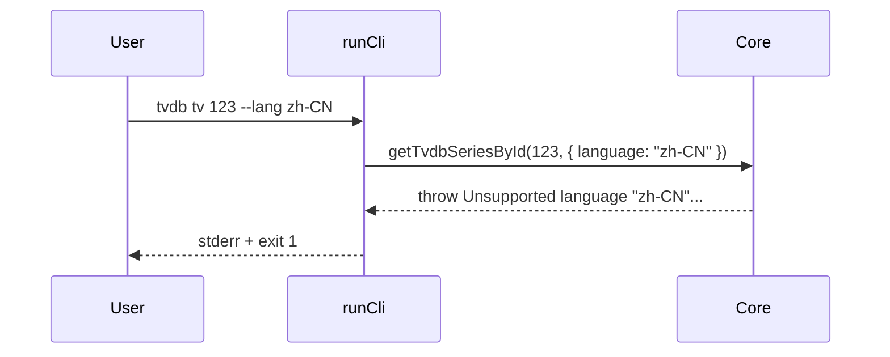

# CLI `smm tvdb tv` / `smm tvdb movie`

This design document describe the high level design of a feature.
The design document is golden source and reference by one or more features.

## 1. Background

`smm tmdb tv` / `smm tmdb movie` already expose **raw upstream TMDB** payloads via Core (`getTvShowInTmdb` / `getMovieInTmdb`). Users need the same for TVDB: CLI commands that talk to the TVDB v4 API, unrelated to local media folders or SMM `MediaMetadata`.

Today:

- `smm tvdb search` is implemented and returns raw search hits.
- `Core.getTvShowInTvdb` / `getMovieInTvdb` build **`TvShowMediaMetadata` / `MovieMediaMetadata`** for recognize / AI / MCP — **not** suitable for a raw-API CLI dump.

TVDB language handling differs from TMDB:

| | TMDB | TVDB |
|--|------|------|
| `--lang` format | IETF (`zh-CN`) | ISO 639-3 (`zho`, `eng`, `yue`) |
| How language applies on get | Same details request (`?language=`) | Separate translation endpoint; extended record is language-agnostic |
| Invalid explicit lang | Offline reject via TMDB primary_translations list | Offline reject via `parseTvdbSearchLanguage` (e.g. `zh-CN` fails) |

## 2. Architecture

## 2.1 Project Level Architecture

```mermaid
sequenceDiagram
  participant U as User
  participant CLI as apps/cli runCli
  participant C as Core
  participant Client as TvdbClient
  participant TVDB as TVDB v4 API

  U->>CLI: smm tvdb tv|movie &lt;id&gt; [--lang zho] ...
  CLI->>C: getTvdbSeriesById / getTvdbMovieById
  C->>Client: createTvdbClient (ISO 639-3 language)
  Client->>TVDB: GET .../extended
  Client->>TVDB: GET .../translations/{lang}
  Client-->>C: { extended, translation }
  C-->>CLI: { extended, translation }
  CLI-->>U: default tree or pretty JSON
```

No change to existing MediaMetadata getters used by recognize / AI / MCP / HTTP.

## 2.2 App Level Architecture

| Piece | Location |
|-------|----------|
| New Core methods | `apps/core/src/Core.ts` (+ export from `apps/core` as needed) |
| Raw fetch helpers | Prefer existing `TvdbClient.getSeriesExtended` / `getMovieExtended` + `getSeriesTranslation` / `getMovieTranslation` |
| CLI commands | `apps/cli/src/cli/runCli.ts` under `tvdb` |
| Output | Reuse `formatTmdbDetailsTree` (generic tree) + `printJson` |
| CLI unit tests | `apps/cli/src/cli/tvdbGet.test.ts` |
| Live e2e | `apps/e2e/cli/tvdb.test.ts` |
| Docs | `docs/dev/tvdb.md` |

## 2.3 Key Design

### Command surface

```bash
smm tvdb tv <tvdbid> [-f|--format json|default] [--lang <iso639-3>] [--host <url>] [--password <key>] [--proxy <url>]
smm tvdb movie <tvdbid> [-f|--format json|default] [--lang <iso639-3>] [--host <url>] [--password <key>] [--proxy <url>]
```

- `tvdbid`: positive integer; invalid → stderr + exit 1.
- `--format` / `-f`: `json` \| `default`; omitted → `default`.
- `--lang`: ISO 639-3 only; validated by `parseTvdbSearchLanguage`. Omitted → `resolveTvdbSearchLanguage` (preferMediaLanguage → OS → `eng`).
- `--host` / `--password` / `--proxy`: same overrides as `smm tvdb search`.

### Core return shape (raw API, not MediaMetadata)

```ts
type TvdbByIdResult = {
  extended: unknown   // series or movie extended `data`
  translation: unknown | null  // translations/{lang} `data`, or null if unavailable
}
```

- Series: `seriesExtendedById` + `seriesTranslationByLangCode`
- Movie: `movieExtendedById` + `movieTranslationByLangCode`
- Missing / failed **extended** → throw (CLI maps to exit 1)
- Missing translation → `translation: null` (still success if extended exists)

Method names (recommended):

- `getTvdbSeriesById(id, options?: TvdbRequestOptions): Promise<TvdbByIdResult>`
- `getTvdbMovieById(id, options?: TvdbRequestOptions): Promise<TvdbByIdResult>`

Do **not** rename or change behavior of `getTvShowInTvdb` / `getMovieInTvdb`.

### Output formats

- `json`: `printJson(result)` of the full `{ extended, translation }` object.
- `default`: `formatTmdbDetailsTree(result)` (indented key/value tree of all enumerable fields).

### Out of scope

- New HTTP / AI / MCP tools for these raw methods (can follow later)
- Changing MediaMetadata builders or search output
- Accepting IETF tags on `--lang` (must stay ISO 639-3)

## 3. User Stories

### 3.1 Fetch series (default + ISO 639-3)

* **Given** - Core can reach TVDB
* **When** - `smm tvdb tv <id> --lang zho`
* **Then** - exit 0; stdout tree includes `extended:` and `translation:`; translated name (when available) matches expected title family; payload is **not** MediaMetadata (`database` key absent at top level)

### 3.2 Fetch movie as JSON

* **Given** - Core can reach TVDB
* **When** - `smm tvdb movie <id> -f json`
* **Then** - exit 0; stdout is pretty JSON with `extended` and `translation` keys

### 3.3 Custom host / proxy

* **Given** - restricted network needs official host + proxy
* **When** - `smm tvdb tv <id> --host ... --password ... --proxy ...`
* **Then** - options forwarded like search; success prints raw payload

### 3.4 Invalid id / invalid lang

* **Given** - bad inputs
* **When** - `smm tvdb tv abc` or `smm tvdb tv <id> --lang zh-CN`
* **Then** - exit 1; stderr explains positive integer id or unsupported ISO 639-3 language


