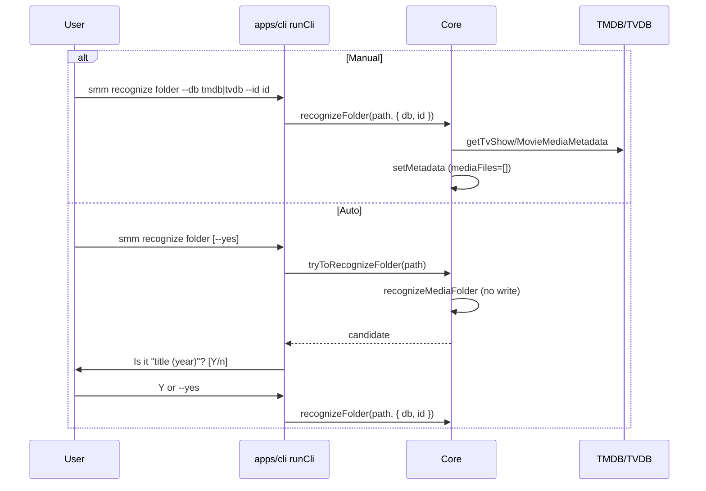

# CLI `smm recognize` (Recognize Folder)

This design document describe the high level design of a feature.
The design document is golden source and reference by one or more features.

Product doc: [docs/dev/recognize-folder.md](../../dev/recognize-folder.md).

## 1. Background

**Recognize Folder** assigns a TMDB/TVDB TV series or movie to an imported media folder. It is distinct from **Recognize Episodes** (`smm try-to-recognize`), which only maps local video files to season/episode numbers.

Today folder recognition runs only inside `importFolder`. Operators need a dedicated CLI to (re)recognize an already-imported folder:

- **Manual:** pass database + id
- **Auto:** probe with the same rules as import, confirm interactively (or `--yes`)

## 2. Architecture

### 2.1 Project Level Architecture



No new HTTP routes, MCP tools, or UI changes in this feature.

### 2.2 App Level Architecture

| Piece | Location |
|-------|----------|
| `tryToRecognizeFolder` / `recognizeFolder` | `apps/core` pipeline + `Core` methods |
| Command | `apps/cli/src/cli/runCli.ts` → `smm recognize` |
| Optional readline helper | small CLI helper next to `runCli` if needed |
| Core unit tests | `apps/core` (in-memory fs + mock network) |
| Live CLI e2e | `apps/e2e/cli/recognize-folder.test.ts` (new; keep existing `recognize.test.ts` for episodes) |
| Product doc | update `docs/dev/recognize-folder.md` status / `--yes` |

### 2.3 Key Design

#### Command surface

```bash
smm recognize <folder> --db tmdb|tvdb --id <id>
smm recognize <folder>
smm recognize <folder> --yes
```

| Case | Behavior |
|------|----------|
| `--db` and `--id` both set | Call `recognizeFolder`; `--yes` ignored |
| Only one of `--db` / `--id` | Error, exit 1 |
| Neither set | `tryToRecognizeFolder` → prompt; `--yes` accepts; empty input = Y; `n`/`N` cancels (exit 0, no write) |
| No candidate | Error, exit 1 |
| Unmanaged / music / missing metadata | Error, exit 1 |
| Success | Print short confirmation (e.g. `Metadata is updated`) |

#### Core API

```ts
type RecognizeFolderDb = "tmdb" | "tvdb"

interface RecognizeFolderCandidate {
  db: RecognizeFolderDb
  id: string
  title: string
  year?: string // first 4 chars of airDate when present
  kind: "tvshow" | "movie"
}

tryToRecognizeFolder(path: string): Promise<RecognizeFolderCandidate>

recognizeFolder(
  path: string,
  options: { db: RecognizeFolderDb; id: string },
): Promise<void>
```

- **Preconditions:** folder imported; metadata exists; type is `tvshow-folder` or `movie-folder`.
- **`tryToRecognizeFolder`:** reuse `recognizeMediaFolder` (NFO → tmdbid/tvdbid in folder name → search ordered by `primaryDatabase`). Map hit to candidate; do **not** write. No hit → throw.
- **`recognizeFolder`:** fetch full show/movie metadata via existing TMDB/TVDB clients (`getTvShowMediaMetadata` / `getMovieMediaMetadata`) for the folder’s type + `db`/`id`. Persist via `setMetadata`:
  - keep `mediaFolderPath`, `type`
  - set `tvShow` **or** `movie` (clear the other)
  - force `mediaFiles: []`
- **Out of scope:** episode matching, picking movie video file, HTTP/MCP/UI.

## 3. User Stories

### 3.1 UC1 — Recognize with TMDB id

* **Given** - an imported TV show folder with blank/skip-init metadata
* **When** - `smm recognize <folder> --db tmdb --id 84666` then `smm metadata <folder>`
* **Then** - exit 0; metadata shows TMDB tvShow (e.g. id `84666`); `mediaFiles` empty

### 3.2 UC2 — Recognize with TVDB id

* **Given** - an imported TV show folder with skip-init metadata
* **When** - `smm recognize <folder> --db tvdb --id 421069` then `smm metadata <folder>`
* **Then** - exit 0; metadata shows TVDB tvShow; `mediaFiles` empty

### 3.3 Auto with `--yes`

* **Given** - imported skip-init folder whose name contains `{tmdbid=…}` (or otherwise recognizable by import rules)
* **When** - `smm recognize <folder> --yes`
* **Then** - no interactive prompt; metadata updated; `mediaFiles` empty

### 3.4 Reject unmanaged / incomplete flags

* **Given** - unmanaged path, or only `--db` / only `--id`
* **When** - `smm recognize …`
* **Then** - exit 1 with clear stderr message

## 4. Testing

- **e2e:** `apps/e2e/cli/recognize-folder.test.ts` — UC1, UC2, auto `--yes`, unmanaged, flag pairing
- **Core unit:** `tryToRecognizeFolder` hit/miss; `recognizeFolder` write + `mediaFiles: []`
- Do **not** change episode coverage in `apps/e2e/cli/recognize.test.ts`
