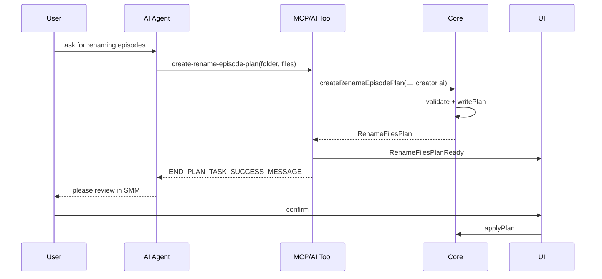
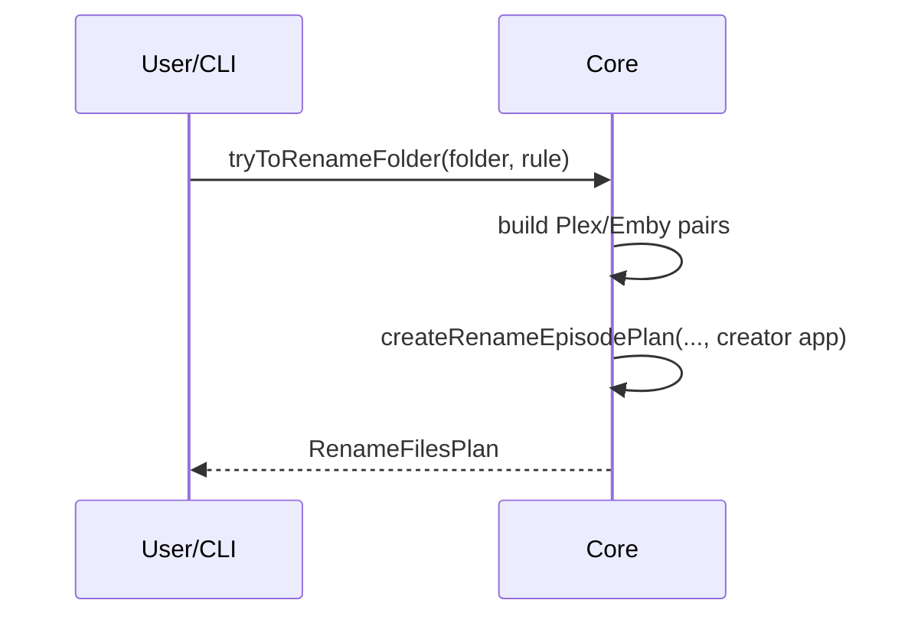

# create-rename-episode-plan

This design document describe the high level design of a feature.
The design document is golden source and reference by one or more features.

Related product docs: [docs/dev/rename-episodes.md](../../dev/rename-episodes.md), [docs/dev/manage-plan.md](../../dev/manage-plan.md).

## 1. Background

AI/MCP rename previously used a three-step task (`begin` → `add` → `end`) implemented largely in `apps/cli` (`renameFilesToolV2`), which read/wrote `{appDataDir}/plans` directly. That duplicated Core plan persistence and, on Linux, diverged from `getCore().applyPlan()` (which used `userDataDir`), causing CI failures (`Plan not found`).

Product redesign collapses AI/MCP into one tool that asks Core to persist a rename plan with AI-chosen `from → to` pairs. Rule-based rename (`tryToRenameFolder` / Plex|Emby) calculates pairs then reuses the same Core write API.

## 2. Architecture

## 2.1 Project Level Architecture

```
AI Agent / MCP client
        │
        ▼
MCP Tool / UI AI Tool  (thin: schema + Core call + broadcast + success message)
        │
        ▼
apps/core  Core.createRenameEpisodePlan()
        │
        ▼
FsPort  →  {appDataDir}/plans/{id}.plan.json

Rule path:
CLI/UI try-to-rename → Core.tryToRenameFolder()
                         → build Plex|Emby pairs
                         → createRenameEpisodePlan(creator: "app")
```

- **apps/core**: validation + plan write (single source of truth for plan dir).
- **packages/core-routes / apps/cli / apps/ui**: thin tool and HTTP wrappers only.
- **Confirm/apply**: unchanged — user reviews in SMM (`AiBasedRenameFilePrompt` / rule prompt) → `POST /api/apply-plan` → `Core.applyPlan`.

## 2.2 App Level Architecture

### Core

```ts
Core.createRenameEpisodePlan(
  mediaFolderPath: string,
  files: Array<{ from: string; to: string }>,
  options?: { creator?: "app" | "ai"; id?: string },
): Promise<RenameFilesPlan>
```

Behavior:

1. Normalize paths with `Path.posix`.
2. Validate (throw on failure — see Key Design).
3. Write `RenameFilesPlan` with `task: "rename-files"`, `status: "pending"`, `creator` default `"app"`.
4. Return the plan.

`tryToRenameFolderPipeline`:

1. Keep existing managed-folder / metadata / TV-show checks and `buildTvShowRenamePlanFileEntries`.
2. Call `createRenameEpisodePlan(path, files, { creator: "app" })` instead of local `writePlan`.

### Tool layer

Single tool name: `create-rename-episode-plan`.

- Input: `mediaFolderPath`, `files: [{ from, to }]`.
- Calls `Core.createRenameEpisodePlan(..., { creator: "ai" })`.
- Broadcasts `RenameFilesPlanReady` (same as former end tool).
- Returns `END_PLAN_TASK_SUCCESS_MESSAGE` (user must return to SMM to review/approve).

### Deletion

Remove begin/add/end rename task surface:

- `@smm/core/types/ai-tools/renameFilesTask` (replace with new tool types)
- UI `Begin` / `Add` / `End` rename AI tools
- core-routes `renameFilesTask` builders + MCP handlers `beginRenameTask` / `addRenameFile` / `endRenameTask`
- cli `renameFilesTool` / `renameFilesToolV2` / `renameFilesTaskV2` and Debug routes `startRenameFilesTask` / `addFileToRenameTask` / `endRenameFilesTask`
- System prompt / how-to MCP text that references begin/add/end

## 2.3 Key Design

**Validation in Core** (preserve former tool checks; fail before write):

| Former tool | Rule |
|-------------|------|
| begin | Media metadata exists for folder (opened in SMM) |
| end | `files.length > 0` |
| add | Each `from` is an episode video in `mediaFiles` |
| add | Batch `validateRenameOperations` (path/conflict rules via injected FsPort deps as needed) |

**Plan identity for apply**: AI and rule plans share the same on-disk layout under Core `appDataDir`, so `apply-plan` / `getPlan` always see the file the tool wrote (fixes Linux XDG split when all writers use Core).

**Not in scope**: changing apply/reject HTTP; rule-based UI rename button flow beyond sharing `createRenameEpisodePlan`; recognize begin/add/end tools.

## 3. User Stories

### 3.1 AI creates arbitrary rename plan

* **Given** a TV show folder is opened in SMM with at least one recognized episode file  
* **When** the agent calls `create-rename-episode-plan` with custom `from`/`to` pairs  
* **Then** Core writes a `pending` plan with `creator: "ai"`, tool returns the success message, UI shows AI rename prompt, and after confirm `apply-plan` renames files and updates metadata  



### 3.2 Rule-based rename still works via shared write API

* **Given** a managed TV show folder with metadata  
* **When** user/CLI runs try-to-rename (Plex or Emby)  
* **Then** `tryToRenameFolder` computes pairs and `createRenameEpisodePlan` persists `creator: "app"` pending plan  



## 4. Testing

| Layer | Change |
|-------|--------|
| Core unit | `createRenameEpisodePlan` validation + write; `tryToRenameFolder` uses it |
| MCP / AI unit | Single-tool success/failure; remove three-step cases |
| E2E `AiTool-RenameTool` | One tool call with custom target (e.g. `[1].mp4`) → confirm → assert panel/metadata |
| CLI rename-episodes | Still covers try-to-rename; plans under Core appDataDir |

## 5. Out of scope

- Recognize AI tools (begin/add/end for recognize)
- Changing `END_PLAN_TASK_SUCCESS_MESSAGE` wording (reuse as-is)
- Docker wait-ready / unrelated e2e infrastructure failures
