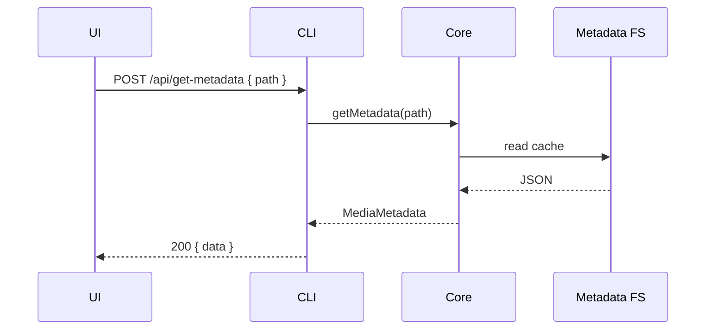
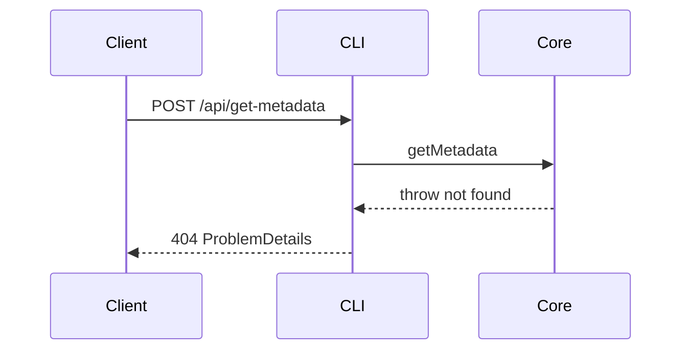

# Core Media Metadata CRUD

This design document describe the high level design of a feature.
The design document is golden source and reference by one or more features.

## 1. Background

Media metadata cache files historically were read/written by multiple layers:

- UI computed `{appDataDir}/metadata/*.json` via `hello().appDataDir` and used `readFile` / `writeFile`.
- Core (`MediaMetadataHelper`) used Core’s own `appDataDir`, which on Linux was wired to `userDataDir` (`~/.config/smm`) while `hello()` reported `getAppDataDir()` (`~/.local/share/smm`).

That split caused production bugs (e.g. `Movie-RenameVideoFile` e2e: UI persisted metadata under `~/.local/share/smm`, Core `renameEpisodeFile` looked under `~/.config/smm`, returned `Media metadata not found`, disk rename never ran).

Additionally, `MediaMetadata.files` is deprecated: live file lists belong to `listFiles`, not the metadata cache.

**Goals**

1. All metadata file CRUD lives in `apps/core`.
2. CLI exposes thin RPC-style HTTP bridges.
3. UI and e2e never know metadata file directories—only `mediaFolderPath` + HTTP (or hooks wrapping HTTP).
4. Align Core storage root with `hello().appDataDir`.

## 2. Architecture

## 2.1 Project Level Architecture

```
apps/ui  ──HTTP──►  apps/cli (bridge RPC)
                      │
                      ▼
                   apps/core  (sole owner of metadata file paths)
                      │
                      ▼
              {appDataDir}/metadata/*.json
```

- **Single source of truth**: `apps/core` `MediaMetadataHelper` owns cache path layout.
- **Directory ownership**: Core `appDataDir` for metadata equals `getAppDataDir()` / `hello().appDataDir` (Linux: `~/.local/share/smm`). User config remains at `getUserDataDir()` (Linux: `~/.config/smm`).
- **UI / e2e**: Only pass `mediaFolderPath`; CRUD via HTTP. No `metadataCacheFilePath` in UI or e2e production paths.
- **Scope of this design**: CLI thin bridge. Extracting routes into `packages/core-routes` is a later optional step.

## 2.2 App Level Architecture

### `apps/core`

Normalize public methods on `Core` (reuse `MediaMetadataHelper`):

| Method | Behavior |
|--------|----------|
| `getMetadata(folderPath)` | Read cache. Missing → throw (HTTP maps to 404 ProblemDetails). |
| `createMetadata(mm)` | If cache exists → conflict. Else write new record with allowed persisted fields (at least `mediaFolderPath`). |
| `setMetadata(folderPath, patch)` | Cache **must** exist; else throw. Patch may only include `type` \| `mediaFiles` \| `tvShow` \| `movie`. Any other key in the patch → validation error (HTTP 400). Merge allowed keys and write. |
| `deleteMetadata(folderPath)` | Delete cache. Missing → idempotent success. |

Public Core surface uses the four names above. Legacy `getMediaMetadata` is removed or aliased to `getMetadata` during migration so internal pipelines compile. Internal pipelines (`renameEpisodeFile`, recognize, scrape, etc.) continue using the same `MediaMetadataHelper`.

### `packages/core` types

- Remove deprecated `files` from `MediaMetadata`.
- Persistable fields: `mediaFolderPath`, `type`, `mediaFiles`, `tvShow`, `movie`.
- Add request/response types for the four RPCs; errors use existing `ProblemDetails` (RFC 9457).

### `apps/cli`

Register four POST routes that call `getCore()`:

| RPC | Core |
|-----|------|
| `POST /api/get-metadata` | `getMetadata` |
| `POST /api/create-metadata` | `createMetadata` |
| `POST /api/set-metadata` | `setMetadata` |
| `POST /api/delete-metadata` | `deleteMetadata` |

Success: HTTP **200**, body `{ data: ... }`.

Errors for **these four APIs only**: `Content-Type: application/problem+json` + `ProblemDetails`:

| Scenario | status |
|---------|--------|
| Metadata not found (get / set) | 404 |
| Create when already exists | 409 |
| Validation (missing path, illegal set fields) | 400 |
| Unexpected | 500 |

Stable `type` URNs, e.g. `urn:smm:problem:metadata-not-found`.

Other existing APIs keep current conventions until a separate migration.

Legacy `/api/readMediaMetadata` and `/api/writeMediaMetadata` are deprecated and removed once callers are migrated.

### `apps/ui`

- `useMediaMetadataQuery(path)` → `POST /api/get-metadata`. 404 ProblemDetails → no cache (`null` / empty query state); callers may `createMetadata`.
- `useMediaMetadataMutation()` → create / set / delete via the three write RPCs; update TanStack Query cache (`mediaMetadataQueryKey`).
- Remove UI path logic in `readMediaMetadataV2` / `writeMediaMetadata` (`writeFile` to metadata paths) / repository dependence on local cache paths.
- File listing for panels continues via `listFiles`, decoupled from metadata.

### `apps/e2e`

- Read/write metadata through browser `execute` (or `/api/execute`) calling the same HTTP RPCs.
- Prefer `delete-metadata` over knowing metadata directories; `removeMetadataDir` may remain as optional cleanup fallback only.

## 2.3 Key Design

1. **Path opacity**: Only Core knows `{appDataDir}/metadata/{sanitizedFolder}.json`.
2. **Partial update**: `setMetadata` is a whitelist patch, not full document replace of arbitrary keys.
3. **Explicit create**: Missing cache is not silently upserted by `setMetadata`.
4. **ProblemDetails for this surface**: Real HTTP status + RFC 9457 body for the four metadata RPCs only.
5. **Fix Linux split**: Core metadata `appDataDir` === reported `hello().appDataDir`.

## 3. User Stories

### 3.1 UI loads metadata without knowing cache path

* **Given** - A managed media folder path and Core has persisted metadata under `appDataDir`
* **When** - UI calls `useMediaMetadataQuery(folderPath)`
* **Then** - CLI `get-metadata` returns 200 `{ data: MediaMetadata }` with no `files` field; UI never opens a metadata JSON path



### 3.2 Metadata missing returns ProblemDetails 404

* **Given** - No metadata cache for the folder
* **When** - Client calls `POST /api/get-metadata`
* **Then** - Response is 404 `application/problem+json` with `type` indicating metadata-not-found



### 3.3 setMetadata rejects missing cache and illegal fields

* **Given** - No cache, or patch includes non-whitelist keys
* **When** - Client calls `POST /api/set-metadata`
* **Then** - Missing cache → 404 ProblemDetails; illegal fields → 400 ProblemDetails; disk files unchanged for invalid requests

### 3.4 E2E renames movie video after recognize

* **Given** - E2E imported a movie folder; UI/Core share one `appDataDir` for metadata
* **When** - User confirms rename via UI (Core `renameEpisodeFile`)
* **Then** - Core finds metadata; video and associated files are renamed on disk

### 3.5 E2E CRUD via execute

* **Given** - Browser session with auth to CLI
* **When** - Test runs create → get → set → get → delete via HTTP inside `execute`
* **Then** - Each step matches Core behavior without asserting filesystem metadata paths

## 4. Out of scope

- Moving HTTP handlers into `packages/core-routes`
- Migrating all project APIs to ProblemDetails
- Rewriting TMDB/recognize business logic beyond changing metadata I/O entry points

## 5. Test plan (summary)

| Layer | Coverage |
|-------|----------|
| Core unit | get missing; set illegal fields; set missing; create conflict; delete idempotent |
| CLI route | 200 + data; 404/409/400 ProblemDetails |
| UI | Query/mutation against API (mock fetch as needed) |
| E2E | Metadata CRUD via execute; Movie-RenameVideoFile regression |
