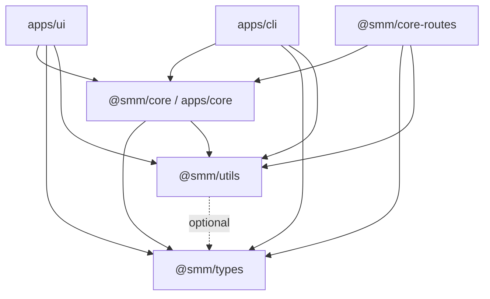

# Split packages/core into types, utils, and apps/core

This design document describe the high level design of a feature.
The design document is golden source and reference by one or more features.

## 1. Background

The monorepo currently has three easily confused “core” concepts:

| Package | Path | Actual role |
|---------|------|-------------|
| `@smm/core` | `packages/core` | Shared types **and** business helpers (AI tools, rename validation, whitelistedCmd, etc.) |
| `core-app` | `apps/core` | Overview 中的业务 Core（ports / pipeline / adapters） |
| `@smm/core-routes` | `packages/core-routes` | Legacy HTTP routes（本次不拆职责，只改依赖） |

`packages/core` 与 `apps/core` 职责重叠，导致：

- overview 的 “Core 层” 无法对应到单一包名；
- UI 通过 `@core/*` 别名直接吃到 `packages/core` 里的业务实现；
- 新增代码时不确定该放共享包还是 `apps/core`。

**Goals**

1. `packages/types`（`@smm/types`）只放类型 / interface / Zod schema（及 schema 级常量）。
2. `packages/utils`（`@smm/utils`）承接无业务语义的纯工具。
3. 业务逻辑迁入 `apps/core`，包名改为 `@smm/core`（替换原 `packages/core` 与 `core-app`）。
4. 硬切换：一次改完 import / 依赖 / 文档，删除 `packages/core`，不保留兼容 re-export。
5. `apps/ui` 与 `apps/cli` 均可直接 `import` `@smm/core` 导出的模块（代码依赖，不强制只走 HTTP）。

**Non-goals**

- 不重构 `packages/core-routes` 的业务下沉（仅更新 import）。
- 不把 `apps/ui` 现有胖业务逻辑迁入 Core（仅包边界重组）。
- 不变更 HTTP API 契约。

## 2. Architecture

## 2.1 Project Level Architecture

```
apps/ui  ──import──►  @smm/core   (apps/core)      业务逻辑 / ports / pipeline
apps/cli ──import──►  @smm/core
         ──import──►  @smm/types  (packages/types) 类型 / interface / Zod / schema 常量
         ──import──►  @smm/utils  (packages/utils) 无业务语义纯工具

@smm/core       ──depends──►  @smm/types + @smm/utils
@smm/core-routes──depends──►  @smm/types + @smm/utils + @smm/core（按需）
@smm/utils      ──may depend──►  @smm/types
@smm/types      ──no──►  @smm/utils / @smm/core
```

依赖方向禁止反向：`@smm/types` / `@smm/utils` 不得依赖 `@smm/core`。

与 [docs/dev/overview.md](../../dev/overview.md) 对齐：overview 图中的 **Core** = `@smm/core`（`apps/core`）。

## 2.2 App Level Architecture

### `@smm/types`（新建 `packages/types`）

从旧 `packages/core` 迁入：

| 来源 | 说明 |
|------|------|
| `types.ts`、`types/**` | 类型 + schema；含 `DEFAULT_AI_PROVIDERS`、`RenameRule*` 等 schema 常量 |
| `event-types.ts` | 事件名常量 + 请求/响应 interface |
| `errors.ts` 中的错误码字符串常量 | 协议层错误文案 |
| `job/ImportLibraryJob.ts` | 仅 interface |
| `tmdbPrimaryTranslations.ts`、`tvdbSupportedLanguages.ts` | 静态语言表 |
| `utils.ts` 中的媒体扩展名列表 | 媒体域常量（非通用工具） |
| `validations/rename/types.ts` | 校验相关类型 |

导出：子路径导出，例如 `@smm/types`、`@smm/types/RenameFilesPlan`、`@smm/types/ai-tools/scrape`。

### `@smm/utils`（扩展现有 `packages/utils`）

从旧 `packages/core` 迁入：

| 来源 | 说明 |
|------|------|
| `path.ts`（+ tests） | `Path` 类 |
| `uri.ts`、`url.ts`（+ tests） | URI/URL |
| `locale.ts`（+ tests） | 语言解析 |
| `versionCompare.ts`（+ tests） | 版本比较 |
| `proxiableFetch.ts`（+ tests） | 可代理 fetch |
| `errors.ts` 中的 `noThrow` / `isError` 等 | 无业务语义小工具 |

保留现有 `formatDate` / `debounce` / `generateId`。

导出：子路径导出，例如 `@smm/utils/path`、`@smm/utils/locale`；根导出保留现有小工具。

### `@smm/core`（`apps/core`，原 `core-app`）

现有 `apps/core/src/**` 保留。从旧 `packages/core` 迁入业务模块：

| 来源 | 说明 |
|------|------|
| `ai-tool/**` | AI tool 组装 / confirm / registry |
| `validations/rename/**`（除 types） | 重命名校验实现 |
| `whitelistedCmd/**` | 命令白名单 |
| `plan/renamePlan.ts` | 计划断言 |
| `getMediaFolder.ts`、`configMigration.ts` | 业务辅助 |
| `download-video-*.ts` | 下载校验与 cookie 平台 |
| `mediaMetadata.ts`、`userConfig.ts` | 元数据/配置领域变换函数 |

`package.json` `name`：`core-app` → `@smm/core`。在现有 exports 上扩展子路径（如 `@smm/core/ai-tool/toolResult`），避免一次性巨大 barrel。

### 删除

- 整个 `packages/core` 目录
- 包名 `core-app`
- UI 的 `@core/*` 路径别名（硬切，不保留双轨）

### Import 映射

| 旧 | 新 |
|----|----|
| `@smm/core`（指向 `packages/core/types`）、`@core/types` | `@smm/types` |
| `@core/path`、`@smm/core/path` | `@smm/utils/path`（或约定的 utils 子路径） |
| `@core/locale`、`uri`、`url`、`versionCompare`、`proxiableFetch` 等 | `@smm/utils/...` |
| `@core/ai-tool/...`、`validations/...`、`whitelistedCmd/...`、`plan/...`、`download-video-*`、`mediaMetadata`、`userConfig`、`getMediaFolder`、`configMigration` | `@smm/core/...` |
| `from 'core-app'` | `from '@smm/core'` |

测试文件随源文件一起搬家。

## 2.3 Key Design

1. **硬切换**：单次重构完成目录迁移、包改名、全仓 import、Docker/CI/文档更新；不保留 `@smm/core` → 旧包的兼容层。
2. **UI 可直接依赖 Core**：`apps/ui` 与 `apps/cli` 对 `@smm/core` 的依赖均为代码 `import`，与 overview「CLI 进程内调用 Core」一致；HTTP 仍用于跨进程/远程场景，但不是本重构的强制边界。
3. **归属判据**：
   - 类型 / Zod / schema 常量 → `@smm/types`
   - 无业务语义纯函数 → `@smm/utils`
   - 有业务语义（校验规则、AI tool、白名单命令、领域变换）→ `@smm/core`
4. **`types.ts` 中的 runtime 常量**（如 `PlexRenameRule`、`DEFAULT_AI_PROVIDERS`）视为 schema 数据，留在 `@smm/types`，不因「有 `const`」迁到 utils/core。

## 3. User Stories

### 3.1 Developer adds a shared DTO

* **Given** - 需要在 UI、CLI、Core 之间共享请求/响应类型
* **When** - 在 `@smm/types` 中新增 interface / Zod schema
* **Then** - 三端均可 import，且无需把实现放进 types 包

### 3.2 Developer adds Path-like utility

* **Given** - 需要跨端路径规范化
* **When** - 在 `@smm/utils` 中实现并导出
* **Then** - UI / CLI / Core 均可使用；utils 不依赖 Core

### 3.3 Developer adds rename validation or AI tool helper

* **Given** - 需要业务规则或 AI tool 结果组装
* **When** - 实现放在 `@smm/core`（`apps/core`）
* **Then** - UI / CLI / core-routes 从 `@smm/core/...` import；types 包保持无业务逻辑

### 3.4 Hard cutover completes

* **Given** - 重构合并后
* **When** - 搜索仓库
* **Then** - 不存在 `packages/core`、`core-app` 包名、`@core/` 别名；`pnpm typecheck` 与相关 unit tests 通过



## 4. Migration Steps

1. 创建 `packages/types`，迁入类型/schema/常量；配置 `@smm/types` 与子路径 exports。
2. 扩展 `packages/utils`，迁入纯工具与 tests；配置子路径 exports。
3. 将业务模块迁入 `apps/core` 合适目录；`name` 改为 `@smm/core`；扩展 exports。
4. 全仓替换 import；更新各 `package.json` 依赖；更新 Docker/CI/文档中的 `packages/core` / `core-app` / `@core` 引用；移除 UI `@core` alias。
5. 删除 `packages/core`；`pnpm install`；跑 `pnpm typecheck` 与受影响包 unit tests。
6. 更新 `AGENTS.md`、`docs/dev/overview.md` 中的包职责说明。

## 5. Acceptance Criteria

- [ ] 仓库内无 `packages/core` 目录，无 `core-app` 包名，无 `@core/` 路径别名
- [ ] `@smm/types` 不含业务编排 / 校验实现 / whitelistedCmd / ai-tool 实现
- [ ] `@smm/utils` 不含领域编排；`@smm/core` 依赖 `@smm/types` + `@smm/utils`
- [ ] `pnpm typecheck` 通过
- [ ] `packages/types`、`packages/utils`、`apps/core` 及相关受影响包的 unit tests 通过
- [ ] AGENTS.md / overview 文档已反映新包职责
