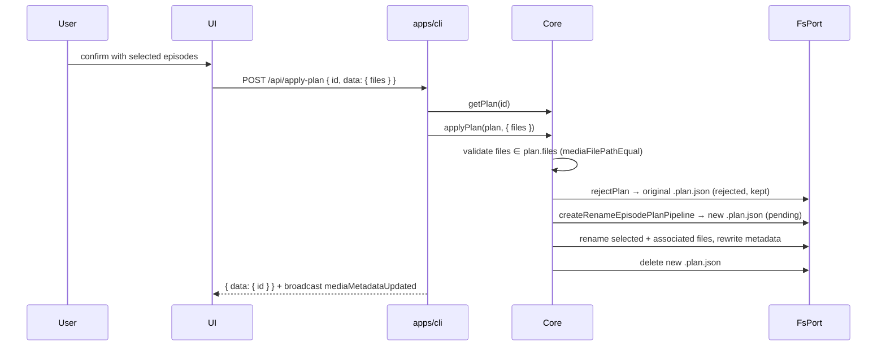

# UC3 Apply Plan With Selected Episodes (Rename Selected Files)

This design document describe the high level design of a feature.
The design document is golden source and reference by one or more features.

## 1. Background

[Rename Episodes](../../dev/rename-episodes.md) UC3: user reviews a rename plan and confirms only a subset of episodes. `POST /api/apply-plan` carries an optional `data.files` list of "from" paths.

A plan has no partial-approved status, so Core cannot apply a subset and mark the original done. Instead Core **rejects the original plan, creates a new plan with only the selected files, and applies that plan**. On disk: a full apply leaves no plan file; a partial apply leaves exactly one plan file — the rejected original.

**Already implemented**

- `Core.applyPlan(plan)` / `applyPlanPipeline` → `applyRenameFilesPlanPipeline` (rename + metadata rewrite + delete plan)
- `Core.rejectPlan(id)` (status → `rejected`, file kept)
- `createRenameEpisodePlanPipeline` (validation + write pending plan)
- `POST /api/apply-plan` (`{ id }` → apply → broadcast `mediaMetadataUpdated`)

**Still missing**

- `data?: { files?: string[] }` on apply-plan (HTTP body and `Core.applyPlan` argument)
- Validation that selected files are in the plan's `from` list; error in RFC 9457 ProblemDetails format
- Reject-original + create-subset + apply orchestration

**Agreed product decisions**

- Error surface: `400` + `Content-Type: application/problem+json` (true RFC 9457) for selection errors. All other errors on this route keep the existing `{ error }` + HTTP 200 pattern.
- `data` is honored only for `rename-files` plans; `recognize-media-file` ignores it.
- `data` or `data.files` absent → full apply (today's behavior). `data.files` present but not a non-empty array of strings → 400 ProblemDetails (`detail`: `data.files must be a non-empty array of strings`).
- Membership comparison uses `mediaFilePathEqual` (POSIX normalization, Windows separators tolerated).
- New plan inherits the original plan's `creator`; id is a fresh UUID.
- Orchestration order is reject → create → apply. If creation fails after reject, nothing is renamed and the original stays rejected (no partial-approved state).
- Response body and `mediaMetadataUpdated` broadcast unchanged.

## 2. Architecture

## 2.1 Project Level Architecture



- No UI changes in this feature (UI sends `data.files` in its own change).
- MCP/AI tools unaffected; they gain the capability implicitly via `Core.applyPlan(plan, data)`.

## 2.2 App Level Architecture

| Piece | Location | Role |
|--------|----------|------|
| Dispatch with data | `apps/core/src/pipeline/applyPlan.ts` | `applyPlanPipeline(plan, deps, data?)`; routes `rename-files` + non-empty `data.files` to selected pipeline |
| Selected apply pipeline | `apps/core/src/pipeline/applySelectedRenameFilesPlan.ts` (new) | Membership validation, reject → create subset → apply |
| Selection error | same new file | `SelectedFilesNotInPlanError extends Error`, carries offending paths |
| Core API | `apps/core/src/Core.ts` | `applyPlan(plan, data?: ApplyPlanData)` |
| HTTP surface | `apps/cli/src/route/RenameEpisodesPlan.ts` | Read `data`, map selection errors to ProblemDetails 400 |
| Core unit tests | `apps/core/src/pipeline/applySelectedRenameFilesPlan.test.ts` (new) | Pipeline behavior |

## 2.3 Key Design

### Core API

```ts
interface ApplyPlanData { files?: string[] }

// Core.ts
applyPlan(plan: Plan, data?: ApplyPlanData): Promise<void>

// applySelectedRenameFilesPlan.ts
class SelectedFilesNotInPlanError extends Error {
  readonly files: string[] // offending paths
}

function applySelectedRenameFilesPlanPipeline(
  plan: RenameFilesPlan,
  selectedFiles: string[],
  deps: ApplyPlanDeps,
): Promise<void>
```

Pipeline steps:

1. `selectedFiles` empty → plain `Error` (caller bug, not an HTTP concern).
2. For each selected path, require a `plan.files[].from` match via `mediaFilePathEqual`; any miss → `SelectedFilesNotInPlanError(offenders)` **before** any disk write.
3. `filtered` = `plan.files` entries whose `from` was selected (duplicate selections collapse).
4. `rejectPlan(fs, appDataDir, plan.id)`.
5. `createRenameEpisodePlanPipeline(plan.mediaFolderPath, filtered, { creator: plan.creator }, deps)` — reuses existing validation (metadata exists, episode assertions, rename operations), writes a fresh pending plan.
6. `applyRenameFilesPlanPipeline(newPlan, deps)` — renames selected entries plus their associated files, rewrites metadata, deletes the new plan file.

### HTTP surface

`POST /api/apply-plan` body: `{ id: string, data?: { files?: string[] } }`.

- Malformed/empty `data.files`, or `SelectedFilesNotInPlanError` → 400 `application/problem+json`:

```json
{
  "type": "about:blank",
  "title": "Bad Request",
  "status": 400,
  "detail": "Files not in plan: /a.mkv",
  "instance": "/api/apply-plan"
}
```

`ProblemDetails` type comes from `@smm/types`.

### Out of scope

- UI changes (`useApplyPlanMutation`, plan table selection) — separate change
- CLI binary commands (`smm apply` gains no selection flag)
- e2e changes (UC3 e2e drives the UI)
- New plan status or `data` handling for `recognize-media-file` plans

## 3. User Stories

### 3.1 Apply selected episodes

* **Given** a pending rename-files plan for 3 episodes
* **When** client applies with `data: { files: [from1, from3] }`
* **Then** only episodes 1 and 3 (plus associated files) are renamed, the original plan file remains `rejected`, the subset plan is applied and deleted, and metadata points to the new paths

### 3.2 Reject unknown selection

* **Given** a pending rename-files plan
* **When** client applies with a `files` entry not in the plan's `from` list
* **Then** HTTP 400 ProblemDetails lists the offender and no file, plan, or metadata changes

### 3.3 Full apply unchanged

* **Given** a pending rename-files plan
* **When** client applies without `data`
* **Then** behavior identical to today: all entries applied, plan file deleted

## 4. Test Plan

**Core unit** (`applySelectedRenameFilesPlan.test.ts`, in-memory `FsPort`)

1. Selected subset: only chosen entries + associated files renamed; original plan `rejected` on disk; new plan file deleted after apply; metadata rewritten
2. Unmatched file → `SelectedFilesNotInPlanError` with offending paths; zero disk changes
3. Empty selection → error
4. Windows-style separators in selection match POSIX `from`
5. `applyPlanPipeline` dispatch: `data.files` routes to selected pipeline; absent `data` keeps full apply; `recognize-media-file` ignores `data`

**CLI unit/route tests** (follow existing pattern in `apps/cli`, if present)

6. `data.files` malformed/empty → 400 problem+json
7. `SelectedFilesNotInPlanError` → 400 problem+json with offender list in `detail`
8. No `data` → existing behavior unchanged
