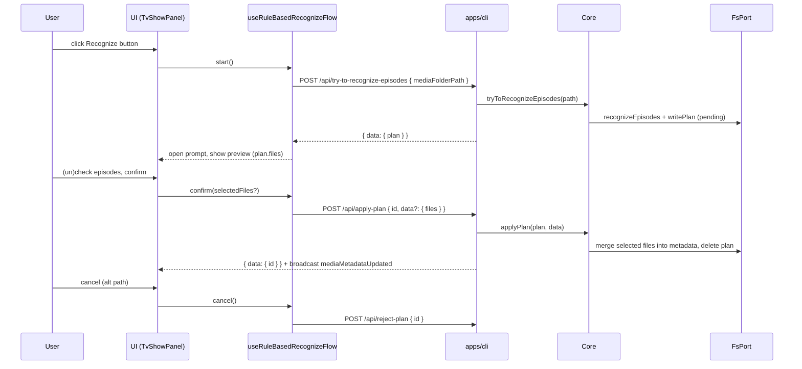

# Rule-Based Recognize Flow Refactor (Mirror Rename Flow)

**Status**: Proposed (2026-09-05)

This design document describe the high level design of a feature.
The design document is golden source and reference by one or more features.

## 1. Background

Rule-based rename was refactored (commit 49fc489d) to the pattern described in
[rename-episodes.md](../../dev/rename-episodes.md): the flow hook owns local
`open`/`plan` state, the backend builds the pending plan (`try-to-rename-episodes`),
and `apply-plan` / `reject-plan` mutations close the loop. The prompt is rendered
directly by `TvShowPanel` instead of through `TvShowAppPlanPromptContext`.

Rule-based recognize still uses the legacy pattern in
`useRuleBasedRecognizeFlow` (344 lines):

- plan selection from the plans cache (`usePlansQuery` + `selectActiveAppPlan`)
- a `preparing` status with client-side computation (`buildTemporaryRecognitionPlanAsync`)
  resumed by `resumeComputation` effects guarded by `computationRef`
- confirm runs in the browser (`applyRecognizeMediaFilePlan` +
  `useUpdateMediaMetadataMutation`) instead of backend `apply-plan`

**Already implemented (backend)**

- `Core.tryToRecognizeEpisodes(path)` / `tryToRecognizeEpisodesPipeline` — rule-based
  episode matching → pending `RecognizeMediaFilePlan` (persisted via `writePlan`);
  empty result yields a plan with `files: []`, not an error. Used by CLI
  (`smm try-to-recognize`).
- `Core.applyPlan(plan, data?)` / `applyPlanPipeline` — dispatches by task;
  `recognize-media-file` merges all `plan.files` into metadata and deletes the plan.
  `data.files` selection is honored for `rename-files` only
  ([UC3](./2026-09-04-uc3-apply-plan-selected-files-design.md)).
- `Core.rejectPlan(id)`
- `POST /api/apply-plan`, `POST /api/reject-plan` (`apps/cli/src/route/RenameEpisodesPlan.ts`)
- `useApplyPlanMutation` / `useRejectPlanMutation` (`apps/ui`)

**Still missing**

- `POST /api/try-to-recognize-episodes` HTTP route
- selected-episodes support for `recognize-media-file` apply (UC3 explicitly left
  `recognize-media-file` ignoring `data`; this design supersedes that decision)
- frontend: `api/tryToRecognizeEpisodes.ts`, `useTryToRecognizeEpisodesMutation`,
  rewritten `useRuleBasedRecognizeFlow`, prompt wired in `TvShowPanel`

**Agreed product decisions**

- Full-stack refactor mirroring the rename flow (user decision).
- Selected-episodes UX is preserved: extend backend `apply-plan` to honor
  `data.files` for `recognize-media-file` (user decision).
- `RuleBasedRecognizePrompt` moves out of `TvShowPanelPrompts` into `TvShowPanel`,
  fed by `recognizeFlow.*` props — same as `RuleBasedRenameFilePrompt`.
- `TvShowAppPlanPromptContext` is slimmed to AI-only fields; the rename-refactor
  stub fields (`onAppRename*`, `renameToolbarOptions`, `selectedNamingRule`,
  `setSelectedNamingRule`, `appRenamePlan`, `appRecognizePlan`,
  `onAppRecognize*`, `tvShowTitle`, `tvShowTmdbId`, `isRuleBasedRecognizeLoading`,
  `notAllEpisodesRecognized`, `allPlanFilesUnchanged`, `allRenamePlanFilesUnchanged`)
  are removed. This also fixes the current unused-variable type errors in
  `TvShowPanelPrompts.tsx`.
- No naming-rule dropdown exists for recognize, so the flow hook has no
  `selectNamingRule`; `start` always uses the backend default rule set.
- Empty recognition result (`plan.files.length === 0`) → frontend rejects the plan
  server-side, toasts "Unable to recognize any episodes. Consider using AI to
  recognize instead.", and does not open the prompt.
- AI-based recognize/rename flows (plans-cache driven) are out of scope and keep
  working unchanged.

## 2. Architecture

### 2.1 Project Level Architecture



### 2.2 App Level Architecture

| Piece | Location | Role |
|--------|----------|------|
| Selected recognize apply | `apps/core/src/pipeline/applySelectedRecognizeFilesPlan.ts` (new) | Validate `data.files` ⊆ `plan.files[].path`, merge selection, delete plan |
| Dispatch with data | `apps/core/src/pipeline/applyPlan.ts` | `recognize-media-file` + non-empty `data.files` → selected pipeline |
| Selection error | same new file | `RecognizedFilesNotInPlanError extends Error` |
| Core API | `apps/core/src/Core.ts` | no signature change (`applyPlan(plan, data?)` already) |
| HTTP surface | `apps/cli/src/route/TryToRecognizeEpisodes.ts` (new) | `POST /api/try-to-recognize-episodes` |
| UI api | `apps/ui/src/api/tryToRecognizeEpisodes.ts` (new) | mirrors `tryToRenameEpisodes.ts` |
| UI mutation | `apps/ui/src/hooks/plans/useTryToRecognizeEpisodesMutation.ts` (new) | mirrors `useTryToRenameEpisodesMutation.ts`, writes plans cache on success |
| UI flow hook | `apps/ui/src/hooks/tv/useRuleBasedRecognizeFlow.ts` (rewrite) | local `open`/`plan`, `start`/`confirm`/`cancel` |
| UI prompt wiring | `apps/ui/src/components/tv/TvShowPanel.tsx` | render `RuleBasedRecognizePrompt` with `recognizeFlow.*` |
| Context slim-down | `apps/ui/src/components/tv/plans/TvShowAppPlanPromptContext.tsx` | AI-only fields |
| Dead code removal | `apps/ui/src/components/tv/TvShowPanelUtils.ts` | drop `buildTemporaryRecognitionPlanAsync`, `applyRecognizeMediaFilePlan`, `rebuildPlanWithSelectedEpisodes` (if unreferenced) |

### 2.3 Key Design

#### Backend: selected recognize apply

```ts
// applySelectedRecognizeFilesPlan.ts
class RecognizedFilesNotInPlanError extends Error {
  readonly files: string[] // offending paths
}

function applySelectedRecognizeFilesPlanPipeline(
  plan: RecognizeMediaFilePlan,
  selectedFiles: string[],
  deps: ApplyPlanDeps,
): Promise<void>
```

1. Empty `selectedFiles` → plain `Error` (caller bug).
2. Each selected path must match a `plan.files[].path` via `mediaFilePathEqual`
   (POSIX normalization, Windows separators tolerated); any miss →
   `RecognizedFilesNotInPlanError(offenders)` before any disk write.
3. `filtered` = `plan.files` entries whose `path` was selected (duplicates collapse).
4. Merge `filtered` into metadata (`updateMediaFileMetadatas`), persist,
   `deletePlan` — identical to `applyRecognizeMediaFilePlanPipeline` but with
   `filtered` instead of `plan.files`.
5. `applyPlanPipeline` dispatch: `recognize-media-file` + non-empty
   `data.files` → selected pipeline; absent `data` → full merge (unchanged).

`RecognizedFilesNotInPlanError` maps to 400 `application/problem+json`:
`POST /api/apply-plan`'s existing catch block (which already maps UC3's
`SelectedFilesNotInPlanError` to 400) additionally catches
`RecognizedFilesNotInPlanError` and builds the same ProblemDetails body with
`detail: "Files not in plan: <path>"`.

#### Backend: try-to-recognize-episodes route

`POST /api/try-to-recognize-episodes` body `{ mediaFolderPath: string }` →
`getCore().tryToRecognizeEpisodes(mediaFolderPath)` → `{ data: { plan } }` with
HTTP 200; errors → `{ error: "Error Reason: ..." }` with HTTP 200 (same pattern
as `try-to-rename-episodes`).

#### Frontend: flow hook

```ts
export interface UseRuleBasedRecognizeFlowOptions {
  mediaMetadata: MediaMetadata | undefined
}

// returns {
//   plan, open, loading,
//   tvShowTitle, tvShowTmdbId,
//   notAllEpisodesRecognized, allPlanFilesUnchanged,
//   confirm, cancel, start,
// }
```

- `loading` = `tryToRecognize.isPending || applyPlan.isPending || rejectPlan.isPending`
- `start()`: guard `mediaFolderPath`, `reset()`, `setOpen(true)`,
  `tryToRecognize.mutateAsync({ mediaFolderPath })` → `setPlan(resp)`;
  empty `files` → `rejectPlan` (fire-and-forget), toast `noRecognizedFiles`,
  `setOpen(false)`; failure → toast `recognizeFailedMessage`, `setOpen(false)`
- `confirm(selectedEpisodeFiles?)`: applyPlan `{ id: plan.id, mediaFolderPath, files: selectedEpisodeFiles }`;
  backend `onSuccess` already invalidates mediaMetadata (rename parity);
  success → `setOpen(false)`, `setPlan(undefined)`; failure → toast, prompt stays open
- `cancel()`: `setOpen(false)`; pending plan → `rejectPlan` (fire-and-forget);
  `setPlan(undefined)` + `reset()`
- `tvShowTitle`/`tvShowTmdbId`/`notAllEpisodesRecognized`/`allPlanFilesUnchanged`
  derived from `plan` + `mediaMetadata` exactly as today (guards on
  `plan.status === "pending"` and `plan.files.length > 0` instead of the old
  `loading` flag)
- `beforeConfirm` is removed: selection now travels via `data.files`

#### Frontend: TvShowPanel wiring

`RuleBasedRecognizePrompt` renders in `TvShowPanel` next to
`RuleBasedRenameFilePrompt`:

- `isOpen={recognizeFlow.open}`, `isLoading={recognizeFlow.loading}`
- `tvShowTitle` / `tvShowTmdbId` / `notAllEpisodesRecognized` / `allPlanFilesUnchanged`
  from `recognizeFlow`
- `isConfirmButtonDisabled={recognizeFlow.loading || recognizeFlow.allPlanFilesUnchanged}`
- `onConfirm`: map checked episodes to paths (same mapping as rename's
  `ruleBasedRenameFilePromptProps`) → `recognizeFlow.confirm(selectedFiles)`
- `onCancel`: `recognizeFlow.cancel()`
- `onRecognizeButtonClick={recognizeFlow.start}`

`TvShowAppPlanPromptContext` keeps only: `aiRenamePlan`, `aiRenamePromptStatus`,
`aiRecognizePlan`, `aiRecognizePromptStatus`, `onAiRenameConfirm/Cancel`,
`onAiRecognizeConfirm/Cancel`.

## 3. User Stories

### 3.1 Start recognize and review preview

* **Given** a TV-show folder with metadata
* **When** the user clicks the Recognize button
* **Then** `POST /api/try-to-recognize-episodes` returns a pending plan, the
  prompt opens with "Recognizing episodes…" while loading and shows the review
  message once `plan.files` arrive

### 3.2 Confirm with selected episodes

* **Given** a pending recognize plan with 3 matched files and the user unchecked one
* **When** the user confirms
* **Then** `apply-plan` carries `data.files` with the 2 checked paths; only those
  files are merged into metadata; the plan file is deleted; the prompt closes

### 3.3 Confirm without selection

* **Given** a pending recognize plan and no checkbox interaction
* **When** the user confirms
* **Then** `apply-plan` carries no `data`; all plan files are merged (today's behavior)

### 3.4 Cancel

* **Given** the recognize prompt is open with a pending plan
* **When** the user cancels
* **Then** `reject-plan` is called, the prompt closes, flow state resets

### 3.5 Nothing recognized

* **Given** a folder whose files match no episode rule
* **When** the user clicks Recognize
* **Then** the returned plan has `files: []`; the prompt never opens; the user
  sees "Unable to recognize any episodes. Consider using AI to recognize instead."

### 3.6 Selection errors

* **Given** a pending recognize plan
* **When** `apply-plan` receives a `data.files` entry not in the plan
* **Then** HTTP 400 ProblemDetails lists the offender; nothing is merged

## 4. Test Plan

**Core unit** (`applySelectedRecognizeFilesPlan.test.ts`, in-memory `FsPort`)

1. Subset apply: only selected entries merged into metadata; plan deleted
2. Unmatched file → `RecognizedFilesNotInPlanError` with offenders; zero disk writes
3. Empty selection → error
4. Windows-style separators in selection match POSIX `plan.files[].path`
5. `applyPlanPipeline` dispatch: recognize + `data.files` → selected pipeline;
   recognize without `data` → full merge; `rename-files` behavior unchanged

**CLI route tests**

6. `POST /api/try-to-recognize-episodes` happy path → `{ data: { plan } }`
7. Missing `mediaFolderPath` → `{ error: "Error Reason: mediaFolderPath is required" }`
8. Pipeline throw → `{ error: "Error Reason: ..." }` HTTP 200
9. `RecognizedFilesNotInPlanError` on apply-plan → 400 problem+json (extend existing test)

**UI hook tests** (`useRuleBasedRecognizeFlow.test.tsx`, mutation-hook mocks — mirror rename tests)

10. Start: `open=true`, `tryToRecognize.mutateAsync` called with `{ mediaFolderPath }`;
    `isPending=true` → `loading=true`
11. Success: `loading=false`, `plan` assigned
12. Cancel: `open=false`, `rejectPlan.mutateAsync` called with `{ id, mediaFolderPath }`,
    mutations reset, `plan=undefined`
13. Start → confirm without selection: applyPlan `{ id, mediaFolderPath, files: undefined }`,
    closes on success
14. Start → confirm → apply fails: toast `recognizeFailedMessage`, prompt stays open,
    plan kept
15. Start → empty `files` result: prompt closed, `noRecognizedFiles` toast, plan rejected
16. Start → confirm with selected files: applyPlan receives the selected paths

**UI context/component**

17. `TvShowAppPlanPromptContext` type shrinks to AI fields; `TvShowPanelPrompts`
     renders only AI prompts + `UseNfoPrompt`; typecheck clean under
     `tsc -p tsconfig.app.json`
