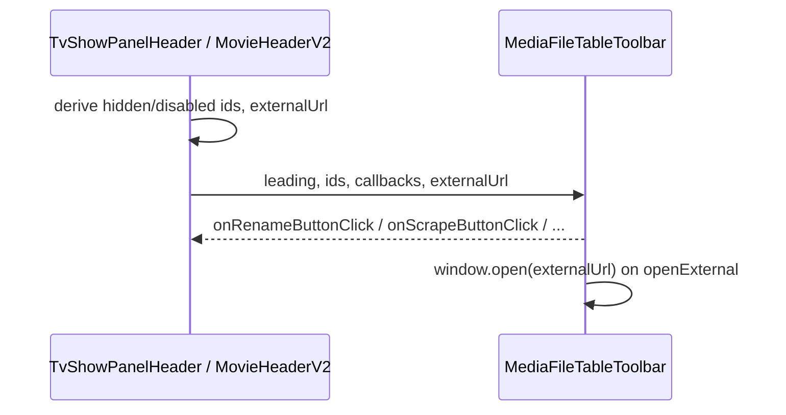

# MediaFileTableToolbar

This design document describe the high level design of a feature.
The design document is golden source and reference by one or more features.

## 1. Background

`TvShowPanelHeader` and `MovieHeaderV2` share the same chrome and the same primary menu. Earlier we extracted a presentational toolbar with caller-built `actions` / `moreItems` arrays. That duplicated menu construction in both headers and treated overflow items as a separate concept.

Goal: `MediaFileTableToolbar` owns the shared menu (labels, icons, collapse breakpoints, More overflow). Headers only supply leading search, loading/layout state, which items are hidden/disabled, callbacks, and an optional external URL.

## 2. Architecture

## 2.1 Project Level Architecture

UI-only change in `apps/ui`. No CLI, core, or type-package changes.

## 2.2 App Level Architecture

```
TvShowPanel / MoviePanel
  -> useTvShowMediaFileTableToolbar / useMovieMediaFileTableToolbar
       derives: loading, hiddenMenuIds, disabledMenuIds, externalUrl, leading, callbacks
  -> MediaFileTableToolbar
       owns: menu order, i18n labels, icons, collapse, More overflow
```

`TvShowPanelHeader` and `MovieHeaderV2` are removed. Panels call the hooks at top level and spread props into `MediaFileTableToolbar`.

## 2.3 Key Design

### Menu ids

```ts
type MediaFileTableMenuId =
  | "recognize"
  | "rename"
  | "scrape"
  | "subtitle"
  | "transcribe"
  | "translate"
  | "synthesize"
  | "process"
  | "openExternal"
```

### Props (toolbar)

| Prop | Role |
|------|------|
| `leading` | Search slot |
| `loading` | Skeletons for leading + actions |
| `layout` / `onLayoutChange` / `showPreviewLayoutButton` | Layout switcher (preview omitted on HarmonyOS) |
| `hiddenMenuIds` | Do not render these items |
| `disabledMenuIds` | Render but disabled |
| `onRecognizeButtonClick` / `onRenameButtonClick` / `onScrapeButtonClick` | Primary actions |
| `onTranscribeClick` / `onTranslateClick` / `onSynthesizeClick` / `onProcessClick` | Subtitle submenu |
| `externalUrl?` | Open in TMDB/TVDB; toolbar `window.open`s; missing URL disables `openExternal` |
| `moreAriaLabel` | Accessible name for More |
| `testIdPrefix?` | e.g. `tvshow-header` / `movie-header` for subtitle-related test ids |

Removed: `actions`, `moreItems`, `layoutLabels`, caller-built menu arrays.

### Menu behavior

Fixed order (left → right). Narrow screens collapse from right → left into More using existing breakpoints (410 / 310 / 220 / 200).

1. Recognize (hidden when in `hiddenMenuIds`, e.g. movie)
2. Rename
3. Scrape
4. Subtitle dropdown (children: transcribe, translate, synthesize, process)
5. `openExternal` — always in More only (never a primary bar button)

Rules:

- Hiding `subtitle` also hides its four children.
- Subtitle trigger is disabled if it is in `disabledMenuIds`, or if all visible children are disabled.
- `openExternal` is disabled when `externalUrl` is absent/empty, or when listed in `disabledMenuIds`.
- More button stays enabled so overflow actions remain reachable.

### Labels

Toolbar owns i18n for layout and menu chrome. Prefer shared keys where copy is identical (`mediaPlayer.trackContextMenu.*`). For rename/scrape/recognize/openExternal, use `tvShow.*` keys as the shared chrome strings (movie header historically used `movie.*` with the same English defaults — migrate movie to the shared keys unless product requires distinct copy).

### Headers

`TvShowPanelHeader` / `MovieHeaderV2` remain logic wrappers:

- Build `leading` (`MediaDatabaseSearchbox` with correct `mediaType`)
- Compute `loading` from folder status
- Compute `hiddenMenuIds` (movie: `recognize`; HarmonyOS subtitle: `subtitle` + children)
- Compute `disabledMenuIds` from metadata / scrape / subtitle availability
- Pass callbacks and `externalUrl`

## 3. User Stories

### 3.1 TV header menu without assembling arrays

* **Given** a recognized TV folder
* **When** the header renders the toolbar with empty hidden ids and domain-derived disabled ids
* **Then** Recognize, Rename, Scrape, Subtitle, and Open external appear with correct collapse behavior

### 3.2 Movie hides Recognize via hiddenMenuIds

* **Given** a movie folder
* **When** the header passes `hiddenMenuIds: ["recognize"]`
* **Then** Recognize is not shown in the bar or More; Rename/Scrape/Subtitle/Open external still work


