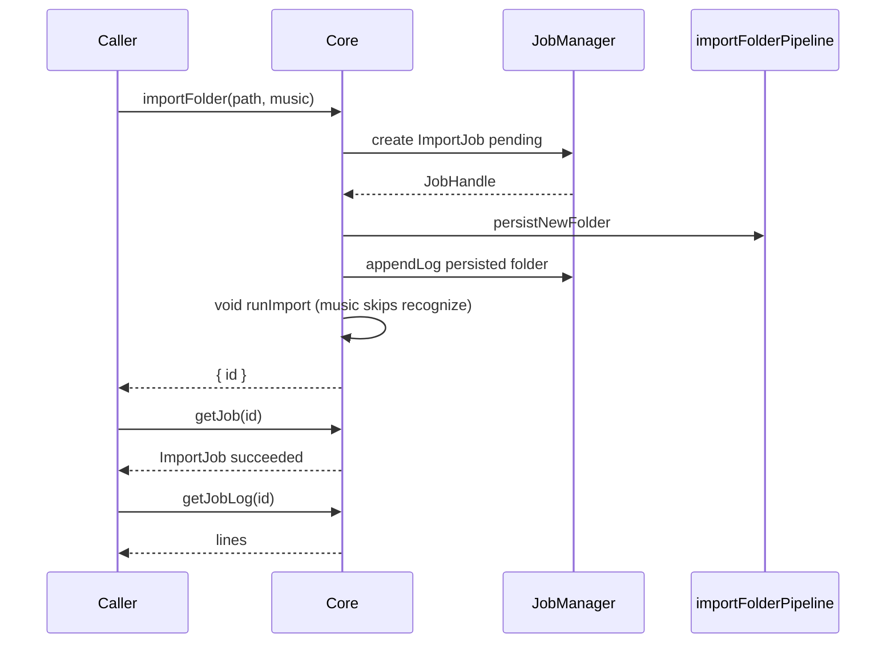
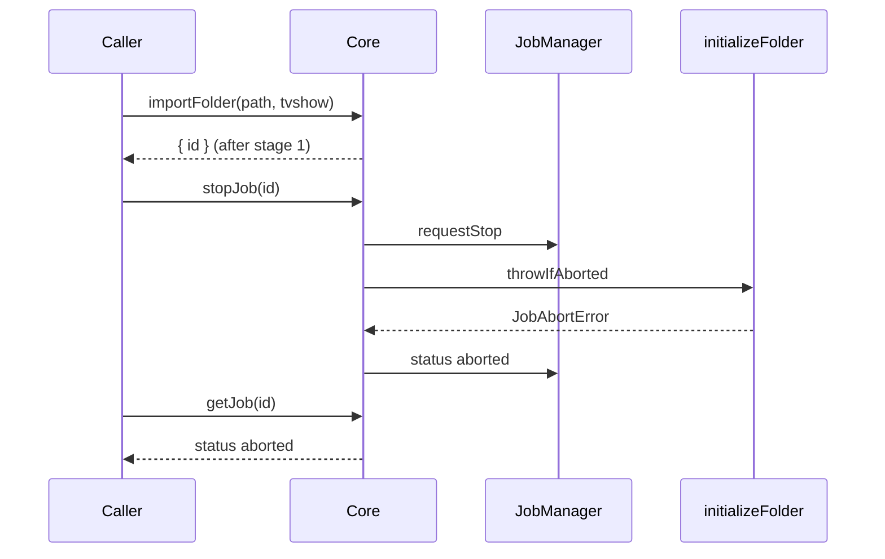

# Core JobManager + ImportJob

This design document describe the high level design of a feature.
The design document is golden source and reference by one or more features.

## 1. Background

Core 今天的 job 实现是进程内 `JobStore`（`create` / `update` / `get`）。`importFolder`、`importLibrary`、`scrapeFolder` 都在 `Core.ts` 里直接改这份 Map。没有停止，也没有按 job 可查询的用户日志。进程级 `LoggerPort` 不能替代 `smm job log`。

产品文档已经要求：

- [import-folder.md](../../dev/import-folder.md)：`importFolder` 在 stage 1 完成后返回 `{ id }`；调用方轮询直到 `succeeded` / `failed` / `aborted`；ImportJob 可在 stage 2 或 stage 3 被 abort。
- [job.md](../../dev/job.md)：Internal Job 自己写日志；Abortable Job 可停；CLI 为 `smm job` / `job log` / `job stop`。

本设计在 Core 抽出成熟的 Job 管理接口（创建、停止、写/读日志），并把 **ImportJob** 迁过去。Scrape / ImportLibrary 仍走同一 `getJob` 入口，本轮不接 abort/log。不持久化、不接 External Command Job、不改 UI 后台任务面板。

**Constraints (product decision):**

- Scope: Core JobManager + ImportJob 流水线；HTTP `stop-job` / `get-job-log`；CLI `smm job log` / `smm job stop`。
- Storage: 进程内内存。进程退出即丢。
- Logs: 双写。Job `appendLog` 是用户可见日志；`LoggerPort` 仍打进程日志。`getJob` 快照不含 logs。
- Abort: 协作式，只在阶段边界 `throwIfAborted`。进行中的 TMDB/TVDB 请求会跑完当前调用。
- `stopJob` 本轮只对 `kind === "import"` 且 `pending` / `running` 生效。
- CLI `smm job*` 走本进程 Core（与现有 `smm job` 相同）。要停 HTTP/UI 拉起的导入，用 `POST /api/stop-job`。本轮不做 CLI 连 daemon。
- Web UI 导入仍只 poll `POST /api/get-job`。本轮 UI 不调用 stop/log。

## 2. Architecture

### 2.1 Project Level Architecture

```
CLI / HTTP / UI poll
        │
        ▼
   Core 公开方法
   importFolder · getJob · stopJob · getJobLog
        │
        ▼
   JobManager  （替换 JobStore）
   记录 · 日志 · abort 标记
        │
        ▼
   JobHandle  →  importFolder 流水线
   appendLog / throwIfAborted / update
```

| 层 | 职责 |
|----|------|
| `apps/core` | `JobManager` / `JobHandle`；`importFolder` 用 Handle 推进状态、写 log、阶段边界 abort |
| `apps/cli` 路由 | 已有 `POST /api/get-job`；新增 `POST /api/stop-job`、`POST /api/get-job-log` |
| `apps/cli` Commander | 已有 `smm job <id>`；新增 `smm job log <id>`、`smm job stop <id>` |
| `apps/ui` | 不改。继续 poll `get-job` |
| Scrape / ImportLibrary | 继续 `create` / `update` / `get`。不写 job log，不可 abort |

### 2.2 App Level Architecture

| Piece | Location | Role |
|--------|----------|------|
| `JobLogLine` / `JobLogLevel` | `apps/core/src/jobs/types.ts` | 用户可见日志行 |
| `JobHandle` | `apps/core/src/jobs/jobHandle.ts` | 流水线只用的窄接口 |
| `JobAbortError` | `apps/core/src/jobs/jobAbortError.ts` | `throwIfAborted` 抛出的错误 |
| `JobManager` | `apps/core/src/jobs/jobManager.ts` | 替换 `JobStore`：create / update / get + log / stop |
| `Core.stopJob` / `Core.getJobLog` | `apps/core/src/Core.ts` | 对外 API |
| `runImport` / `initializeFolder` | `Core.ts`、`pipeline/importFolderPipeline.ts` | 阶段边界 abort + appendLog |
| `POST /api/stop-job` | `apps/cli/src/route/StopJob.ts` | 停 ImportJob |
| `POST /api/get-job-log` | `apps/cli/src/route/GetJobLog.ts` | 读 job log |
| `smm job log` / `smm job stop` | `apps/cli/src/cli/runCli.ts` | 本进程 Core |

删除 `JobStore`，只保留 `JobManager` 一处存储。`Core.getJob` 对三种 `kind` 的快照形状不变。

### 2.3 Key Design

#### Job 快照 vs 日志

所有 kind 的快照字段保持现状（`id` / `kind` / `status` / `createdAt` / `updatedAt` / `error?` + kind 专有字段）。`appendLog`、`requestStop`、`update` 都 bump `updatedAt`。

日志不在快照里：

```ts
export type JobLogLevel = "info" | "warn" | "error";

export interface JobLogLine {
  ts: number;
  level: JobLogLevel;
  message: string;
}
```

`message` 是纯文本。结构化诊断继续走 `LoggerPort`。

#### JobHandle

`JobManager.create()` 返回 `JobHandle`。`Core.importFolder` 对外仍只返回 `{ id }`，Handle 不离开 Core。

```ts
export interface JobHandle {
  readonly id: string;
  appendLog(level: JobLogLevel, message: string): void;
  requestStop(): void;
  throwIfAborted(): void;
  update(patch: Partial<ImportJob> | Partial<ImportLibraryJob> | Partial<ScrapeJob>): void;
}
```

- `throwIfAborted()`：若已 `requestStop`，抛 `JobAbortError`。
- 终态后再 `appendLog` / `update`：忽略，不改 `status`。因此 abort 路径必须先 `appendLog("warn", "aborted")`，再把 `status` 设为 `aborted`。
- Scrape / ImportLibrary 可以丢掉 Handle，继续用 `jobs.update(id, patch)`。
- `JobManager.update` 保持现有 typed overload（`Partial<ImportJob>` 等）。`JobHandle.update` 转发给同一方法。

#### Core 公开方法

```ts
getJob(id: string): Job | undefined
stopJob(id: string): void
getJobLog(id: string): JobLogLine[]
```

| 调用 | 未知 id | 其它 |
|------|---------|------|
| `getJob` | `undefined` | 快照（无 logs） |
| `getJobLog` | throw `Job not found` | 行数组副本。Scrape/ImportLibrary 返回 `[]` |
| `stopJob` | throw `Job not found` | 见下表 |

`stopJob`：

| 现状 | 行为 |
|------|------|
| `kind !== "import"` | throw `Job is not abortable` |
| `pending` / `running` | `requestStop()`，立即返回。流水线在下一阶段边界变成 `aborted` |
| `succeeded` / `failed` / `aborted` | throw `Job already finished` |

HTTP 把上述 message 包成 `error: "Error Reason: …"`，状态码 200。CLI 打 stderr，exit 1。

#### ImportJob 状态机

```
pending ──stage 1 成功──► running ──stage 2/3 成功──► succeeded
   │                        │
   │ stage 1 失败            │ JobAbortError
   ▼                        ▼
 failed                   aborted
```

- `importFolder` 在 stage 1 **之后**才返回 `{ id }`，所以外部 `stop` 只会打到 `running`（`skipInit` 则已是 `succeeded`）。
- `aborted` 的 `error` 固定为 `"aborted"`。
- 不回滚：smm.json、空白 metadata、以及已经写出的识别结果都保留。

#### `importFolder` 编排

1. `jobs.create({ kind: "import", status: "pending", stage: null, progress: 0, ... })` → `JobHandle`
2. Stage 1 `persistNewFolder`。失败：`status: "failed"`，`appendLog("error", message)`，返回 `{ id }`（不 throw）
3. `handle.update({ stage: "persistFolder", progress: 10 })` + `appendLog("info", "persisted folder")`
4. `skipInit`：先 `appendLog("info", "skipped init")`，再 `succeeded`，返回
5. 否则 `void runImport(handle, path, type)`，返回 `{ id }`

`runImport` / `initializeFolder`：

```
status = running
throwIfAborted
recognizeFolder
onStage + appendLog
throwIfAborted
recognizeEpisodes
onStage + appendLog
appendLog("info", "succeeded")
status = succeeded
```

`JobAbortError` → 先 `appendLog("warn", "aborted")`，再 `status: "aborted"`、`error: "aborted"`。其它异常 → `failed`（同样先打 error log，再改 status）。
`onStage` 仍更新 `stage` / `progress` / `recognizedTitle`，`smm add` 进度行不改。
`LoggerPort` 的 `importFolder: stage=…` 保留。

用户可见 log（music / `skipInit` 没有 stage 2/3 行）：

```
persisted folder
recognizing folder
recognized "Show Name"          # 或 recognition completed, no title
recognizing episodes
recognized episodes
succeeded
```

#### HTTP

RPC 命名，200 + `data` / `error`。

| 接口 | Body | 成功 `data` |
|------|------|-------------|
| 已有 `POST /api/get-job` | `{ id }` | Job 快照（无 logs） |
| `POST /api/stop-job` | `{ id }` | `{ id }` |
| `POST /api/get-job-log` | `{ id }` | `{ lines: JobLogLine[] }` |

缺 id：`Error Reason: id is required`（与 `get-job` 相同）。MCP `get-job` 不改。

#### CLI

```
smm job <id>         # 现状：import 打 JSON；scrape 打 task 行
smm job log <id>     # 每行打印一条 message，无 JSON
smm job stop <id>    # 成功无输出，exit 0
```

没有 start 子命令。Job 由 `smm add` / HTTP import / scrape 创建。

## 3. User Stories

### 3.1 导入文件夹并查询 job 与日志

* **Given** - 一个可导入的 music 文件夹（无需网络识别）
* **When** - 调用 `core.importFolder(path, "music")`，然后 `getJob(id)` 与 `getJobLog(id)`
* **Then** - job 终态 `succeeded`；日志含 `persisted folder` 与 `succeeded`；`getJob` 快照没有 `logs` 字段



### 3.2 Stage 2 前停止 ImportJob

* **Given** - tvshow 导入已完成 stage 1，stage 2 尚未开始（或测试中在 `throwIfAborted` 处拦截）
* **When** - 调用 `core.stopJob(id)`
* **Then** - `getJob(id).status === "aborted"`，`error === "aborted"`；识别流水线不被调用；smm.json 与空白 metadata 保留；日志含 `aborted`



### 3.3 停止非 Import Job 或已结束的 Job

* **Given** - 一个 scrape job，或已经 `succeeded` 的 import job
* **When** - 调用 `core.stopJob(id)`
* **Then** - 抛错：前者 `Job is not abortable`，后者 `Job already finished`；job 状态不变

### 3.4 HTTP 停止长驻进程里的 ImportJob

* **Given** - CLI/Electron HTTP server 正在跑一个 ImportJob（stage 2 或 3）
* **When** - 客户端 `POST /api/stop-job { id }`，再 `POST /api/get-job` 与 `POST /api/get-job-log`
* **Then** - stop 返回 `{ data: { id } }`；随后 job 为 `aborted`；log 含 `aborted`

### 3.5 CLI 本进程查询日志

* **Given** - 测试里同一 Core 上已有 ImportJob
* **When** - `smm job log <id>` / `smm job stop <id>`
* **Then** - log 向 stdout 逐行打印 `message`；stop 成功 exit 0。未知 id 则 stderr + exit 1

### 3.6 现有导入路径不回归

* **Given** - Web UI / `smm add` 现有导入流程
* **When** - 导入 tvshow / movie / music / `--skip-init`
* **Then** - `POST /api/import-folder` 与 `get-job` 契约不变；UI 仍只 poll `get-job`；`smm add` 进度行仍由 stage 字段驱动
