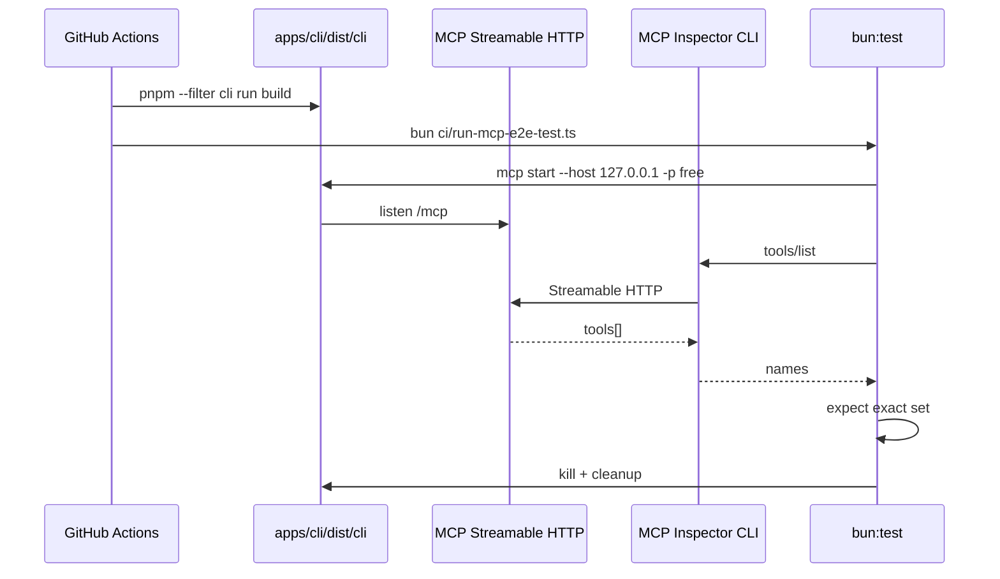

# MCP Tools E2E (built CLI + tools/list)

## 1. Background

`E2E Tests for MCP Tools` was a placeholder GitHub Actions workflow. We need a manual multi-platform smoke that builds the SMM CLI binary, starts MCP via `smm mcp start`, and verifies the advertised tool list with `@modelcontextprotocol/inspector`.

Existing `test/mcp/` stays as-is (uses `bun apps/cli/index.ts`). This suite lives under `apps/e2e/mcp` and targets the built binary, matching `E2E Tests for CLI`.

## 2. Architecture

### 2.1 Project Level

| Component | Role |
|-----------|------|
| `apps/cli` build | Produces `apps/cli/dist/cli[.exe]` |
| `apps/e2e/mcp` | bun:test suite; spawns MCP; calls Inspector |
| `ci/run-mcp-e2e-test.ts` | Runner used by Actions and local `e2e:mcp:bin` |
| `.github/workflows/e2e-mcp-tools.yml` | Manual 5-platform matrix |

### 2.2 App Level

1. Test `beforeAll` spawns `cli mcp start --host 127.0.0.1 --port <free>` with isolated data dirs.
2. Readiness: Inspector `tools/list` returns ≥1 tool.
3. Assertion: returned names equal `EXPECTED_MCP_TOOL_NAMES` (order-insensitive exact set).
4. `afterAll` kills the process and removes temp dirs.

### 2.3 Key Design

- Exact-set assertion (extras or missing names fail).
- Inspector via `node <launcher>` (not `npx`).
- No TMDB/TVDB secrets for tools/list.
- Not a CI/release gate.

## 3. User Stories

### 3.1 tools/list matches CLI MCP registration

* **Given** a freshly built `cli` binary on the runner
* **When** tests start `cli mcp start` and call Inspector `tools/list`
* **Then** the tool name set equals the expected CLI registration set

