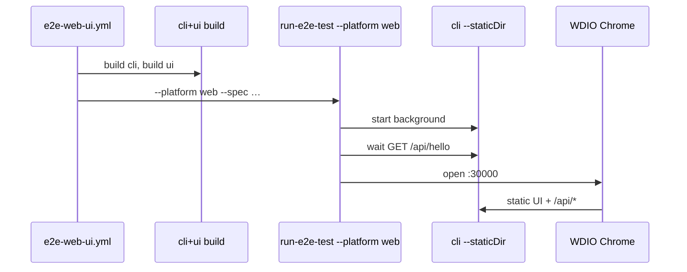

# Web UI E2E Platform (`--platform web`)

This design document describe the high level design of a feature.
The design document is golden source and reference by one or more features.

## 1. Background

`docs/dev/supported-platform.md` defines Web UI as: user operates `apps/ui` while the HTTP server is the `smm` / CLI process serving built static assets (not the Vite dev server).

`.github/workflows/e2e-web-ui.yml` was written to exercise that product shape across the same OS/arch matrix as Electron e2e. In practice it called `bun ci/run-e2e-test.ts --platform desktop`, which starts:

- `pnpm e2e:cli` (Bun-run CLI)
- `pnpm dev:ui` (Vite on `:8000`, proxying `/api` to CLI)

Failed config specs (`CustomTmdbHost-*`) timed out waiting for `window._smm_status === "ready"` while Vite held API responses far longer than CLI had already finished them. That is a symptom of the **wrong CI stack**, not proof of a TMDB product bug.

Scope for this change: **only** the manual Web UI workflow and the runner support it needs. Do **not** change `desktop` (Vite) or `ci.yml` `host-e2e`.

## 2. Architecture

## 2.1 Project Level Architecture

```text
CI runner (win / linux / mac × arch)
  ├─ pnpm --filter cli run build     → apps/cli/dist/cli[.exe]
  ├─ pnpm --filter ui run build      → apps/ui/dist
  └─ bun ci/run-e2e-test.ts --platform web --spec …
        background: dist/cli --staticDir <ui/dist> --port 30000
        wait:        GET http://localhost:30000/api/hello
        Chrome/WDIO → http://localhost:30000/?token=…
```

| Platform | What it tests today | This design |
|----------|---------------------|-------------|
| `desktop` | Vite + CLI start (local / host-e2e) | Unchanged |
| `docker` | Container `smm:latest` | Unchanged |
| `electron` | Packaged Electron app | Unchanged |
| **`web` (new)** | Built CLI serving built UI on host | Used by `e2e-web-ui.yml` |

## 2.2 App Level Architecture

### Runner (`ci/run-e2e-test-lib.ts`)

- Extend `Platform` with `'web'`.
- Add `buildWebConfig(specs)`:
  - `env.E2E_PLATFORM = 'web'`
  - Single background hook: compiled CLI with `--staticDir` (absolute path to `apps/ui/dist`) and `--port 30000`
  - Auth: `SMM_AUTH_ENABLED=true`, `SMM_AUTH_TOKEN` same default as other e2e (`ChangeMe123`)
  - Wait task: poll `http://localhost:30000/api/hello` (same contract as docker wait; share or thin-wrap existing helper)
  - WDIO: reuse desktop `pnpm wdio` unless a tiny isolation gap forces `wdio:web`; origin comes from `E2E_PLATFORM=web`, not Vite port parsing
- Spec gating: same as `desktop` / `docker` — allow `common/`, reject ohos/electron-only specs.
- Default patterns: like docker, require explicit `--spec` (workflow always passes specs).

### UI origin (`apps/e2e/test/lib/ui-page-url.ts`)

- When `E2E_PLATFORM === 'web'`, default base is `http://localhost:30000/` (trailing slash normalized).
- Optional override: `E2E_WEB_UI_ORIGIN` (same role as `E2E_DOCKER_UI_ORIGIN` for docker).

### Workflow (`.github/workflows/e2e-web-ui.yml`)

1. After install: build CLI, build UI.
2. Run suites with `--platform web` (same `--spec` batches as today).
3. Remove misleading `BUILD_ENV: docker` from the e2e step (it only tweaked Chrome args and implied a Docker stack).
4. Keep Chrome setup, API key secrets, secure-data scan, and log artifacts.
5. Update header comments to state: built CLI + static UI, not Vite.

## 2.3 Key Design

- **One process serves UI + API** — matches product Web UI (`smm` / `cli --staticDir`).
- **Port 30000** — same host-facing port convention as Docker e2e; avoids Vite `:8000`.
- **Keep `desktop` intact** — local Vite iteration and host-e2e stay on the old path until a separate change.
- **Acceptance signal** — network/main logs must show packaged assets (e.g. `/assets/…`) and must not show `@vite/client`, `/src/main.tsx`, or Vite `[proxy-timing]`.

## 3. User Stories

### 3.1 Web UI CI runs against production-shaped server

* **Given** - a clean checkout on a matrix runner and valid TMDB/TVDB secrets  
* **When** - `E2E Tests for Web UI` is dispatched  
* **Then** - CLI and UI are built, a single `cli --staticDir …/ui/dist --port 30000` serves the app, and WDIO opens `http://localhost:30000/?token=…` without starting Vite  



### 3.2 Wrong stack is detectable

* **Given** - a Web UI e2e run  
* **When** - inspecting artifacts  
* **Then** - there is no `pnpm dev:ui` background task and no Vite client modules in the network log  

### 3.3 Desktop Vite path remains available

* **Given** - a developer runs `bun ci/run-e2e-test.ts --platform desktop` (or omits `--platform`)  
* **When** - the runner starts  
* **Then** - behavior remains Vite + `e2e:cli` as today  

## 4. Out of scope

- Changing `ci.yml` `host-e2e` / release gate to `--platform web`
- Replacing Web UI matrix with `--platform docker`
- Fixing individual TMDB e2e assertions beyond environment correctness
- Renaming or removing the `desktop` platform

## 5. Test plan

1. Unit: `Platform` parsing includes `web`; `buildWebConfig` has one background command with `--staticDir` and `--port 30000`, no `dev:ui`.
2. Unit: `assertSpecsMatchPlatform('web', …)` matches desktop/docker rules.
3. Unit: `resolveUiPageUrl` with `E2E_PLATFORM=web` → `:30000`; `E2E_WEB_UI_ORIGIN` overrides.
4. Manual / CI: dispatch `e2e-web-ui.yml` and confirm acceptance signals in §2.3.
