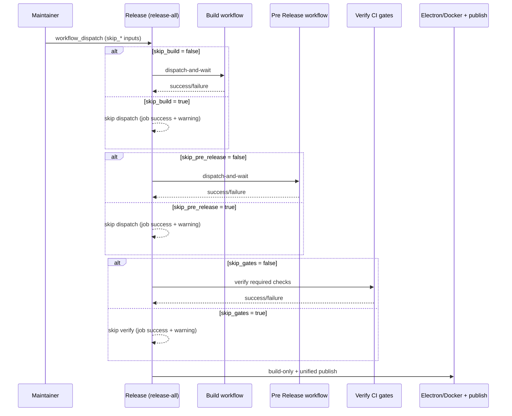

# Release CI: skip Build / Pre Release and rename skip_gates

This design document describe the high level design of a feature.
The design document is golden source and reference by one or more features.

## 1. Background

The **Release** orchestrator (`.github/workflows/release-all.yml`) always runs, in order:

1. **Dispatch Build** — full multi-platform Build validation
2. **Dispatch Pre Release** — full product E2E matrix (CLI / Electron / Web UI / MCP / AI Tools / Docker)
3. **Verify CI gates** — checks that required PR/push CI checks already passed on the commit (does not re-run tests)
4. Electron + Docker build-only sub-workflows, then unified **publish**

Flaky or one-off Pre Release / Build failures can block an otherwise ready release. Maintainers already have an emergency escape for step 3 (`skip_ci_verification`), but cannot skip steps 1–2 without abandoning the orchestrator and running product workflows by hand.

**Decisions (locked):**

1. Scope is **orchestrator-only** (option A): add skip controls for Dispatch Build and Dispatch Pre Release on **Release** (`release-all.yml`) only. Standalone Build / Pre Release / Release Electron / Release Docker are unchanged in behavior (except the rename below).
2. Implementation uses **step-level** `if:` on the dispatch steps so jobs still conclude `success`. Job-level `if:` that skips entire jobs must not be used — it breaks the `needs` chain and can leave `publish` skipped (see `docs/dev/release.md` troubleshooting).
3. Rename `skip_ci_verification` → **`skip_gates`** everywhere it is a workflow input (Release / Release Electron / Release Docker + docs). Do **not** rename the internal caller flag `skip_verify_ci` (means “caller already verified”).
4. No extra approval/permissions gate; same trust model as today’s emergency skip (maintainer + Actions summary warning).

## 2. Architecture

## 2.1 Project Level Architecture

```
Release (release-all.yml)
  ├── Dispatch Build        [skip when skip_build]
  ├── Dispatch Pre Release  [skip when skip_pre_release]
  ├── Verify CI gates       [skip when skip_gates]
  ├── Release Electron (build-only)
  ├── Release Docker (build-only)
  └── publish (unified gate — unchanged)
```

Standalone product releases keep their own `skip_gates` input only (no `skip_build` / `skip_pre_release`).

## 2.2 App Level Architecture

### `.github/workflows/release-all.yml`

| Input | Type | Default | Effect |
|-------|------|---------|--------|
| `skip_build` | boolean | `false` | Skip the `dispatch-and-wait` step for `build.yml` |
| `skip_pre_release` | boolean | `false` | Skip the `dispatch-and-wait` step for `pre-release.yml` |
| `skip_gates` | boolean | `false` | Formerly `skip_ci_verification`; passed to `_verify-ci-gates.yml` as `skip` and to child release workflows |

Job graph (`needs`) stays:

`dispatch-build` → `dispatch-pre-release` → `verify-ci` → `release-electron` / `release-docker` → `publish`

When a skip input is true:

- Checkout (and any cheap setup) may still run
- The dispatch step is gated with `if: ${{ !inputs.skip_* }}`
- Emit `::warning::` and a short Step Summary note for that skip
- Job exits success so dependents are not skipped

`summary` job lists every enabled skip among `skip_build`, `skip_pre_release`, `skip_gates`.

### `.github/workflows/release.yml` / `release-docker.yml`

- Rename input `skip_ci_verification` → `skip_gates` on both `workflow_dispatch` and `workflow_call`
- Wire `skip: ${{ inputs.skip_verify_ci || inputs.skip_gates }}` into `_verify-ci-gates.yml`
- Update any summary text that mentions the old name
- Leave `skip_verify_ci`, `skip_final_publish`, and product-specific skips unchanged

### `docs/dev/release.md`

- Document the three Release orchestrator skips and risk notes
- Replace all `skip_ci_verification` references with `skip_gates`
- Clarify that `skip_build` / `skip_pre_release` apply only to **Release** Dispatch jobs, not to Electron/Docker artifact builds inside the sub-workflows

### Out of scope

- Changes to `ci/dispatch-and-wait-workflow.sh`
- Skipping Electron platform builds, Docker image builds, or the unified `publish` job
- Required-reviewer / environment protection rules for skip flags

## 2.3 Key Design

- **Step-level skip** — preserves job success and the existing `needs` chain (same pattern as `_verify-ci-gates.yml` `inputs.skip`).
- **Orthogonal flags** — `skip_build`, `skip_pre_release`, and `skip_gates` combine freely for emergency paths.
- **Naming** — `skip_gates` means “skip verifying that required CI checks already passed on this commit,” not “skip running CI.”
- **Audit** — every enabled skip writes a workflow warning into the run summary.

## 3. User Stories

### 3.1 Default release unchanged

* **Given** - all skip inputs are `false` (defaults)
* **When** - maintainer runs **Release**
* **Then** - Build and Pre Release are dispatched and awaited, CI gates are verified, then Electron/Docker build-only and publish proceed as today

### 3.2 Skip Pre Release on flaky E2E

* **Given** - recent CI is green but Pre Release has a known flaky failure
* **When** - maintainer runs **Release** with `skip_pre_release: true`
* **Then** - Pre Release is not dispatched; Build (unless also skipped) and subsequent release jobs still run; summary warns that `skip_pre_release` was enabled

### 3.3 Emergency fast path

* **Given** - an urgent hotfix must ship and orchestrator gates are the blocker
* **When** - maintainer sets `skip_build`, `skip_pre_release`, and optionally `skip_gates` to `true`
* **Then** - Release proceeds to product builds / publish without re-running Build or Pre Release; summary lists all enabled skips

### 3.4 Rename without behavior change

* **Given** - a standalone **Release Electron** or **Release Docker** run
* **When** - maintainer uses `skip_gates: true` (formerly `skip_ci_verification`)
* **Then** - Verify CI gates is skipped exactly as before; input name in Actions UI is `skip_gates`



## 4. Acceptance

1. Actions UI for **Release** shows booleans `skip_build`, `skip_pre_release`, `skip_gates` (no `skip_ci_verification`).
2. Defaults all `false` preserve current orchestrator behavior.
3. `skip_build=true` alone does not dispatch `build.yml`; later jobs still run.
4. `skip_pre_release=true` alone does not dispatch `pre-release.yml`; later jobs still run.
5. Both true: orchestrator reaches verify-ci (or skips it if `skip_gates`) then product release jobs.
6. `docs/dev/release.md` matches workflow input names and documents risks.
