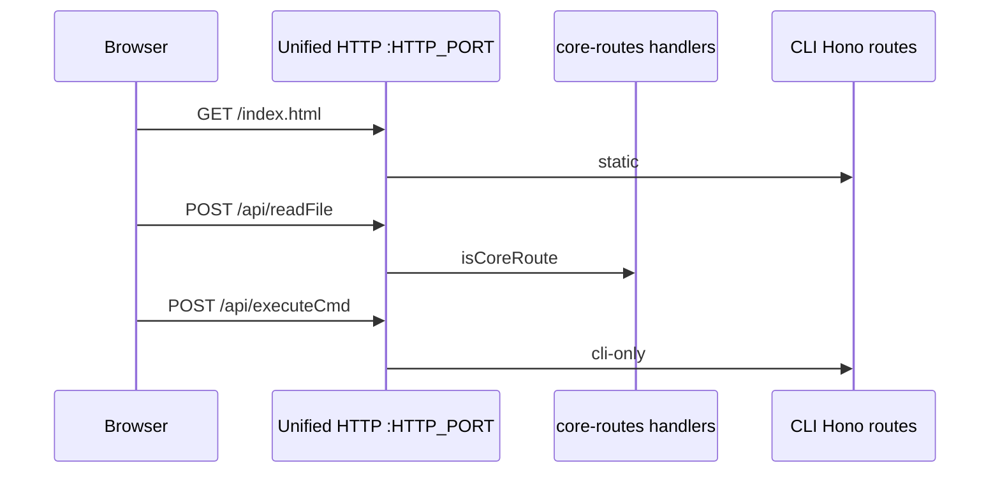

# Unified HTTP server (static + core-routes + cli APIs)

## 1. Background

Desktop CLI previously listened on two ports: UI/static+Hono (`30000`) and a separate core-routes `node:http` server (`3001`). The Web UI used relative `/api/*` on the UI origin; `3001` was a second entry for the same shared handlers. HarmonyOS already used one HTTP server.

## 2. Architecture

### 2.1 Project Level

One CLI listen (`HTTP_PORT` / `--port`, bind `HTTP_ADDRESS`):

| Path class | Handler |
|------------|---------|
| Shared public APIs (`coreRoutes` table) | `createCoreRoutesRequestHandler` |
| CLI-only APIs | Hono in `apps/cli` |
| Static UI | Hono `serveStatic` |
| Socket.IO | same `http.Server` |

MCP (`mcpPort`) and reverse proxy remain separate listens.

### 2.2 App Level

- `packages/core-routes/src/coreRouteTable.ts` — `coreRoutes: { method, path, handle }[]`; `isCoreRoute()` derived from that list (single source of truth when adding APIs).
- `apps/cli/server.ts` — `if (isCoreRoute(method, url)) coreRoutesHandler; else honoListener`.
- Env: `HTTP_PORT` (fallback `PORT`), `HTTP_ADDRESS` (fallback `WEBUI_ADDRESS`). Default port `30000`.
- Vite uses `VITE_PORT` for the page server; proxy target follows `HTTP_PORT` (`pnpm dev` sets `VITE_PORT=8081 HTTP_PORT=8082`).

- `hello.coreRoutesPort` = unified listen port (wire field name kept).

### 2.3 Key Design

Adding a shared API: append one entry to `coreRoutes`. Hosts that dispatch with `isCoreRoute` pick it up automatically. CLI-only routes stay Hono-only and are never listed in `coreRoutes`.

## 3. User Stories

### 3.1 Single port for Web UI

* **Given** CLI started with default env  
* **When** browser opens `http://127.0.0.1:30000`  
* **Then** static assets, shared `/api/hello`, and CLI `/api/executeCmd` all work on that origin  

