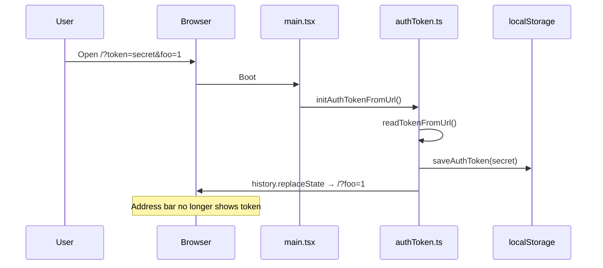

# Auth token URL strip after localStorage persist

This design document describe the high level design of a feature.
The design document is golden source and reference by one or more features.

## 1. Background

CLI prints a ready URL with an auth token query parameter, e.g.
`http://127.0.0.1:30000?token=<secret>`, so users can open the UI already authenticated.

The UI already:

- Reads `?token=` via `readTokenFromUrl()`
- Persists it with `saveAuthToken()` inside `initAuthTokenFromUrl()` (called from `apps/ui/src/main.tsx` at boot)
- Uses `getAuthToken()` (URL first, then localStorage) for API `Authorization` headers

Leaving `token` in the address bar keeps the secret visible (screenshots, shoulder surfing, shared links). After persist, the URL should no longer contain `token`.

## 2. Architecture

## 2.1 Project Level Architecture

No cross-app contract change. CLI continues to advertise `?token=`. Only `apps/ui` changes.

## 2.2 App Level Architecture

Boot path in `apps/ui`:

1. `main.tsx` calls `initAuthTokenFromUrl()`
2. That function saves the query token to localStorage (existing)
3. **New:** strip `token` from the current URL with `history.replaceState` (no reload)

`LoginPanel` / `AuthGate` are unchanged; manual login still uses `saveAuthToken` after `verifyHelloWithToken`.

## 2.3 Key Design

- **Approach:** `history.replaceState` — update the address bar without a second React boot; replace the current history entry so Back does not restore the token URL.
- **Scope of URL edit:** delete only the `token` search param; preserve pathname, other query params, and hash.
- **No validation on URL ingest:** same as today — URL token is stored as-is; invalid tokens surface later via 401 / login gate.
- **Implementation site:** extend `initAuthTokenFromUrl()` in `apps/ui/src/lib/authToken.ts` only.

Pseudo-flow:

```
if (token in search):
  saveAuthToken(token)
  url = current location
  delete url.searchParams.token
  history.replaceState(null, '', url.pathname + url.search + url.hash)
```

## 3. User Stories

### 3.1 Open ready URL with token

* **Given** - User opens `http://127.0.0.1:30000/?token=secret&foo=1#section` (or equivalent path)
* **When** - UI boots and `initAuthTokenFromUrl()` runs
* **Then** - `localStorage` key `auth-token` is `secret`, address bar is without `token` (e.g. `/?foo=1#section`), and `getAuthToken()` returns `secret` from storage



### 3.2 Open URL without token

* **Given** - URL has no `token` query param
* **When** - `initAuthTokenFromUrl()` runs
* **Then** - No localStorage write from this path; URL unchanged

## 4. Testing

- Unit tests in `apps/ui/src/lib/authToken.test.ts`:
  - Persist + strip `token` from search
  - Preserve other query params and hash when stripping
  - Existing prefer-URL / fallback-storage cases remain valid (after strip, storage is the source)

## 5. Out of scope

- Full page reload / `location.replace`
- Verifying the URL token via `/api/hello` before save
- Changes to CLI ready-URL logging
- HarmonyOS / Electron login pages
