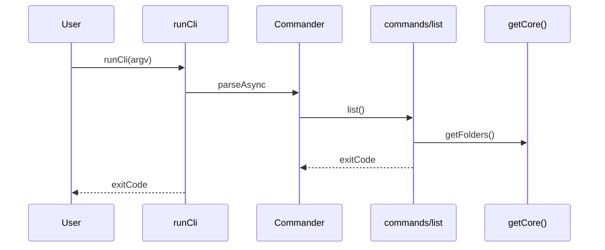

# CLI Commands Extract (runCli → commands/)

This design document describe the high level design of a feature.
The design document is golden source and reference by one or more features.

## 1. Background

`apps/cli/src/cli/runCli.ts` currently mixes Commander argument parsing with command business logic (~950 lines). Three commands (`add`, `addlib`, `scrape`) already live under `apps/cli/src/cli/commands/` as pure handlers that take typed options and return an exit code. The remaining commands stay inlined in `runCli`, which makes unit testing harder and keeps the file large.

Goal: extract **all** leaf commands into `commands/`, decouple them from Commander, keep existing CLI behavior and existing `runCli`-level tests as the safety net.

## 2. Architecture

## 2.1 Project Level Architecture

No change to monorepo package boundaries. Work stays inside `apps/cli`:

- `runCli` remains the CLI entry invoked from `apps/cli/index.ts` for subcommands.
- Handlers continue to call `@smm/core` via `getCore()` and shared formatters under `apps/cli/src/cli/`.

## 2.2 App Level Architecture

```
argv
  → runCli.ts (Commander: schema, parse, exitOverride)
    → commands/<leaf>.ts (handler: Core + formatters + console)
      → Promise<number> exit code
```

- **`runCli.ts`**: Commander-only shell. Defines program/subcommands/options/args, then `exitCode = await handler(...)`. Catches `CommanderError` from `exitOverride()`.
- **`commands/<leaf>.ts`**: One file per leaf command. Does **not** import `commander`.
- **Formatters / helpers** (`*Format.ts`, `folderDisplay.ts`, `renameDispatch.ts`, etc.): remain outside `commands/`; imported by handlers.
- **`commands/shared.ts`**: small shared helpers moved out of `runCli` (`printJson`, `parseConfigValue`, `resolveFolderType`, `resolveRenameRule`).

## 2.3 Key Design

### Handler contract

Follow existing `add` / `scrape` style:

```ts
export async function hello(options: HelloOptions): Promise<number>
```

- Use `console.log` / `console.error` inside the handler.
- Return `0` on success, `1` on failure.
- Domain validation failures may return `1` without throwing (e.g. folder not imported).
- Unexpected errors: catch, print message, return `1`.
- Test-only `_context` / `_ports` only on commands that already need them (`add`, `addlib`, `scrape`); do not add to every command.

### File inventory & naming

**Already present:** `add.ts`, `addlib.ts`, `scrape.ts`

**Top-level leaves:**

| CLI | File | Export |
|-----|------|--------|
| `hello` | `hello.ts` | `hello` |
| `list` | `list.ts` | `list` |
| `show` | `show.ts` | `show` |
| `metadata` | `metadata.ts` | `metadata` |
| `rm` | `rm.ts` | `rm` |
| `recognize` | `recognize.ts` | `recognize` |
| `try-to-recognize` | `tryToRecognize.ts` | `tryToRecognize` |
| `try-to-rename` | `tryToRename.ts` | `tryToRename` |
| `apply` | `apply.ts` | `apply` |
| `reject` | `reject.ts` | `reject` |
| `rename` | `rename.ts` | `rename` |
| `rename-episode-file` | `renameEpisodeFile.ts` | `renameEpisodeFile` |

**Nested leaves (flat files, camelCase group+action):**

| CLI | File |
|-----|------|
| `plan list/show/apply/reject` | `planList.ts`, `planShow.ts`, `planApply.ts`, `planReject.ts` |
| `job list/log/stop` + default show | `jobList.ts`, `jobLog.ts`, `jobStop.ts`, `jobShow.ts` |
| `tmdb search/tv/movie` | `tmdbSearch.ts`, `tmdbTv.ts`, `tmdbMovie.ts` |
| `tvdb search/tv/movie` | `tvdbSearch.ts`, `tvdbTv.ts`, `tvdbMovie.ts` |
| `config list/get/set` | `configList.ts`, `configGet.ts`, `configSet.ts` |
| `mcp start` | `mcpStart.ts` |

**Aliases:** top-level `apply` / `reject` and `plan apply` / `plan reject` share the same handlers (`apply` / `reject`). Prefer implementing logic once in `apply.ts` / `reject.ts`; `planApply` / `planReject` may re-export or thin-wrap those handlers.

**MCP:** keep lazy imports inside `mcpStart` (avoid loading `@smm/core-routes` / path alias issues in vitest at module load).

### Out of scope

- Changing CLI flags, help text, or user-visible output
- Moving formatters into `commands/`
- Self-registering Commander commands inside each handler file
- Requiring a new unit test for every extracted command

## 3. User Stories

### 3.1 Invoke a leaf command via runCli (behavior unchanged)

* **Given** - an existing CLI invocation such as `smm list` or `smm tmdb search foo --type tv`
* **When** - `runCli(argv)` runs
* **Then** - Commander parses args, the leaf handler runs, stdout/stderr and exit code match pre-refactor behavior



### 3.2 Call a command handler without Commander (testability)

* **Given** - a unit test that wants to exercise import/scrape logic
* **When** - the test imports `add` / `scrape` (or another leaf) and calls it with typed options
* **Then** - the handler runs without constructing a Commander program; existing `commands/*.test.ts` continue to work

### 3.3 Existing runCli-level tests remain the safety net

* **Given** - existing tests under `apps/cli/src/cli/*.test.ts` that call `runCli([...])`
* **When** - the extract refactor lands
* **Then** - those tests still pass without requiring a new test file per leaf command
