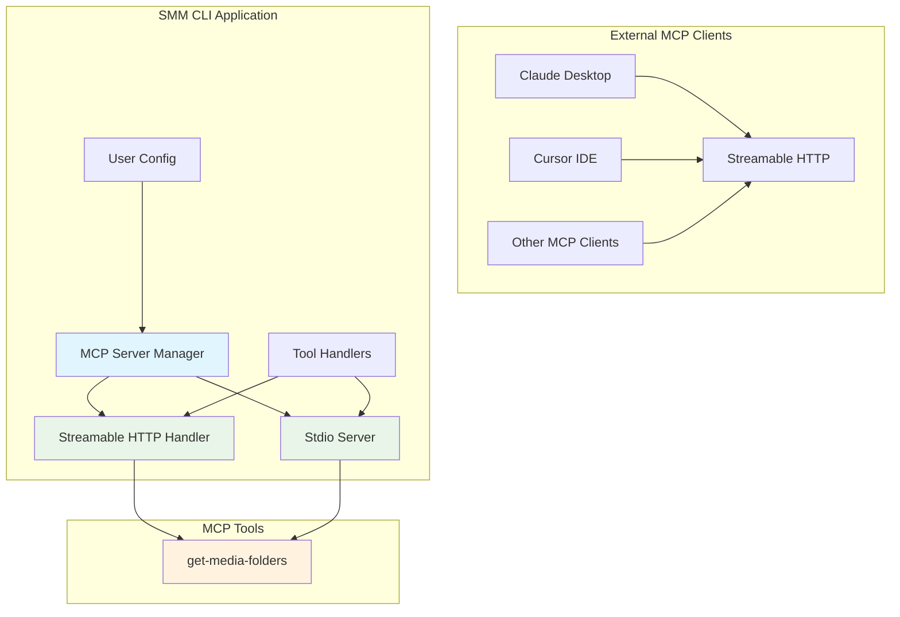
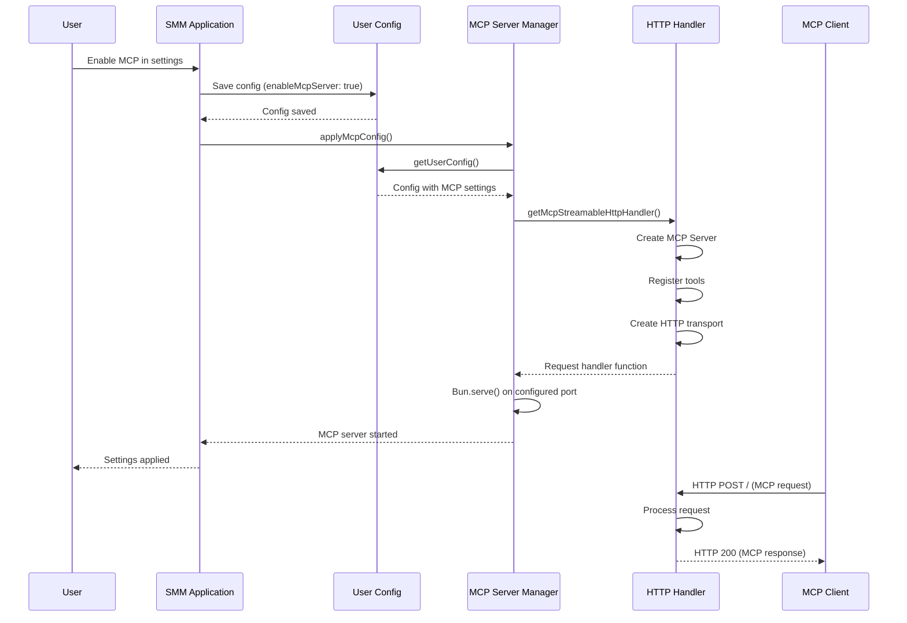
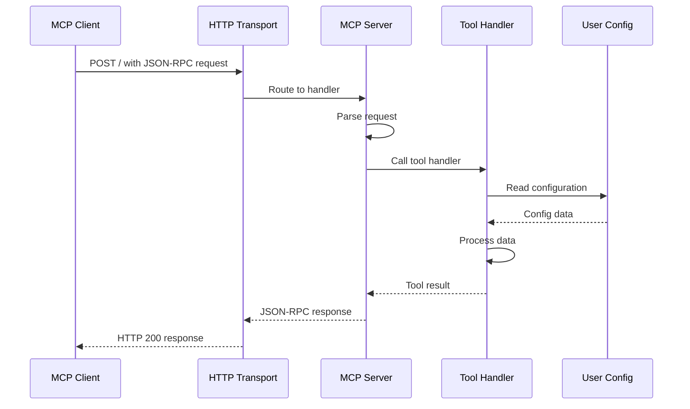
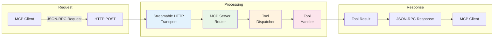

# MCP (Model Context Protocol) Architecture in SMM

This document describes the architecture and code design of the Model Context Protocol (MCP) implementation in the Simple Media Manager (SMM) CLI module.

## Overview

SMM implements an MCP server that allows external AI clients (such as Claude Desktop, Cursor, or other MCP-compatible clients) to interact with the SMM application programmatically. The MCP server exposes tools that provide access to SMM's functionality, enabling AI assistants to query media folders and potentially perform other operations through a standardized protocol.

The MCP implementation in SMM supports two transport mechanisms:

1. **Streamable HTTP** - The primary transport that runs on a separate port, allowing MCP clients to connect over HTTP
2. **Stdio** - A standalone server for subprocess-based clients like Claude Desktop

## Architecture

### System Architecture Diagram



### Component Responsibilities

| Component | File | Responsibility |
|-----------|------|----------------|
| MCP Server Manager | `mcpServerManager.ts` | Manages server lifecycle based on user config |
| Streamable HTTP Handler | `mcp.ts` | Creates and configures HTTP-based MCP server |
| Stdio Server | `server.ts` | Standalone stdio-based MCP server for subprocess clients |
| Tool Handlers | `getMediaFoldersTool.ts` | Implementation of individual MCP tools |

### Directory Structure

```
cli/src/mcp/
├── mcpServerManager.ts      # Server lifecycle management
├── mcp.ts        # HTTP transport implementation
├── server.ts                # Stdio transport implementation
├── getMediaFoldersTool.ts   # Tool implementation
└── getMediaFoldersTool.test.ts  # Unit tests
```

## Code Design

### MCP Server Manager

The `McpServerManager` module handles the lifecycle of the MCP server based on user configuration. It is responsible for:

1. Reading user configuration to determine if MCP should be enabled
2. Starting the MCP server on the configured host and port
3. Stopping any existing MCP server before starting a new one
4. Handling configuration changes without requiring application restart

```typescript
// Key functions in mcpServerManager.ts

/**
 * Applies MCP server config from user config: stops any running MCP server,
 * then starts one on mcpHost:mcpPort if enableMcpServer is true.
 */
export async function applyMcpConfig(): Promise<void>
```

The `applyMcpConfig` function is called whenever the user configuration changes. This enables dynamic enabling/disabling of the MCP server without restarting the application.

**Configuration Properties:**

| Property | Type | Default | Description |
|----------|------|---------|-------------|
| `enableMcpServer` | boolean | `false` | Whether to enable the MCP server |
| `mcpHost` | string | `"127.0.0.1"` | Network interface to bind to |
| `mcpPort` | number | `30001` | TCP port to listen on |

### Streamable HTTP Transport

The `mcp.ts` module implements the Streamable HTTP transport for MCP. This is the primary transport mechanism used when running SMM as a server.

Key design patterns:

1. **Lazy Initialization**: The HTTP handler is created once and reused for all subsequent requests
2. **Singleton Pattern**: Only one MCP server instance is created per application session
3. **Stateless Mode**: The server runs without session IDs, making each request independent

```typescript
// Key pattern in mcp.ts

export async function getMcpStreamableHttpHandler(): Promise<
  (req: Request) => Promise<Response>
> {
  if (handlerPromise) {
    return handlerPromise;
  }
  handlerPromise = (async () => {
    // Create MCP server instance
    const server = new McpServer({...});

    // Register tools
    server.registerTool("get-media-folders", {...}, async () => {...});

    // Create transport and connect
    const transport = new WebStandardStreamableHTTPServerTransport({...});
    await server.connect(transport);

    // Return request handler
    return (req: Request) => transport.handleRequest(req);
  })();
  return handlerPromise;
}
```

### Tool Implementation Pattern

Each MCP tool follows a consistent pattern:

1. **Handler Function**: Contains the business logic for the tool
2. **Registration**: Registered with the MCP server with metadata
3. **Response Format**: Returns a standardized response with `content` and optional `isError` fields

```typescript
// Pattern from getMediaFoldersTool.ts

export async function handleGetMediaFolders(): Promise<{
  content: Array<{ type: "text"; text: string }>;
  isError?: boolean;
}> {
  try {
    // Business logic
    const userConfig = await getUserConfig();
    const folders = userConfig.folders ?? [];

    // Success response
    return {
      content: [{ type: "text" as const, text: JSON.stringify(folders) }],
    };
  } catch (err) {
    // Error response
    const message = err instanceof Error ? err.message : String(err);
    return {
      content: [{ type: "text" as const, text: `Error reading config: ${message}` }],
      isError: true,
    };
  }
}
```

## System Flow

### HTTP Server Initialization Flow



### Tool Invocation Flow



### Request/Response Flow Diagram



## Tool Response Format

All MCP tools in SMM follow a standardized response format:

```typescript
interface ToolResponse {
  /** Array of content blocks to return to the client */
  content: Array<{
    /** Content type (always "text" for SMM tools) */
    type: "text";
    /** The actual content as a string */
    text: string;
  }>;
  /** Optional flag indicating this is an error response */
  isError?: boolean;
}
```

**Success Response Example:**

```json
{
  "content": [
    {
      "type": "text",
      "text": "[\"C:\\\\Media\\\\TV\", \"C:\\\\Media\\\\Movies\"]"
    }
  ]
}
```

**Error Response Example:**

```json
{
  "content": [
    {
      "type": "text",
      "text": "Error reading config: Config file not found"
    }
  ],
  "isError": true
}
```

## How to Add New MCP Tools

This section provides a step-by-step guide for adding new MCP tools to SMM.

### Step 1: Create the Tool Handler

Create a new file in `cli/src/mcp/` with the naming convention `<toolName>Tool.ts`. The handler should:

1. Import necessary dependencies
2. Export an async function that implements the tool logic
3. Return the standardized response format

```typescript
// cli/src/mcp/exampleTool.ts
import { getUserConfig } from "@/utils/config";

export async function handleExampleTool(): Promise<{
  content: Array<{ type: "text"; text: string }>;
  isError?: boolean;
}> {
  try {
    // Tool implementation here
    const userConfig = await getUserConfig();

    // Process data
    const result = /* ... */;

    return {
      content: [{ type: "text" as const, text: JSON.stringify(result) }],
    };
  } catch (err) {
    const message = err instanceof Error ? err.message : String(err);
    return {
      content: [{ type: "text" as const, text: `Error: ${message}` }],
      isError: true,
    };
  }
}
```

### Step 2: Register the Tool in HTTP Server

Update `cli/src/mcp/mcp.ts` to register the new tool:

```typescript
// In getMcpStreamableHttpHandler function, after creating the server instance:

server.registerTool(
  "example-tool",
  {
    description: "Description of what this tool does. Include parameters and their types.",
    // Schema for input parameters (empty object if no parameters)
    inputSchema: {
      type: "object",
      properties: {
        // Define parameters here if needed
        // paramName: { type: "string", description: "..." }
      },
      required: [], // Array of required parameter names
    },
  },
  async (args: { /* parameter types */ }) => {
    // Call the handler with arguments
    return handleExampleTool(/* pass args if needed */);
  }
);
```

### Step 3: Register the Tool in Stdio Server

Update `cli/src/mcp/server.ts` to register the same tool (for subprocess-based clients):

```typescript
// After creating the server instance:

server.registerTool(
  "example-tool",
  {
    description: "Description of what this tool does.",
    inputSchema: {
      type: "object",
      properties: {/* ... */},
      required: [],
    },
  },
  async (args: { /* ... */ }) => {
    return handleExampleTool(/* ... */);
  }
);
```

### Step 4: Write Unit Tests

Create a test file following the pattern `<toolName>Tool.test.ts`:

```typescript
// cli/src/mcp/exampleTool.test.ts
import { describe, it, expect, mock } from "bun:test";
import type { UserConfig } from "@core/types";

// Mock dependencies
mock.module("@/utils/config", () => ({
  getUserConfig: () => mockGetUserConfig(),
}));

// Import after mocking
const { handleExampleTool } = await import("./exampleTool");

describe("handleExampleTool", () => {
  it("returns expected result on success", async () => {
    // Setup mock
    mockGetUserConfig = async () => ({/* ... */}) as UserConfig;

    const result = await handleExampleTool();

    // Assertions
    expect(result.isError).toBeUndefined();
    expect(result.content).toHaveLength(1);
    expect(result.content[0].type).toBe("text");
  });

  it("returns error when operation fails", async () => {
    mockGetUserConfig = async () => {
      throw new Error("Test error");
    };

    const result = await handleExampleTool();

    expect(result.isError).toBe(true);
    expect(result.content[0].text).toContain("Test error");
  });
});
```

### Step 5: Document the Tool

Add documentation for the new tool in `cli/docs/MCP.md`:

```markdown
## Tool: example-tool

- **Description**: Brief description of what the tool does.
- **Parameters**:
  - `paramName` (string): Description of the parameter.
- **Success**: Returns a JSON object with the result.
- **Error**: Returns an error message if the operation fails.
```

### Complete Example: Adding a Media File Counter Tool

Here is a complete example of adding a tool that counts media files in configured folders:

```typescript
// cli/src/mcp/countMediaFilesTool.ts
import { getUserConfig } from "@/utils/config";
import { Path } from "@core/path";
import fs from "fs";

export async function handleCountMediaFiles(): Promise<{
  content: Array<{ type: "text"; text: string }>;
  isError?: boolean;
}> {
  try {
    const userConfig = await getUserConfig();
    const folders = userConfig.folders ?? [];

    let totalCount = 0;
    const counts: Record<string, number> = {};

    for (const folder of folders) {
      const normalizedPath = Path.fromOsPath(folder).toString();
      const files = fs.readdirSync(folder);
      const mediaFiles = files.filter((f) =>
        /\.(mp4|mkv|avi|mov|wmv)$/i.test(f)
      );
      counts[normalizedPath] = mediaFiles.length;
      totalCount += mediaFiles.length;
    }

    return {
      content: [
        {
          type: "text" as const,
          text: JSON.stringify({ total: totalCount, byFolder: counts }),
        },
      ],
    };
  } catch (err) {
    const message = err instanceof Error ? err.message : String(err);
    return {
      content: [{ type: "text" as const, text: `Error: ${message}` }],
      isError: true,
    };
  }
}
```

Then register it in both `mcp.ts` and `server.ts`:

```typescript
server.registerTool(
  "count-media-files",
  {
    description:
      "Counts media files (mp4, mkv, avi, mov, wmv) in each configured media folder. Returns total count and count per folder.",
  },
  async () => {
    return handleCountMediaFiles();
  }
);
```

## Best Practices

### Error Handling

1. Always wrap tool logic in try/catch blocks
2. Convert errors to user-friendly messages
3. Return `isError: true` for error responses
4. Include enough context in error messages for debugging

### Performance Considerations

1. Tool handlers are synchronous with respect to the MCP protocol
2. For long-running operations, consider:
   - Using async operations internally
   - Implementing timeouts
   - Adding progress indicators if supported

### Security Considerations

1. Validate all input parameters
2. Use the existing config system for path access
3. Avoid exposing sensitive information in tool responses
4. Consider adding authentication for production deployments

### Testing

1. Write unit tests for each tool handler
2. Mock external dependencies (config, file system, etc.)
3. Test both success and error paths
4. Follow the red-green testing principle (tests should fail when production code is broken)

## Related Documentation

- [MCP Specification](https://spec.modelcontextprotocol.io/)
- [MCP SDK Documentation](https://github.com/modelcontextprotocol/sdk)
- [SMM User Configuration](../docs/Configuration.md)
- [SMM API Design Guidelines](ApiDesignGuideline.md)
